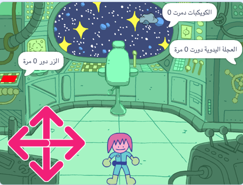

## سوف تصنع

قم بإنشاء غرفة لغز سفينة الفضاء ذات الشخصية التي تحل الألغاز.

** غرف الألغاز **، أو ** غرف الهروب ** ، هي غرف تحتوي على ألغاز يجب حلها للخروج من الغرفة أو للدخول إلى الغرفة المجاورة. يمكن أن تكون غرفًا عبر الإنترنت أو غرفًا حقيقية ، ولكن الفكرة هي نفسها عادةً: أكمل المهمة بأسرع ما يمكن!

سوف تفعلها:
+ استخدم المقطع البرمجي`كرر حتى `{: class = "block3control"} للتحكم في وقت توقف أحد الإجراءات
+ استخدم عدة مقاطع برمجية `اربط`{: class = "block3operators"} لإخراج قيمة `متغير`{: class = "block3variables"}
+ اجمع بين `و`{: class = "block3operators"} `أو`{: class = "block3operators"} و `ليس`{: class = "block3operators"} لحل المشكلات

--- no-print ---

### العب ▶️

--- task ---

  
أوه ، تواجه سفينة الفضاء بعض الصعوبات! استخدم الأسهم للحصول على شخصية المهندس للتحرك حول سفينة الفضاء. هل يمكنك مساعدتهم في حل جميع الألغاز ومساعدة سفينة الفضاء؟

**غرفة الألغاز**: [اطلع على البرنامج](https://scratch.mit.edu/projects/536877672/editor){:target="_blank"}

  <iframe allowtransparency="true" width="485" height="402" src="https://scratch.mit.edu/projects/embed/536877672/?autostart=false" frameborder="0"></iframe>

--- collapse ---
---
العنوان: نصائح للعب
---

1. يجب أن تكون قريبًا من الزر وتنقر عليه خمس مرات
2. يجب أن تكون قريبًا من الكرسي ثم تستخدم علامة التصويب لتدمير عشرة كويكبات
3. يجب أن تكون قريبًا من العجلة اليدوية وتنقر عليها لتدويرها بمجموع ثلاث لفات كاملة

--- /collapse ---

--- /task ---

--- /no-print ---

--- print-only ---

--- /print-only ---

