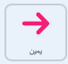
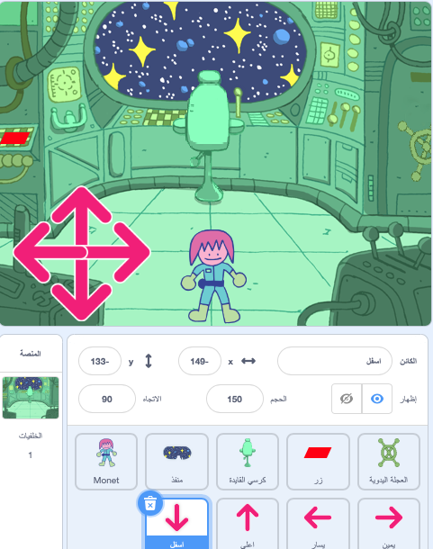

## من في غرفة الألغاز؟

<div style="display: flex; flex-wrap: wrap">
<div style="flex-basis: 200px; flex-grow: 1; margin-right: 15px;">
في هذه الخطوة ، ستقوم بإضافة شخصية إلى غرفة الألغاز ، وإنشاء عناصر تحكم لتحريكها.
</div>
<div>
{:width="300px"}
</div>
</div>

--- task ---

افتح [مشروع بدء Scratch](https://scratch.mit.edu/projects/531567946/editor/){:target="_blank"}. سيتم فتح Scratch في علامة تبويب متصفح أخرى.

إذا كنت تعمل دون اتصال بالإنترنت ، يمكنك تنزيل مشروع البداية على [rpf.io/p/en/puzzle-room-go](https://rpf.io/p/en/puzzle-room-go).

[[[working-offline]]]

--- /task ---

يجب أن ترى مشهدًا من داخل سفينة الفضاء. تم صنع العديد من الكائنات المتحركة من أجلك ، وتم تعيين مواقعها.

**اختر:** من في سفينة الفضاء؟ يمكن أن تكون مهمة منفردة من الأرض ، أو مركبة فضائية غريبة ، أو قد تكون موجودة في المستقبل حيث تحكم القطط العالم.

أنت بحاجة إلى شخصية واحدة للتفاعل مع الألغاز التي تصنعها.

--- task ---

أضف كائن آخر إلى مشروعك. في هذا المثال ، سترى الشخصية **Monet**.


--- /task ---

إذا كانت شخصيتك كبيرة جدًا أو صغيرة جدًا بالنسبة للمشهد ، فيجب عليك تغيير حجمها. يمكنك أيضًا اختيار موضع البداية للشخصية.

--- task ---

أضف مقطع برمجي لإعداد حجم شخصيتك وموضع البداية.

--- /task ---

ستحتاج إلى عناصر تحكم على الشاشة لتتمكن من تحريك شخصيتك.

--- task ---

اختر أحد كائنات **سهم**. عند النقر على الكائن ، يجب أن يبث اتجاهه حتى يتمكن من تحريك الشخصية في هذا الاتجاه.



```blocks3
when this sprite clicked
broadcast (right v) //Direction the arrow is pointing
```

--- /task ---

**نصيحة:** إذا كان من الصعب جدًا النقر فوق كائنات**سهم** عند استخدام هاتف محمول أو جهاز لوحي ، فيمكنك عندئذٍ تغيير الازياء. يحتوي كل كائن **سهم** أيضًا على دائرة أرجوانية كبيرة يمكن استخدامها بدلاً من ذلك.

أضف الآن المزيد من عناصر التحكم  لتحريك شخصيتك الرئيسية.

--- task ---

قم بتكرار الرمز **سهم** ثلاث مرات. بعد ذلك ، لكل كائن ، قم بتغيير المظهر بحيث يشير إلى اتجاه مختلف.

غيّر اسم كل كائن إلى الاتجاه الذي يشير إليه وغيّر ` البث `{: class = "block3events"} إلى الاتجاه الذي يشير إليه.

رتب جميع المقاطع البرمجية المتحركة **سهم** في زاوية الشاشة.



--- /task ---

يجب أن تتحرك شخصيتك الرئيسية عند الضغط على الأسهم.

--- task ---

قم بترميز الكائن الرئيسي لشخصيتك للتحرك عندما يتلقى البث ليذهب إلى `يسارًا ويمينًا ولأعلى ولأسفل`{: class = "block3events"}.


```blocks3
when I receive [up v]
change y by (10)

when I receive [down v]
change y by (-10)

when I receive [right v]
change x by (10)

when I receive [left v]
change x by (-10)
```

--- /task ---

--- task ---

**اختبار:** انقر فوق العلم الأخضر ثم انقر فوق الأسهم لتحريك شخصيتك.

--- /task ---


--- save ---
