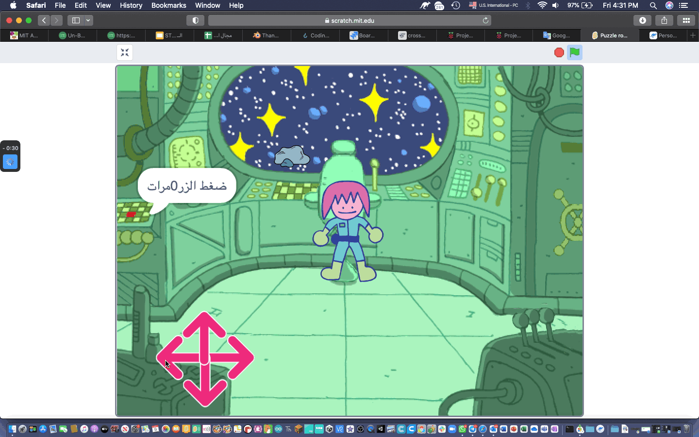
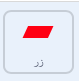

## لغز الزر

<div style="display: flex; flex-wrap: wrap">
<div style="flex-basis: 200px; flex-grow: 1; margin-right: 15px;">
في هذه الخطوة ، ستضيف اللغز الأول الخاص بك ، والذي سيكون الضغط على الزر عددًا معينًا من المرات.
</div>
<div>
{:width="300px"}
</div>
</div>

عندما تبدأ اللعبة ، يجب أن يبقى الزر في نفس المكان ، وأن يكون دائمًا مرئيًا على الطبقة الأمامية.

--- task ---

أضف المقاطع البرمجي التالية إلى كائن ** الزر **.

```blocks3
when flag clicked
forever
go to x: (-225) y (27)
go to [front v] layer //The button is visible
```

--- /task ---

سيحتاج الزر إلى الضغط عليه عدة مرات حتى يكتمل اللغز. لهذا ، ستحتاج إلى ` متغير `{: class = "block3variables"} لتخزين عدد الدفعات.

--- task ---

قم بإنشاء متغيير ` متغير `{: class = "block3variables"} وقم بتسميته  `بالضغط على الزر`{: class = "block3variables"}.

--- /task ---

في بداية اللعبة، `الضغط على الزر`{:class="block3variables"} يجب أن يكون `0`.

--- task ---

أضف المقاطع البرمجي التالية إلى كائن ** الزر **.



```blocks3
when flag clicked
set [button pressed v] to (0) //Button presses set to 0 at start
```

--- /task ---

المقطع البرمجي `كرر حتى`{: class = "block3control"} هي حلقة تستمر في التكرار حتى يتم استيفاء شرط معين.

**اختر:** كم مرة يجب الضغط على الزر لحل اللغز؟ في هذا المثال ، ستحتاج إلى الضغط عليه `5` مرة ، ولكن يمكنك اختيار رقم مختلف.

--- task ---

أضف `كرر حتى حلقة`{: class = "block3control"} ، واضبط حالتها عند الضغط على</code>`: class = "block3variables"} تساوي <code>تساوي`{: class = "block3operators"} إلى `5`.


```blocks3
when flag clicked
set [button pressed v] to (0)
+ repeat until <(button pressed) = (5)> //Keep repeating until button is pressed 5 times
```

--- /task ---

الآن ، يحتاج اللاعب إلى أن يكون قادرًا على الضغط على الزر. يجب أن يكونوا قادرين على الضغط فقط عندما يكون الحرف قريبًا من الزر رغم ذلك!

--- task ---

أضف المقطع البرمجي لاكتشاف ما إذا كان الحرف قريبًا من الزر عند النقر فوق ** الزر **.


```blocks3
when this sprite clicked
if <(distance to (Monet v)) < (50)> then
else
```

--- /task ---

إذا كان الحرف قريبًا ، وتم الضغط على الزر ، فيمكن زيادة متغير `المتغيير`الضغط عليه {: class = "block3variables"}. إذا لم تكن الشخصية قريبة ، يجب إعادة تعيين اللغز ؛ يحتاج اللاعب إلى الضغط على الزر خمس مرات متتالية ، قبل تجربة أي ألغاز أخرى.

**نصيحة:** في Scratch ، يتم حساب المسافة بين أي اثنين من الكائنات من مراكز الكائنات. هذا يعني أن الكائنات الكبيرة يمكن أن تبدو وكأنها تلامس ، لكن مراكزها قد لا تزال متباعدة.

--- task ---

قم بإضافة كود لتغيير قيمة المتغير `الذي تم الضغط عليه`زر {: class = "block3variables"}.


```blocks3
when this sprite clicked
if <(distance to (Monet v)) < (50)> then
+ change [button pressed v] by (1) //If close to Monet, then increase button press count
else
+ set [button press v] to (0) //If far from Monet, then reset button press count
```

--- /task ---

--- task ---

**اختبار:** قم بتشغيل التعليمات البرمجية الخاصة بك وحرك الماوس للتحكم في المشغل. أثناء النقر فوق الزر ، يجب زيادة متغير</code>زر اليمين `{: class = 'block3variables'}. يمكنك ضبط قيمة <code>مسافة إلى Monet`{: class = 'block3sensing'} لأعلى أو لأسفل ، حتى تجد الرقم الذي يناسبك.

--- /task ---

يمكنك استخدام المقطع البرمجي `انضم`{: class = "block3operators"} إلى `قل`{: class = "block3looks"} للاعب كم مرة تم الضغط على الزر.

--- task ---

ضع كائن`رابط`{: class = "block3operators"} كتلة داخل كتلة أخرى. ثم أضف النص الذي تريده ، متغيير `اضغط الزر`{: class = "block3variables"} ، كل ذلك داخل المقطع البرمجي `say`{: class = "block3looks"}.

مثال:


```blocks3
when flag clicked
set [button pressed v] to (0)
repeat until <(button pressed) = (5)> 
+ say (join [button pressed] (join (button pressed) [times])
```

**نصيحة:** تأكد من إضافة مسافات في النص في مقطع `الانضمام`{: class = "block3operators"}.

--- /task ---

ستنتهي الحلقة عندما يتم الضغط على الزر `5` مرات، ثم سيتم تشغيل آخر مقطع برمجي في البرنامج النصي. هذا يمكن أن يخبر اللاعب أن المهمة قد اكتملت.

--- task ---

استخدم المقطع `say`{: class = "block3looks"} لإخبار اللاعب بأن المهمة قد اكتملت.


```blocks3
when flag clicked
set [button pressed v] to (0)
repeat until <(button pressed) = (5)>
say (join [button pressed] (join (button pressed) [times])
end
+ say [task complete] for (2) seconds
```

--- /task ---


--- task ---

**اختبار:** قم بتشغيل مشروعك وحرك الشخصية بالقرب من الزر. عند النقر فوق الزر خمس مرات ، يجب أن تكتمل المهمة.

--- /task ---

--- save ---

