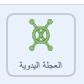

## لغز العجلة اليدوية

<div style="display: flex; flex-wrap: wrap">
<div style="flex-basis: 200px; flex-grow: 1; margin-right: 15px;">
في هذه الخطوة ، ستقوم بإنشاء لغز حيث تحتاج عجلة يدوية إلى التدوير.
</div>
<div>
! [تتحرك الشخصية عبر الشاشة إلى عجلة اليد وتبدأ في تدويرها. يتم حساب مقدار الدوران في المتغير وكلما اكتملت كل دورة كاملة ، تحسب فقاعة بقعة مقدار الدورات.] (images / step_4.gif) {: width = "300px"}
</div>
</div>

المقطع البرمجي الخاصة بهذا اللغز تشبه إلى حد كبير لغز الأزرار ، لذا يمكنك نسخ تلك المقاطع البرمجية ثم تحريرها.

--- task ---

اسحب المقطعين البرمجين اللذين قمت بإنشائهما ** للزر ** على كائن **عجلة اليد** ، لنسخهما إلى هذا الكائن.

--- /task ---

`عند النقر فوق العلم`{:class='block3events'} هو أول مقطع برمجي يحتاج إلى تغيير.

--- task ---

إنشاء متغير جديد يسمى `دوران العجلة اليدوية`{:class="block3variables"}، واستخدام ذلك المتغير بدلاً من `زر الضغط`{:class="block3variables"}.

**اختر:** قم بتغيير رقم اكمال الدوران إلى ما تريده. اخترنا `3` في المثال.



```blocks3
when flag clicked
+ set [handwheel turned v] to (0)
+ repeat until <(handwheel turned) = (3)>
+ say (join [handwheel turned] (join (handwheel turned) [times])
end
+ say [task complete] for (2) seconds
```

--- /task ---

مثل العجلة اليدوية الحقيقية ، فإن </strong> العجلة **قادرة فقط على تدوير عدد قليل من الدرجات في المرة الواحدة ، لذلك يجب تخزين الزاوية التي تم تدويرها.</p>

--- task ---

أنشئ متغيرًا جديدًا يسمى `دوران`{: class = "block3variables"} واضبطه على `0` عند بدء اللعبة.


```blocks3
when flag clicked
+ set [turned v] to (0)
set [handwheel turned v] to (0)
repeat until <(handwheel turned) = (3)>
say (join [handwheel turned] (join (handwheel turned) [times])
end
say [task complete] for (2) seconds
```

--- /task ---

يمكنك الآن تحرير `عندما ينقر هذا الكائن على`{: class = "block3events" **المقطع البرمجي ، بحيث عندما يتم النقر على العجلة اليدوية** بشكل متكرر ، فإنه يحول مقدارًا صغيرًا في كل مرة حتى يكمل دورة كاملة. عندما يكمل العدد الصحيح من الدورات الكاملة (`3` مرة في المثال) ، سيتم حل اللغز.

--- task ---

أضف المقطع البرمجي بحيث في كل مرة يتم فيها النقر على العجلة اليدوية **** ، يدور `15` درجات ويزداد المتغير `الذي يتحول إلى`{: class = "block3variables"} بمقدار `15`.


```blocks3
when this sprite clicked
if <(distance to (Monet v)) < (50)> then
+ change [turned v] by (15) //Store the turnes of the wheel
+ turn cw (15) degrees
else
+ set [handwheel turned v] to (0)
```

--- /task ---

**اختبار**: حرك كائن **Monet** (أو كائنك الشخصي) بالقرب من  **العجلة اليدوية** ثم انقر على  **العجلة اليدوية**. من المفيد أن تكون في وضع ملء الشاشة ، بحيث لا يمكنك سحب </strong>العجلة اليديوة**.</p>

عندما وصل المتغير `دوران`{: class = "block3variables" `إلى 360`، فإن العجلة اليدوية قد تم تدويرها مرة واحدة ؛ يمكن الآن تخزين هذا في متغير `عجلة يدوية تحولت إلى`{: class = "block3variables"}.

--- task ---

استخدم **اذا** `متداخلة`{: class = "block3control"} لتغيير العجلة اليدوية `التي تحولت إلى`{: class = "block3variables"} وإعادة تعيين المتغيرات `التي تحولت إلى`{: class = "block3variables"}. القيمة **اذا** `المتداخلة`{: class = "block3control"} هي عندما يتم وضع `اذا`{: class = "block3control"} داخل أخرى.


```blocks3
when this sprite clicked
if <(distance to (Monet v)) < (50)> then
change [turned v] by (15)
turn cw (15) degrees
+ if <(turned) = (360)> then //The handwheel has turned a full circle
+ change [handwheel turned v] by (1) //Store the total number of turns
+ set [turned v] to (0) //Reset the angle that it has been turned
end
else
set [handwheel turned v] to (0)
```

--- /task ---

--- task ---

**اختبار:** حرك كائن الشخصية بالقرب من عجلة اليد ، ثم انقر فوقه. قد تضطر إلى ضبط المسافة التي يجب أن تكون عليها الشخصية من العجلة اليدوية.


```blocks3
<(distance to (Monet v)) < (150)>
```

--- /task ---

**نصيحة**: يمكنك النقر على **Monet** (أو الشخصية) وسحبها ، لتقريبها من عجلة اليد ، على سبيل المثال. سيوفر لك هذا الوقت ، حيث لن تضطر إلى استخدام عناصر التحكم.

--- save ---
