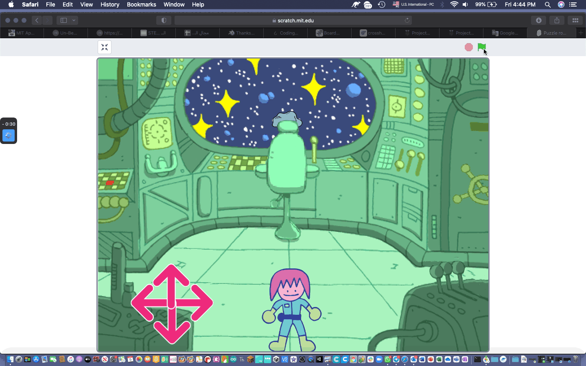
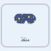

## لغز الكويكبات

<div style="display: flex; flex-wrap: wrap">
<div style="flex-basis: 200px; flex-grow: 1; margin-right: 15px;">
في هذه الخطوة ، ستنشئ اللغز الأكثر تحديًا. سوف تصنع لغزًا لتدمير الكويكبات الخطرة.
</div>
<div>
{:width="300px"}
</div>
</div>

ستحتاج إلى علامة تصويب يمكنك استخدامها لاستهداف الكويكبات.

--- task ---

ارسم كائنًا جديدًا يسمى **علامة التصويب**. يتم عرض مثال أدناه ، باستخدام دائرة وخطين. اجعل الدائرة في البداية ثم اضبط **ملء** إلى شفافة ، بمجرد أن تحدد حجمها وموضعها.


قم بتغيير حجم **علامة التصويب**إذا كنت بحاجة إلى ذلك.

**نصيحة**: يمكنك تكبير محرر الطلاء ، باستخدام +، لتسهيل تحديد المواقع ، خاصةً إذا كنت تستخدم جهازًا محمولًا أو جهازًا لوحيًا.

--- /task ---

ستتبع علامة التقاطع الماوس ، ولكن يجب أن تكون مرئية فقط من خلال النافذة في الفضاء.

--- task ---

استخدم المقطع البرمجي التالي بحيث تتبع**علامة التصويب**مؤشر الماوس.


```blocks3
when flag clicked
forever
go to (mouse-pointer v)
```

**اختبار:** انقر فوق العلم الأخضر واجعل الكائن **علامة التصويب** يتبع موشر الماوس.

--- /task ---

يمكنك استخدام المقطع البرمجي `اذا`{:class="block3control"} لاختبار ما إذا كانت **علامة التصويب** تلامس الكائن **منفذ** ، بحيث يتم إخفاؤها عندما **ليس** لا  يلمسه.

--- task ---

أضف اختبارًا للتأكد من أن **علامة التصويب** تلامس **المنفذ**.


```blocks3
when flag clicked
forever
+ show
go to (mouse-pointer v)
+ if <not <touching (المنفذ v) ?>> then //أظهر علامة التصويب فقط عندما يلمس الماوس المنفذ
hide
```

**اختبار:** انقر فوق العلم الأخضر وتأكد من إخفاء **علامة التصويب** عندما لا تلامس **المنفذ**.

--- /task ---

قد تلاحظ أن علامة التصويب يظهر على حافة **المنفذ** ويبدو أنه داخل سفينة الفضاء. يمكن إصلاح ذلك عن طريق التحقق من عدم ملامسته للون الخلفية.

--- task ---

اضف المقطع البرمجي `او`{:class="block3operators"} إلى المقطع البرمجي `إذا`{:class="block3control"}. الشرط الثاني هو إذا كان **علامة التصويب** يلامس اللون الأخضر الذي يحيط بالــ **منفذ**.


```blocks3
when flag clicked
forever
show
go to (mouse-pointer v)
+ if <<not <touching (المنفذ v) ?>> or <touching color (#69B486) ?>> then //أيضا لا تلمس حافة المنفذ
hide
```

**نصيحة:** بينما يتبع علامة التصويب مؤشر الفأرة ، تأكد من إيقاف مشروعك قبل استخدام منتقي الألوان.

--- /task ---

حان الوقت الآن لإنشاء الكويكبات.

--- task ---

ابحث عن كائن **Rocks** وأضفه إلى مشروعك. قم بتغيير حجم الكائن بحيث لا يكون كبيرًا جدًا.

--- /task ---

ربما تكون قد رأيت كيف أن `لبناتي`{:class="block3myblocks"} تساعد في الحفاظ على تنظيم البرمجة مشروع في [الروبوت كشّاف الطبيعة](https://projects.raspberrypi.org/ar-SA/projects/nature-rover){:target="_blank"}.

`لبناتي`{:class="block3myblocks"} تساعد أيضًا في جعلها لا تضطر إلى كتابة او استخدام نفس المقطع البرمجي مرارًا وتكرارًا. يمكنك استخدام `لبناتي`{:class="block3myblocks"} **Rocks**لوضعها في منفذ سفينة الفضاء.

--- task ---

قم بإنشاء `لبنة`{:class="block3myblocks"} جديدة واسمها `انتقل إلى الموضع`{:class="block3myblocks"}. يمكن أن يكون وضع البداية في أي مكان على الشاشة.


```blocks3
define go to position
go to (random position v)
```

--- /task ---

يحتاج الكائن **Rocks** إلى الاستمرار في العثور على موضع عشوائي حتى يلمس المنفذين `و`{:class="block3operators"} ولا يلمس حافة المنفذ. هذا مشابه للمقطع الرمجي الذي استخدمته في**علامة التصويب**، ولكن هذه المرة ستستخدم مقطع البرمجي `و`{:class="block3operators"}.

--- task ---

أضف `كرر حتى`{:class="block3control"} والمقطع `و`{:class="block3operators"} لتتأكد من أن **Rocks** تستمر في الحركة حتى تكون في الموضع الصحيح.


```blocks3
define go to position
go to (random position v)
+ repeat until <<touching (المنفذ v) ?> and <not <touching color (#69B486) ?>>
go to (random position v)

```

**اختبار:** انقر فوق مقطع `لبناتي`{:class="block3myblocks"} وسترى الصخور تتحرك بشكل عشوائي حول الشاشة ، حتى تتوقف في المنفذ.

--- /task ---

يجب إخفاء **Rocks** عن الأنظار أثناء تحركها ، ولكن إذا كانت مخفية ، فلن تلامس المنفذ ، لذلك يمكن استخدام تأثير `شبح`{:class="block3looks"} لعمل لهم غير مرئيين.

--- task ---

تعيين تأثير `الشبح`{:class="block3looks"} على **الصخور** إلى `100` أثناء تحرك الكائن، ثم مسح تأثير الرسوم البيانية.


```blocks3
define go to position
go to (random position v)
repeat until <<touching (المنفذ v) ?> and <not <touching color (#69B486) ?>>
+ set [ghost v] effect to (100) //إخفاء الكائن
go to (random position v)
end
+ clear graphic effects
```

--- /task ---

الجزء الأخير مشابه للألغاز الأخرى. باستخدام متغير يسمى `الكويكبات`{:class="block3variables"}، عد عدد مرات لمس **علامة التصويب** **Rocks** في كل مرة يحدث ذلك ، يزداد متغير الكويكب وينتقل **Rocks** إلى موضع جديد. يجب أن يعمل هذا فقط إذا كانت شخصيتك على الكرسي.

--- task ---

على الكائن الخاص بك ، أنشئ متغير جديد يسمى `على الكرسي`{:class="block3variables"}، ثم ضبطها إلى `صحيح` عندما تلامس الشخصية الكرسي و `خطا` عندما لا تكون كذلك.


```blocks3
when flag clicked
set size to (60) %
go to x: (0) y: (-130)
+ forever //تأكد من أن Monet على الكرسي
if <touching (كرسي القيادة v) ?> then
set [على الكرسي v] to [حقيقي]
else
set [على الكرسي v] to [خاطئ]
```

--- /task ---

--- task ---

أضف المقطع البرمجي التالي إلى الكائن **Rocks** لضبطه عند اكتمال المهمة.


```blocks3
when flag clicked
set [الكويكبات v] to (0)
الذهاب إلى الموضع ::custom
repeat until <(الكويكبات) = (10)> //تم تدمير 10 كويكباً
```

--- /task ---

--- task ---

استخدم مقطع أخر `و`{:class="block3operators"} في المقطع `اذا`{:class="block3control"} للتحقق من أن **علامة التصويب** تلامس الصخرة وأن `في المقعد`{:class="block3variables"} هو `صحيح`.


```blocks3
when flag clicked
set [الكويكبات v] to (0)
الذهاب إلى الموضع ::custom
+ repeat until <(الكويكبات) = (10)>
+ if <<(على الكرسي) = [حقيقي]> and <touching (علامة التصويب v)>> then //Monet على الكرسي وعلامة التصويب تلامس كويكب
```

--- /task ---

--- task ---

إذا تم استيفاء الشرط، ثم يمكن زيادة متغير `الكويكبات`{:class="block3variables"} بمقدار `1` و `لبناتي`{:class="block3custom"} يمكن استدعاءه مرة أخرى حتى تنتقل Rocks إلى موضع جديد.


```blocks3
when flag clicked
set [الكويكبات v] to (0)
الذهاب إلى الموضع ::custom
repeat until <(الكويكبات) = (10)>
if <<(على الكرسي) = [حقيقي]> and <touching (علامة التصويب v)>> then
+ change [الكويكبات v] by (1) //تخزين عدد الكويكبات المدمرة
+ الذهاب إلى الموضع ::custom //إعادة تعيين موضع الكويكب
```

--- /task ---

آخر شيء يجب القيام به هو إخبار اللاعب عن المهمة. يمكن القيام بذلك على الكائن **المنفذ**.

--- task ---

أضف مقطع لتخبر اللاعب عن عدد الكويكبات التي تم تدميرها.



```blocks3
when flag clicked
go to x: (-15) y: (122)
repeat until <(الكويكبات) = (10)>
say (join (الكويكبات) [الكويكبات دمرت])
end
say [اكتملت المهمة] for (2) seconds
```

--- /task ---

--- task ---

**اختبار:** حرك شخصيتك بالقرب من الكرسي، ثم حرك علامة التصويب محاولة تدمير بعض الكويكبات. يمكنك بعد ذلك ضبط أي من القيم التي تحتاجها في التعليمات البرمجية الخاصة بك لجعلها تعمل بشكل جيد مع أحجام الرموز الخاصة بك.

--- /task ---

--- save ---


