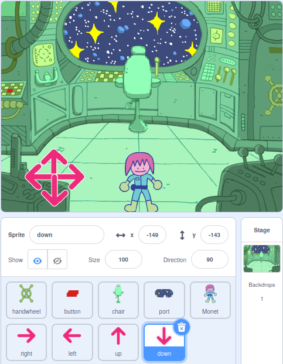

## Pwy sydd yn yr ystafell posau?

<div style="display: flex; flex-wrap: wrap">
<div style="flex-basis: 200px; flex-grow: 1; margin-right: 15px;">
Yn y cam hwn, byddi di'n ychwanegu cymeriad at ystafell bos, ac yn creu rheolyddion i'w symud o gwmpas.
</div>
<div>
{:width="300px"}
</div>
</div>

--- task ---

Agora [brosiect cychwyn arni gyda Scratch](https://scratch.mit.edu/projects/531567946/editor/){:target="_blank"}. Bydd Scratch yn agor mewn tab arall ar y porwr.

Os wyt ti'n gweithio heb gyswllt, gelli lawrlwytho'r prosiect cychwyn arni yn [rpf.io/p/en/puzzle-room-go](https://rpf.io/p/en/puzzle-room-go).

[[[working-offline]]]

--- /task ---

Dylet weld golygfa o'r tu mewn i long ofod. Mae sawl corlun wedi'u gwneud i ti, ac mae eu safleoedd wedi'u gosod.

**Dewisa:** Pwy sydd yn y llong ofod? Gallai fod yn daith unigol o'r Ddaear, gallai fod yn llong ofod estron, neu gallai hyd yn oed fodoli mewn dyfodol lle mae cathod yn rheoli'r byd.

Mae angen un cymeriad arnat i ryngweithio â'r posau rwyt ti'n eu gwneud.

--- task ---

Ychwanegu gorlun newydd at dy brosiect. Yn yr enghraifft hon, fe weli'r cymeriad **Monet**.


--- /task ---

Os yw dy gymeriad yn rhy fawr neu'n rhy fach ar gyfer yr olygfa, dylet newid ei faint. Gelli hefyd ddewis man cychwyn ar gyfer y cymeriad.

--- task ---

Ychwanega god i sefydlu maint a man cychwyn dy gymeriad.

--- /task ---

Bydd angen rheolyddion ar y sgrin arnat i dy alluogi i symud dy gymeriad o gwmpas.

--- task ---

Dewisa un o'r corluniau **arrow**. Pan fydd y corlun yn cael ei glicio, dylai ddarlledu ei gyfeiriad fel y gall wneud i'r cymeriad symud i'r cyfeiriad hwnnw.


```blocks3
when this sprite clicked
broadcast (right v) //Direction the arrow is pointing
```

--- /task ---

**Awgrym:** Os yw'r corluniau **arrow** yn rhy anodd i glicio arno wrth ddefnyddio ffôn symudol neu lechen, yna gellir newid eu gwisgoedd. Mae gan bob corlun **arrow** hefyd gylch porffor mawr y gellir ei ddefnyddio yn lle.

Nawr ychwanega fwy o reolaethau cyfeiriad i symud dy brif gymeriad.

--- task ---

Dyblyga'r corlun **arrow** deirgwaith. Yna, ar gyfer pob corlun, newidia'r wisg fel ei bod yn pwyntio i gyfeiriad gwahanol.

Newidia enw pob corlun i'r cyfeiriad y mae'n ei bwyntio a newidia'r `darllediad`{:class="block3events"} i'r cyfeiriad y mae'n ei bwyntio.

Trefna'r holl gorluniau **arrow** yng nghornel y sgrin.



--- /task ---

Dylai dy brif gymeriad symud pan fydd y saethau'n cael eu pwyso.

--- task ---

Coda gorlun dy brif gymeriad i'w symud pan fydd yn derbyn darllediadau i fynd `i'r chwith, i'r dde, i fyny ac i lawr`{:class="block3events"}.


```blocks3
when I receive [up v]
change y by (10)

when I receive [down v]
change y by (-10)

when I receive [right v]
change x by (10)

when I receive [left v]
change x by (-10)
```

--- /task ---

--- task ---

**Profi:** Clicia'r faner werdd ac yna clicia ar y saethau i symud dy gymeriad o gwmpas.

--- /task ---


--- save ---
