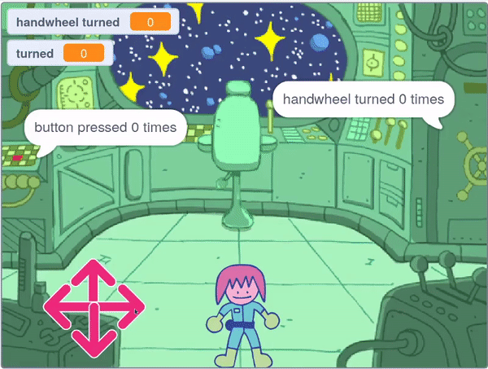

## Pos yr olwyn law

<div style="display: flex; flex-wrap: wrap">
<div style="flex-basis: 200px; flex-grow: 1; margin-right: 15px;">
Yn y cam hwn, byddi di'n creu pos lle mae angen troi olwyn law.
</div>
<div>
{:width="300px"}
</div>
</div>

Mae'r sgriptiau ar gyfer y pos hwn yn eithaf tebyg i'r pos botwm, felly gelli di gopïo'r sgriptiau hynny drosodd ac yna eu golygu.

--- task ---

Llusga'r ddwy sgript i ti eu creu ar gyfer **botwm** y corlun ymlaen i gorlun yr **olwyn law**, i'w copïo i'r corlun hwnnw.

--- /task ---

Y sgript `pan gliciwyd baner`{:class='block3events'} sgript yw'r un cyntaf sydd angen ei newid.

--- task ---

Crea newidyn newydd o'r enw `handwheel troi`{:class="block3variables"}, a defnyddio'r newidyn hwnnw yn lle'r newidyn `botwm wedi'i wasgu`{:class="block3variables"}.

**Dewisa:** Newidia'r rhif cwblhau i beth bynnag yr hoffet iddo fod. Dewison ni `3` yn yr enghraifft.


```blocks3
when flag clicked
+ set [handwheel turned v] to (0)
+ repeat until <(handwheel turned) = (3)>
+ say (join [handwheel turned] (join (handwheel turned) [times])
end
+ say [task complete] for (2) seconds
```

--- /task ---

Fel olwyn law go iawn, dim ond nifer fach o raddau ar y tro y bydd corlun yr **olwyn law** yn gallu troi, felly bydd angen storio'r ongl y mae wedi'i droi.

--- task ---

Crea newidyn newydd o'r enw `wedi troi`{:class="block3variables"} a'i osod i `0` pan fydd y gêm yn dechrau.


```blocks3
when flag clicked
+ set [turned v] to (0)
set [handwheel turned v] to (0)
repeat until <(handwheel turned) = (3)>
say (join [handwheel turned] (join (handwheel turned) [times])
end
say [task complete] for (2) seconds
```

--- /task ---

Nawr gelli di olygu sgript `wrth glicio ar y corlun hwn`{:class="block3events"}, fel bod y corlun **olwyn law**, pan fydd rhywun yn clicio arno dro ar ôl tro, ei bod yn troi swm bach bob tro nes iddo gwblhau cylchdro llawn. Pan fydd wedi cwblhau'r nifer cywir o droadau llawn (`3` gwaith yn yr enghraifft), bydd y pos yn cael ei ddatrys.

--- task ---

Ychwanega flociau fel bod y corlun **handwheel**, bob tro mae'n cael ei glicio, yn troi `15` gradd ac mae'r newidyn `wedi troi`{:class="block3variables"} yn cynyddu `15`.


```blocks3
when this sprite clicked
if <(distance to (Monet v)) < (50)> then
+ change [turned v] by (15) //Store the turnes of the wheel
+ turn cw (15) degrees
else
+ set [handwheel turned v] to (0)
```

--- /task ---

**Profi**: Symuda gorlun **Monet** (neu gorlun dy gymeriad) yn agos at y **olwyn law** ac yna clicia ar gorlun yr **olwyn law**. Mae'n helpu i fod yn y modd sgrin lawn, fel na elli lusgo corlun yr **olwyn law** o gwmpas.

Pan fydd y newidyn `wedi troi`{:class="block3variables"} yn cyrraedd `360`, yna mae'r olwyn law wedi'i throi unwaith; gall hwn bellach gael ei storio yn y newidyn `olwyn law wedi'i throi`{:class="block3variables"}.

--- task ---

Defnyddia **wedi'i nythu** `os`{:class="block3control"} i newid yr `olwyn law wedi'i throi`{:class="block3variables"} ac ailosod y newidyn `wedi troi`{:class="block3variables"}. **Yn nythu** `os`{:class="block3control"} yw pan fydd un `os`{:class="block3control"} yn cael ei osod y tu mewn i un arall.


```blocks3
when this sprite clicked
if <(distance to (Monet v)) < (50)> then
change [turned v] by (15)
turn cw (15) degrees
+ if <(turned) = (360)> then //The handwheel has turned a full circle
+ change [handwheel turned v] by (1) //Store the total number of turns
+ set [turned v] to (0) //Reset the angle that it has been turned
end
else
set [handwheel turned v] to (0)
```

--- /task ---

--- task ---

**Profi** Symuda corlun dy gymeriad yn agos at yr olwyn law, ac yna clicia arno. Efallai y bydd yn rhaid i ti addasu'r pellter y mae angen i'r cymeriad fod o'r olwyn law.


```blocks3
<(distance to (Monet v)) < (150)>
```

--- /task ---

**Awgrym**: Gelli glicio a llusgo dy gorlun (neu gymeriad) **Monet** o gwmpas, i ddod ag ef yn nes at yr olwyn law, er enghraifft. Bydd hyn yn arbed amser i ti, gan na fyddi di'n gorfod parhau i defnyddio'r rheolyddion.

--- save ---
