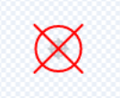
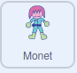

## Pos yr asteroidau

<div style="display: flex; flex-wrap: wrap">
<div style="flex-basis: 200px; flex-grow: 1; margin-right: 15px;">
Yn y cam hwn, byddi di'n creu'r pos mwyaf heriol. Byddi di'n creu pos i ddinistrio asteroidau peryglus.
</div>
<div>
{:width="300px"}
</div>
</div>

Bydd angen crosshair arnat y gelli ei ddefnyddio i dargedu'r asteroidau.

--- task ---

Paentia gorlun newydd o'r enw **crosshair**. Dangosir enghraifft isod, gan ddefnyddio cylch a dwy linell. Gwna'r cylch yn solet i ddechrau ac yna addasa ei **llenwad** i dryloyw, ar ôl i ti benderfynu ar ei faint a'i leoliad.



Newidia faint dy gorlun **crosshair** os oes angen.

**Awgrym**: Gelli di chwyddo i mewn ar y golygydd paent, gan ddefnyddio'r symbolau **+** a **-**, i'w gwneud hi'n haws lleoli, yn enwedig os wyt ti ar ddyfais symudol neu lechen.

--- /task ---

Bydd y crosshair yn dilyn y llygoden, ond dim ond trwy'r ffenestr i'r gofod y dylai fod yn weladwy.

--- task ---

Defnyddia'r blociau canlynol fel bod y **crosshair** yn dilyn pwyntydd y llygoden.


```blocks3
when flag clicked
forever
go to (mouse-pointer v)
```

**Profi:** Clicia'r faner werdd a sicrha bod y **crosshair** yn dilyn pwyntydd y llygoden.

--- /task ---

Gelli ddefnyddio bloc `os`{:class="block3control"} i brofi a yw'r **crosshair** yn cyffwrdd â chorlun **port**, fel ei fod wedi'i guddio pan fydd **ddim** yn ei gyffwrdd.

--- task ---

Ychwanega brawf, i sicrhau bod y **crosshair** yn cyffwrdd â'r **port**.


```blocks3
when flag clicked
forever
+ show
go to (mouse-pointer v)
+ if <not <touching (port v) ?>> then //Only show the crosshair when the mouse is touching the port
hide
```

**Profi:** Clicia'r faner werdd a sicrha bod y **crosshair** yn cuddio pan nad yw'n cyffwrdd â'r **port**.

--- /task ---

Efallai y byddi di'n sylwi bod y crosshair yn ymddangos ar ymyl y **port** ac felly mae'n ymddangos ei fod y tu mewn i'r llong ofod. Gellir trwsio hyn trwy wirio nad yw'n cyffwrdd â lliw'r cefnlen.

--- task ---

Ychwanega floc `neu`{:class="block3operators"} i'r bloc `os`{:class="block3control"}. Yr ail amod yw os yw'r **crosshair** yn cyffwrdd â'r lliw gwyrdd o amgylch y **port**.


```blocks3
when flag clicked
forever
show
go to (mouse-pointer v)
+ if <<not <touching (port v) ?>> or <touching color (#69B486) ?>> then //Also not touching the edge of the port
hide
```

**Awgrym:** Wrth i'r crosshair ddilyn pwyntydd y llygoden, gwna'n siŵr dy fod yn stopio dy brosiect cyn defnyddio'r dewisydd lliwiau.

--- /task ---

Nawr mae'n bryd creu'r asteroidau.

--- task ---

Der o hyd i gorlun **Rocks** a'i ychwanegu at dy brosiect. Newidia faint y corlun fel nad yw'n rhy fawr.

--- /task ---

Efallai dy fod wedi gweld sut mae `fy mlociau`{:class="block3myblocks"} yn helpu i gadw trefn ar y cod ym mhrosiect [Nature rover](https://projects.raspberrypi.org/en/projects/nature-rover){:target = "_blank"}.

Mae `Fy mlociau`{:class="block3myblocks"} hefyd yn helpu trwy sicrhau nad oes rhaid i ti ysgrifennu'r un cod dro ar ôl tro. Gelli ddefnyddio `fy mlociau`{:class="block3myblocks"} ar gyfer **Rocks** i'w gosod ym mhorth y llong ofod.

--- task ---

Crea `floc` {:class="block3myblocks"} newydd a'i alw'n `mynd i safle`{:class="block3myblocks"}. Gall y man cychwyn fod yn unrhyw le ar y sgrin.


```blocks3
define go to position
go to (random position v)
```

--- /task ---

Mae angen i gorlun **Rocks** barhau i ddod o hyd i safle ar hap nes ei fod yn cyffwrdd â'r **port** `a`{:class="block3operators"} ddim yn cyffwrdd ag ymyl y **port**. Mae hwn yn debyg i'r cod a ddefnyddiwyd gennyt ar y **crosshair**, ond y tro hwn byddi di'n defnyddio bloc `a`{:class="block3operators"}.

--- task ---

Ychwanega floc `ailadrodd tan`{:class="block3control"} ac `a`{:class="block3operators"} i wneud yn siŵr bod **Rocks** yn dal i symud nes eu bod yn y safle cywir.


```blocks3
define go to position
go to (random position v)
+ repeat until <<touching (port v) ?> and <not <touching color (#69B486) ?>>
go to (random position v)

```

**Profi:** Clicia ar dy ddiffiniad `fy mlociau`{:class="block3myblocks"} a dylet weld Rocks yn symud ar hap o amgylch y sgrin, nes iddi stopio yn y port.

--- /task ---

Mae angen cuddio **Rocks** o'r golwg wrth iddynt symud, ond os ydynt wedi'u cuddio, ni fyddant yn cyffwrdd â'r **port**, felly gellir defnyddio effaith `ysbryd`{:class="block3looks"} i'w gwneud nhw'n anweledig.

--- task ---

Gosoda'r effaith `ysbryd`{:class="block3looks"} ar y **Rocks** i `100` tra bod y corlun yn symud, ac yna cliria'r effaith graffigol.


```blocks3
define go to position
go to (random position v)
repeat until <<touching (port v) ?> and <not <touching color (#69B486) ?>>
+ set [ghost v] effect to (100) //Hide the sprite
go to (random position v)
end
+ clear graphic effects
```

--- /task ---

Mae'r rhan olaf yn debyg i'r posau eraill. Gan ddefnyddio newidyn o'r enw `asteroidau`{:class="block3variables"}, cyfrifa pa mor aml mae'r **crosshair** yn cyffwrdd â'r **Rocks**. Bob tro mae'n gwneud hynny, mae'r newidyn asteroid yn cynyddu ac mae **Rocks** yn symud i safle newydd. Ond dim ond os yw'ch cymeriad wrth y gadair y dylai hyn weithio.

--- task ---

Ar gorlun dy **gymeriad**, crea newidyn newydd o'r enw `ar gadair`{:class="block3variables"}, a'i osod i `true` pan fydd y cymeriad yn cyffwrdd â'r gadair a `false` pan nad ydynt.



```blocks3
when flag clicked
set size to (60) %
go to x: (0) y: (-130)
+ forever //Check that Monet is at the chair
if <touching (chair v) ?> then
set [at chair v] to [true]
else
set [at chair v] to [false]
```

--- /task ---

--- task ---

Ychwanega'r blociau canlynol at gorlun **Rocks** i'w osod pan fydd y dasg wedi'i chwblhau.


```blocks3
when flag clicked
set [asteroids v] to (0)
go to position ::custom
repeat until <(asteroids) = (10)> //10 asteroids have been destroyed
```

--- /task ---

--- task ---

Defnyddia floc `a`{:class="block3operators"} arall mewn bloc `os`{:class="block3control"} i wirio bod y **crosshair** yn cyffwrdd â'r rock a bod newidyn `ar gadair`{:class= "block3variables"} yn `true`.


```blocks3
when flag clicked
set [asteroids v] to (0)
go to position ::custom
+ repeat until <(asteroids) = (10)>
+ if <<(at chair) = [true]> and <touching (crosshair v)>> then //Monet is at chair and crosshair is touching asteroid
```

--- /task ---

--- task ---

Os yw'r amod wedi'i fodloni, yna gellir cynyddu'r newidyn `asteroidau`{:class="block3variables"} gan `1` a gellir galw'r `fy bloc`{:class="block3custom"} eto er mwyn i **Rocks** symud i safle newydd.


```blocks3
when flag clicked
set [asteroids v] to (0)
go to position ::custom
repeat until <(asteroids) = (10)>
if <<(at chair) = [true]> and <touching (crosshair v)>> then
+ change [asteroids v] by (1) //Store the number of asteroids destroyed
+ go to position ::custom //Reset asteroid position
```

--- /task ---

Y peth olaf i'w wneud yw dweud wrth y chwaraewr am y dasg. Gellir gwneud hyn ar y corlun **port**.

--- task ---

Ychwanega flociau i ddweud wrth y chwaraewr faint o asteroidau sydd wedi'u dinistrio.


```blocks3
when flag clicked
go to x: (-15) y: (122)
repeat until <(asteroids) = (10)>
say (join (asteroids) [asteroids destroyed])
end
say [task completed] for (2) seconds
```

--- /task ---

--- task ---

**Profi:** Symuda dy gymeriad yn agos at y gadair, yna symuda'r crosshair o gwmpas a cheisia ddinistrio rhai asteroidau. Yna gelli addasu unrhyw un o'r gwerthoedd yn dy god sydd eu hangen arnat er mwyn gwneud iddo weithio'n dda ar gyfer maint dy gorluniau.

--- /task ---

--- save ---


