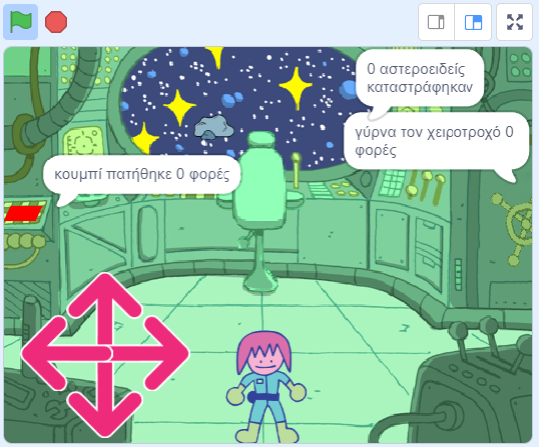

## You will make

Create a spaceship puzzle room with a character that solves puzzles.

**Δωμάτια με γρίφους**, ή ** δωμάτια απόδρασης**, είναι δωμάτια που περιέχουν γρίφους που πρέπει να λύσεις για να βγεις από το δωμάτιο ή για να μπεις στο διπλανό δωμάτιο. Μπορούν να είναι διαδικτυακά ή πραγματικά δωμάτια, αλλά η ιδέα είναι συνήθως η ίδια: ολοκλήρωσε την αποστολή όσο πιο γρήγορα μπορείς!

Θα χρειαστεί να:
+ Χρησιμοποιήσεις ένα μπλοκ `επανάλαβε ώσπου`{:class="block3control"} για να ελέγξεις πότε μια ενέργεια σταματά
+ Χρησιμοποιήσεις πολλαπλά μπλοκ `ένωσε`{:class="block3operators"} για να εξάγεις την τιμή μιας `μεταβλητής`{:class="block3variables"}
+ Συνδυάσεις `και`{:class="block3operators"}, `ή`{:class="block3operators"} και `όχι`{:class="block3operators"} συνθήκες για να λύσεις προβλήματα

--- no-print ---

### Play ▶️

--- task ---

  
Uh oh, the spaceship is encountering some difficulties! Χρησιμοποίησε τα βέλη για να κάνεις τον χαρακτήρα του/της μηχανικού να κινηθεί σε όλο το διαστημόπλοιο. Μπορείς να τον/την βοηθήσεις να λύσει όλους τους γρίφους και να βοηθήσει το διαστημόπλοιο;

**Δωμάτιο με γρίφους**: [Δες μέσα](https://scratch.mit.edu/projects/536877672/editor){:target="_blank"}

  <iframe allowtransparency="true" width="485" height="402" src="https://scratch.mit.edu/projects/embed/536877672/?autostart=false" frameborder="0"></iframe>

--- collapse ---
---
title: Συμβουλές για το παιχνίδι
---

1. Πρέπει να είσαι κοντά στο κουμπί και να το πατήσεις πέντε φορές
2. Πρέπει να είσαι κοντά στην καρέκλα και στη συνέχεια να χρησιμοποιήσεις το σταυρόνημα για να καταστρέψεις δέκα αστεροειδείς
3. Πρέπει να είσαι κοντά στον χειροτροχό και να τον πατήσεις για να τον γυρίσεις συνολικά τρεις πλήρεις στροφές

--- /collapse ---

--- /task ---

--- /no-print ---

--- print-only ---

--- /print-only ---

