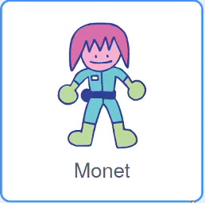

## Ποιος είναι στο δωμάτιο των γρίφων;

<div style="display: flex; flex-wrap: wrap">
<div style="flex-basis: 200px; flex-grow: 1; margin-right: 15px;">
Σε αυτό το βήμα, θα προσθέσεις έναν χαρακτήρα σε ένα δωμάτιο με γρίφους και θα δημιουργήσεις χειριστήρια για να τον μετακινήσεις.
</div>
<div>
{:width="300px"}
</div>
</div>

--- task ---

Άνοιξε το [αρχικό έργο Scratch](https://scratch.mit.edu/projects/531567946/editor/){:target="_ blank"}. Το Scratch θα ανοίξει σε νέα καρτέλα του φυλλομετρητή.

Εάν εργάζεσαι εκτός σύνδεσης, μπορείς να κάνεις λήψη του αρχικού έργου στη διεύθυνση [rpf.io/p/en/puzzle-room](https://rpf.io/p/en/puzzle-room).

[[[working-offline]]]

--- /task ---

Θα δεις μια σκηνή μέσα από ένα διαστημόπλοιο. Έχουν δημιουργηθεί πολλά αντικείμενα για εσένα και έχουν τοποθετηθεί στη θέση τους.

**Επίλεξε:** Ποιος είναι στο διαστημόπλοιο; Θα μπορούσε να είναι μια αποστολή για έναν/μία από τη Γη, θα μπορούσε να είναι ένα εξωγήινο διαστημόπλοιο, ή θα μπορούσε ακόμη και να εξελιχθεί σε ένα μέλλον όπου οι γάτες κυβερνούν τον κόσμο.

Χρειάζεσαι έναν χαρακτήρα για να αλληλεπιδράσει με τους γρίφους που δημιουργείς.

--- task ---

Πρόσθεσε ένα νέο αντικείμενο στο έργο σου. Σε αυτό το παράδειγμα, θα δεις τον χαρακτήρα **Monet**.



--- /task ---

Εάν ο χαρακτήρας σου είναι πολύ μεγάλος ή πολύ μικρός για τη σκηνή, θα πρέπει να αλλάξεις το μέγεθός του. Μπορείς επίσης να επιλέξεις μια αρχική θέση για τον χαρακτήρα.

--- task ---

Πρόσθεσε κώδικα για να ρυθμίσεις το μέγεθος και τη θέση έναρξης του χαρακτήρα σου.

--- /task ---

Θα χρειαστείς χειριστήρια στην οθόνη για να μπορέσεις να μετακινήσεις τον χαρακτήρα σου.

--- task ---

Επίλεξε ένα απο τα αντικείμενα **βέλη**. Όταν κάνεις κλικ στο αντικείμενο, θα μεταδώσει την κατεύθυνσή του έτσι ώστε να μπορεί να κάνει τον χαρακτήρα να κινηθεί προς αυτήν την κατεύθυνση.


```blocks3
when this sprite clicked
broadcast (right v) //Direction the arrow is pointing
```

--- /task ---

**Συμβουλή:** Εάν τα αντικείμενα **βέλη** είναι πολύ δύσκολο να πατηθούν όταν χρησιμοποιείς κινητό ή tablet, τότε μπορείς να αλλάξεις τις ενδυμασίες τους. Κάθε αντικείμενο **βέλος** έχει επίσης έναν μεγάλο μωβ κύκλο που μπορεί να χρησιμοποιηθεί.

Τώρα πρόσθεσε περισσότερα στοιχεία ελέγχου κατεύθυνσης για να μετακινήσεις τον κύριο χαρακτήρα σου.

--- task ---

Διπλασίασε το αντικείμενο **βέλος** τρεις φορές. Στη συνέχεια, για κάθε αντικείμενο, άλλαξε την ενδυμασία ώστε να δείχνει σε διαφορετική κατεύθυνση.

Άλλαξε το όνομα κάθε αντικειμένου προς την κατεύθυνση που δείχνει και άλλαξε τη `μετάδοση`{:class="block3events"} προς την κατεύθυνση που δείχνει.

Τακτοποίησε όλα τα αντικείμενα **βέλη** στη γωνία της οθόνης.


--- /task ---

Ο κύριος χαρακτήρας σου θα πρέπει να μετακινείται όταν πατάς τα βέλη.

--- task ---

Προγραμμάτισε το αντικείμενο του κύριου χαρακτήρα σου ώστε να μετακινείται όταν λαμβάνει μεταδόσεις για να πηγαίνει `αριστερά, δεξιά, πάνω και κάτω`{:class="block3events"}.


```blocks3
when I receive [up v]
change y by (10)

when I receive [down v]
change y by (-10)

when I receive [right v]
change x by (10)

when I receive [left v]
change x by (-10)
```

--- /task ---

--- task ---

**Δοκιμή:** Κάνε κλικ στην πράσινη σημαία και, στη συνέχεια, κάνε κλικ στα βέλη για να μετακινήσεις τον χαρακτήρα σου.

--- /task ---


--- save ---
