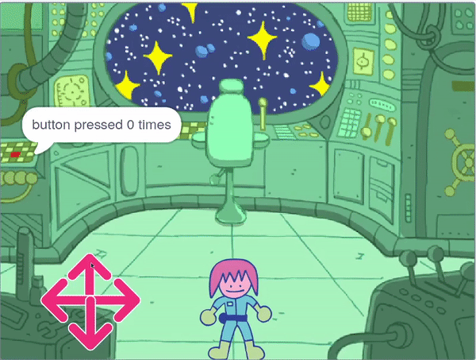
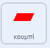

## Ο γρίφος του κουμπιού

<div style="display: flex; flex-wrap: wrap">
<div style="flex-basis: 200px; flex-grow: 1; margin-right: 15px;">
Σε αυτό το βήμα, θα προσθέσεις τον πρώτο σου γρίφο, ο οποίος θα είναι να πατήσεις το κουμπί ορισμένες φορές.
</div>
<div>
{:width="300px"}
</div>
</div>

Όταν ξεκινά το παιχνίδι, το κουμπί πρέπει να παραμένει στο ίδιο σημείο και να είναι πάντα ορατό στο μπροστινό επίπεδο.

--- task ---

Πρόσθεσε αυτά τα μπλοκ στο αντικείμενο **Κουμπί**.

```blocks3
when flag clicked
forever
go to x: (-225) y (27)
go to [front v] layer //The button is visible
```

--- /task ---

Το κουμπί θα πρέπει να πατηθεί κάποιες φορές για να ολοκληρωθεί ο γρίφος. Για αυτό, θα χρειαστείς μια `μεταβλητή`{:class="block3variables"} για να αποθηκεύσεις το πόσες φορές πατήθηκε.

--- task ---

Δημιούργησε μία νέα `μεταβλητή`{:class="block3variables"} και ονόμασέ την `κουμπί πατήθηκε`{:class="block3variables"}.

--- /task ---

Στην αρχή του παιχνιδιού, το `κουμπί πατήθηκε`{:class="block3variables"} θα πρέπει να είναι `0`.

--- task ---

Πρόσθεσε αυτά τα μπλοκ στο αντικείμενο **Κουμπί**.



```blocks3
when flag clicked
set [button pressed v] to (0) //Button presses set to 0 at start
```

--- /task ---

Ένα μπλοκ `επανάλαβε ώσπου`{:class="block3control"} είναι ένας βρόχος που συνεχίζει να επαναλαμβάνεται μέχρι να εκπληρωθεί μια συγκεκριμένη συνθήκη.

**Επίλεξε:** Πόσες φορές θα χρειαστεί να πατήσεις το κουμπί για να λύσεις τον γρίφο; Σε αυτό το παράδειγμα, θα χρειαστεί να πατηθεί `5` φορές, αλλά μπορείς να επιλέξεις διαφορετικό αριθμό.

--- task ---

Πρόσθεσε έναν βρόχο `επανάλαβε ώσπου`{:class="block3control"} και ορίστε την συνθήκη του να εκπληρώνεται όταν η μεταβλητή `κουμπί πατήθηκε`{:class="block3variables"} είναι `ίση`{:class="block3operators"} με `5`.


```blocks3
when flag clicked
set [button pressed v] to (0)
+ repeat until <(button pressed) = (5)> //Keep repeating until button is pressed 5 times
```

--- /task ---

Τώρα, ο παίκτης θα μπορεί να πατήσει το κουμπί. Ωστόσο, θα πρέπει να μπορεί να το πατήσει μόνο όταν ο χαρακτήρας είναι κοντά στο κουμπί!

--- task ---

Πρόσθεσε μπλοκ για να εντοπίσεις εάν ο χαρακτήρας είναι κοντά στο κουμπί όταν κάνεις κλικ στο αντικείμενο **κουμπί**.


```blocks3
when this sprite clicked
if <(distance to (Monet v)) < (50)> then
else
```

--- /task ---

Εάν ο χαρακτήρας είναι κοντά και πατηθεί το κουμπί, τότε η μεταβλητή `κουμπί πατήθηκε`{:class="block3variables"} μπορεί να αυξηθεί. Εάν ο χαρακτήρας δεν είναι κοντά, ο γρίφος πρέπει να μηδενιστεί. ο παίκτης πρέπει να πατήσει το κουμπί πέντε φορές στη σειρά, πριν δοκιμάσει οποιονδήποτε άλλο γρίφο.

**Συμβουλή:** Στο Scratch, η απόσταση μεταξύ δύο οποιωνδήποτε αντικειμένων υπολογίζεται από τα κέντρα των αντικειμένων. Αυτό σημαίνει ότι τα μεγάλα αντικείμενα μπορεί να φαίνονται σαν να αγγίζονται, αλλά τα κέντρα τους μπορεί να είναι ακόμα μακριά.

--- task ---

Πρόσθεσε κώδικα για να αλλάξεις την τιμή της μεταβλητής `κουμπί πατήθηκε`{:class="block3variables"}.


```blocks3
when this sprite clicked
if <(distance to (Monet v)) < (50)> then
+ change [button pressed v] by (1) //If close to Monet, then increase button press count
else
+ set [button pressed v] to (0) //If far from Monet, then reset button press count
```

--- /task ---

--- task ---

**Δοκιμή:** Εκτέλεσε το έργο σου και μετακίνησε τον χαρακτήρα κοντά στο κουμπί. Καθώς κάνεις κλικ στο κουμπί, η μεταβλητή `κουμπί πατήθηκε`{:class='block3variables'} θα πρέπει να αυξάνεται. Μπορείς να προσαρμόσεις την τιμή `της απόστασης από τον Monet`{:class='block3sensing'} προς τα πάνω ή προς τα κάτω, έως ότου βρεις έναν αριθμό που να σου φαίνεται λογικός.

--- /task ---

Μπορείς να χρησιμοποιήσεις το μπλοκ `ένωσε`{:class="block3operators"} για `να πεις`{:class="block3looks"} στον παίκτη πόσες φορές έχει πατηθεί το κουμπί.

--- task ---

Τοποθέτησε ένα μπλοκ `ένωσε`{:class="block3operators"} μέσα σε ένα άλλο. Στη συνέχεια, πρόσθεσε το κείμενο που θέλεις και τη μεταβλητή `κουμπί πατήθηκε`{:class="block3variables"}, όλα μέσα σε ένα μπλοκ `πες`{:class="block3looks"}.

Για παράδειγμα:


```blocks3
when flag clicked
set [button pressed v] to (0)
repeat until <(button pressed) = (5)> 
+ say (join [button pressed] (join (button pressed) [times])
```

**Συμβουλή:** Βεβαιώσου ότι έχεις προσθέσει κενά στο κείμενο στο μπλοκ `ένωσε`{:class="block3operators"}.

--- /task ---

Ο βρόχος θα τελειώσει όταν το κουμπί έχει πατηθεί `5` φορές, τότε θα εκτελεστεί το τελευταίο μπλοκ στο script. Αυτό μπορεί να πει στον παίκτη ότι η εργασία έχει ολοκληρωθεί.

--- task ---

Χρησιμοποίησε ένα μπλοκ `πες`{:class="block3looks"} για να πεις στον παίκτη ότι η εργασία έχει ολοκληρωθεί.


```blocks3
when flag clicked
set [button pressed v] to (0)
repeat until <(button pressed) = (5)>
say (join [button pressed] (join (button pressed) [times])
end
+ say [task complete] for (2) seconds
```

--- /task ---


--- task ---

**Δοκιμή:** Τρέξε το έργο σου και μετακίνησε τον χαρακτήρα κοντά στο κουμπί. Όταν κάνεις κλικ στο κουμπί πέντε φορές, η εργασία πρέπει να έχει ολοκληρωθεί.

--- /task ---

--- save ---

