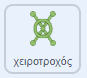

## Ο γρίφος του χειροτροχού

<div style="display: flex; flex-wrap: wrap">
<div style="flex-basis: 200px; flex-grow: 1; margin-right: 15px;">
Σε αυτό το βήμα, θα δημιουργήσεις έναν γρίφο όπου πρέπει να γυρίσεις έναν χειροτροχό.
</div>
<div>
{:width="300px"}
</div>
</div>

Τα scripts για αυτόν τον γρίφο είναι αρκετά παρόμοια με τον γρίφο του κουμπιού, επομένως μπορείς να αντιγράψεις αυτά τα scripts και στη συνέχεια να τα επεξεργαστείς.

--- task ---

Σύρε τα δύο scripts που δημιούργησες για το αντικείμενο **κουμπί** στο αντικείμενο **χειροτροχός**, για να τα αντιγράψεις σε αυτό το αντικείμενο.

--- /task ---

Το script `όταν γίνει κλικ στην πράσινη σημαία`{:class='block3events'} είναι το πρώτο που πρέπει να αλλάξει.

--- task ---

Δημιούργησε μια νέα μεταβλητή που ονομάζεται `χειροτροχός γύρισε`{:class="block3variables"} και χρησιμοποίησε αυτήν τη μεταβλητή αντί για τη μεταβλητή `κουμπί πατήθηκε`{:class="block3variables"}.

**Επίλεξε:** Άλλαξε τον αριθμό ολοκλήρωσης σε όποιον θέλεις να είναι. Επιλέξαμε `3` στο παράδειγμα.



```blocks3
when flag clicked
+ set [χειροτροχός γύρισε v] to (0)
+ repeat until <(χειροτροχός γύρισε) = (3)>
+ say (join [χειροτροχός γύρισε] (join (χειροτροχός γύρισε) [φορές])
end
+ say [εργασία ολοκληρώθηκε] for (2) seconds
```

--- /task ---

Όπως ένας πραγματικός χειροτροχός, το αντικείμενο **χειροτροχός** θα μπορεί να περιστρέφει μόνο έναν μικρό αριθμό μοιρών κάθε φορά, επομένως η γωνία που έχει περιστραφεί θα πρέπει να αποθηκεύεται.

--- task ---

Δημιούργησε μια νέα μεταβλητή που ονομάζεται `στροφή`{:class="block3variables"} και όρισέ την σε `0` όταν ξεκινήσει το παιχνίδι.


```blocks3
when flag clicked
+ set [στροφή v] to (0)
set [χειροτροχός γύρισε v] to (0)
repeat until <(χειροτροχός γύρισε) = (3)>
say (join [χειροτροχός γύρισε] (join (χειροτροχός γύρισε) [φορές])
end
say [εργασία ολοκληρώθηκε] for (2) seconds
```

--- /task ---

Τώρα μπορείς να επεξεργαστείς το script `όταν γίνει κλικ σε αυτό το αντικείμενο`{:class="block3events"}, έτσι ώστε όταν γίνεται επανειλημμένα κλικ στο αντικείμενο **χειροτροχός**, να περιστρέφεται ένα μικρό ποσό κάθε φορά μέχρι να ολοκληρώσει μια πλήρη περιστροφή. Όταν ολοκληρώσει τον σωστό αριθμό πλήρων στροφών (`3` φορές στο παράδειγμα), ο γρίφος θα λυθεί.

--- task ---

Πρόσθεσε μπλοκ έτσι ώστε κάθε φορά που γίνεται κλικ στο αντικείμενο **χειροτροχός**, να γυρνάει `15` μοίρες και η μεταβλητή `στροφή`{:class="block3variables"} να αυξάνεται κατά `15`.


```blocks3
when this sprite clicked
if <(distance to (Monet v)) < (50)> then
+ change [στροφή v] by (15) // Αποθήκευσε τις στροφές του τροχού
+ turn cw (15) degrees
else
+ set [χειροτροχός γύρισε v] to (0)
```

--- /task ---

**Δοκιμή**: Μετακίνησε το αντικείμενο **Monet** (ή το αντικείμενο του χαρακτήρα σου) κοντά στον **χειροτροχό** και, στη συνέχεια, κάνε κλικ στο αντικείμενο **χειροτροχός**. Βοηθάει να βρίσκεσαι σε λειτουργία πλήρους οθόνης, ώστε να μην μπορείς να μετακινήσεις το αντικείμενο **χειροτροχός**.

Όταν η μεταβλητή `στροφή`{:class="block3variables"} φτάσει το `360`, τότε ο χειροτροχός έχει περιστραφεί μία φορά. Αυτό μπορεί τώρα να αποθηκευτεί στη μεταβλητή `χειροτροχής γύρισε`{:class="block3variables"}.

--- task ---

Χρησιμοποίησε ένα **εμφωλευμένο** `εάν`{:class="block3control"} για να αλλάξεις την μεταβλητή `χειροτροχός γύρισε`{:class="block3variables"} και να επαναφέρεις τη μεταβλητή `στροφή`{:class="block3variables"}. Ένα **εμφωλευμένο** `εάν`{:class="block3control"} είναι όταν ένα `εάν`{:class="block3control"} τοποθετείται μέσα σε ένα άλλο.


```blocks3
when this sprite clicked
if <(distance to (Monet v)) < (50)> then
change [στροφή v] by (15)
turn cw (15) degrees
+ if <(στροφή) = (360)> then // Ο χειροτροχός έχει κάνει έναν πλήρη κύκλο
+ change [χειροτροχός γύρισε v] by (1) // Αποθήκευσε τον συνολικό αριθμό στροφών
+ set [στροφή v] to (0) // Επανάφερε τη γωνία που έχει περιστραφεί
end
else
set [χειροτροχός γύρισε v] to (0)
```

--- /task ---

--- task ---

**Δοκιμή:** Μετακίνησε το αντικείμενο του χαρακτήρα σου κοντά στον χειροτροχό και, στη συνέχεια, κάνε κλικ σε αυτό. Ίσως χρειαστεί να προσαρμόσεις την απόσταση που πρέπει να είναι ο χαρακτήρας από τον χειροτροχό.


```blocks3
<(distance to (Monet v)) < (150)>
```

--- /task ---

**Συμβουλή**: Μπορείς να κάνεις κλικ και να σύρεις το αντικείμενο **Monet** (ή τον χαρακτήρα) σου, για να το φέρεις πιο κοντά στον χειροτροχό, για παράδειγμα. Αυτό θα σου εξοικονομήσει χρόνο, καθώς δεν θα χρειαστεί να συνεχίσεις να χρησιμοποιείς τα χειριστήρια.

--- save ---
