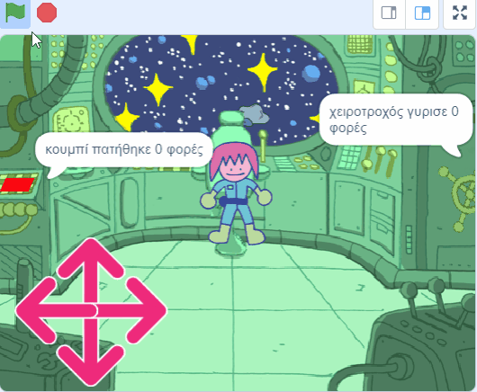
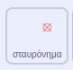
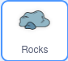
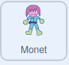
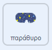

## Ο γρίφος των αστεροειδών

<div style="display: flex; flex-wrap: wrap">
<div style="flex-basis: 200px; flex-grow: 1; margin-right: 15px;">
Σε αυτό το βήμα, θα δημιουργήσεις τον πιο απαιτητικό γρίφο. Θα δημιουργήσεις έναν γρίφο για να καταστρέψεις επικίνδυνους αστεροειδείς.
</div>
<div>
{:width="300px"}
</div>
</div>

Θα χρειαστείς ένα σταυρόνημα που μπορείς να χρησιμοποιήσεις για να στοχεύσεις τους αστεροειδείς.

--- task ---

Ζωγράφισε ένα νέο αντικείμενο που ονομάζεται **σταυρόνημα**. Ένα παράδειγμα φαίνεται παρακάτω, χρησιμοποιώντας έναν κύκλο και δύο γραμμές. Κάνε τον κύκλο αρχικά συμπαγή και, στη συνέχεια, προσάρμοσε το **γέμισμα** του σε διαφανές, αφού έχεις οριστικοποιήσει το μέγεθος και την θέση του.


Άλλαξε το μέγεθος του αντικειμένου **σταυτόνημα**, αν χρειάζεται.

**Συμβουλή**: Μπορείς να κάνεις μεγέθυνση στο πρόγραμμα επεξεργασίας ζωγραφικής, χρησιμοποιώντας τα σύμβολα **+** και **-**, για να διευκολύνεις την τοποθέτηση, ειδικά εάν βρίσκεσαι σε κινητό ή tablet.

--- /task ---

Το σταυρόνημα θα ακολουθεί το ποντίκι, αλλά θα πρέπει να είναι ορατό μόνο μέσα από το παράθυρο στο διάστημα.

--- task ---

Χρησιμοποίησε τα παρακάτω μπλοκ έτσι ώστε το **σταυρόνημα** να ακολουθεί το δείκτη του ποντικιού.



```blocks3
when flag clicked
forever
go to (mouse-pointer v)
```

**Δοκιμή:** Κάνε κλικ στην πράσινη σημαία και βεβαιώσου ότι το αντικείμενο **σταυρόνημα** ακολουθεί τον δείκτη του ποντικιού.

--- /task ---

Μπορείς να χρησιμοποιήσεις ένα μπλοκ `εάν`{:class="block3control"} για να ελέγξεις εάν το **σταυρόνημα** αγγίζει το αντικείμενο **παράθυρο**, έτσι ώστε να είναι κρυφό όταν **δεν** το αγγίζει (με χρήση του τελεστή <1>όχι</1>).

--- task ---

Πρόσθεσε μια δοκιμή, για να βεβαιωθείς ότι το **σταυρόνημα** αγγίζει το **παράθυρο**.


```blocks3
when flag clicked
forever
+ show
go to (mouse-pointer v)
+ if <not <touching (port v) ?>> then //Only show the crosshair when the mouse is touching the port
hide
```

**Δοκιμή:** Κάνε κλικ στην πράσινη σημαία και βεβαιώσου ότι το **σταυρόνημα** κρύβεται όταν δεν αγγίζει το **παράθυρο**.

--- /task ---

Μπορεί να παρατηρήσεις ότι το σταυρόνημα εμφανίζεται στην άκρη του **παραθύρου** και έτσι φαίνεται να βρίσκεται μέσα στο διαστημόπλοιο. Αυτό μπορεί να διορθωθεί ελέγχοντας ότι δεν αγγίζει κάποιο χρώμα του φόντου.

--- task ---

Πρόσθεσε ένα μπλοκ `ή`{:class="block3operators"} στο μπλοκ `εάν`{:class="block3control"}. Η δεύτερη συνθήκη είναι εάν το **σταυρόνημα** αγγίζει το πράσινο χρώμα που περιβάλλει το **παράθυρο**.


```blocks3
when flag clicked
forever
show
go to (mouse-pointer v)
+ if <<not <touching (port v) ?>> or <touching color (#69B486) ?>> then //Also not touching the edge of the port
hide
```

**Συμβουλή:** Καθώς το σταυρόνημα ακολουθεί τον δείκτη του ποντικιού, βεβαιώσου ότι έχεις σταματήσει το έργο σου πριν χρησιμοποιήσεις τον επιλογέα χρώματος.

--- /task ---

Τώρα ήρθε η ώρα να δημιουργήσουμε τους αστεροειδείς.

--- task ---

Βρες ένα αντικείμενο **Rocks** και πρόσθεσέ το στο έργο σου. Άλλαξε το μέγεθος του αντικειμένου ώστε να μην είναι πολύ μεγάλο.

--- /task ---

Ίσως έχεις δει πώς `οι εντολές μου`{:class="block3myblocks"} βοηθούν στο να διατηρηθεί ο κώδικας οργανωμένος στο [έργο Ρομποτικό όχημα εξερεύνησης της φύσης](https://projects.raspberrypi.org/en/projects/nature-rover){:target="_blank"}.

`Οι εντολές μου`{:class="block3myblocks"} βοηθούν επίσης έτσι ώστε να μην χρειάζεται να γράφεις τον ίδιο κώδικα ξανά και ξανά. Μπορείς να χρησιμοποιήσεις τις `συναρτήσεις μου`{:class="block3myblocks"} για τα **Rocks** για να τα τοποθετήσεις στο παράθυρο του διαστημόπλοιου.

--- task ---

Δημιούργησε ένα νέο `μπλοκ`{:class="block3variables"} και ονόμασέ το `πήγαινε στη θέση`{:class="block3variables"}. Η αρχική θέση μπορεί να είναι οπουδήποτε στην οθόνη.



```blocks3
define go to position
go to (random position v)
```

--- /task ---

Το αντικείμενο **Rocks** πρέπει να συνεχίσει να βρίσκει μια τυχαία θέση μέχρι να αγγίξει το **παράθυρο** `και`{:class="block3operators"} να μην αγγίζει την άκρη του **παράθυρου**. Αυτός είναι παρόμοιος με τον κώδικα που χρησιμοποίησες στο **σταυρόνημα**, αλλά αυτή τη φορά θα χρησιμοποιήσεις ένα μπλοκ `και`{:class="block3operators"}.

--- task ---

Πρόσθεσε ένα `επανάλαβε ώσπου`{:class="block3control"} και ένα μπλοκ `και`{:class="block3operators"} για να βεβαιωθείς ότι το **Rocks** συνεχίζει να κινείται μέχρι να βρεθεί στη σωστή θέση.


```blocks3
define go to position
go to (random position v)
+ repeat until <<touching (port v) ?> and <not <touching color (#69B486) ?>>
go to (random position v)

```

**Δοκιμή:** Κάνε κλικ στον ορισμό του `οι εντολές μου`{:class="block3myblocks"} και θα δεις το βράχο να κινείται τυχαία στην οθόνη, μέχρι να σταματήσει στη παράθυρο.

--- /task ---

Το **Rocks** πρέπει να να είναι κρυμμένο από το οπτικό πεδίο καθώς κινείται, αλλά εάν είναι κρυμμένο, δεν θα αγγίζει το **παράθυρο**, επομένως μπορεί να χρησιμοποιηθεί ένα εφέ `φαντάσματος`{:class="block3looks"} για να το κάνει αόρατο.

--- task ---

Όρισε το εφέ `φαντάσματος`{:class="block3looks"} στο **Rocks** σε `100` ενώ το αντικείμενο κινείται και, στη συνέχεια, καθάρισε το γραφικό εφέ.


```blocks3
define go to position
go to (random position v)
repeat until <<touching (port v) ?> and <not <touching color (#69B486) ?>>
+ set [ghost v] effect to (100) //Hide the sprite
go to (random position v)
end
+ clear graphic effects
```

--- /task ---

Το τελευταίο μέρος είναι παρόμοιο με τους άλλους γρίφους. Χρησιμοποιώντας μια μεταβλητή που ονομάζεται `αστεροειδείς`{:class="block3variables"}, μέτρησε πόσο συχνά το **σταυρόνημα** αγγίζει το **Rocks**. Κάθε φορά που συμβαίνει, η μεταβλητή του αστεροειδούς αυξάνεται και το **Rocks** μετακινείται σε μια νέα θέση. Ωστόσο, αυτό θα πρέπει να λειτουργεί μόνο εάν ο χαρακτήρας σου είναι στην καρέκλα.

--- task ---

Στο αντικείμενο του **χαρακτήρα** σου, δημιούργησε μια νέα μεταβλητή που ονομάζεται `στην καρέκλα`{:class="block3variables"} και ορίσε την σε `αληθής` όταν ο χαρακτήρας αγγίζει την καρέκλα και `ψευδής` όταν δεν την αγγίζει.



```blocks3
when flag clicked
set size to (60) %
go to x: (0) y: (-130)
+ forever //Check that Monet is at the chair
if <touching (chair v) ?> then
set [at chair v] to [true]
else
set [at chair v] to [false]
```

--- /task ---

--- task ---

Πρόσθεσε τα ακόλουθα μπλοκ στο αντικείμενο **Rocks** για να ορίσεις το πότε θα ολοκληρωθεί η εργασία.


```blocks3
when flag clicked
set [asteroids v] to (0)
go to position ::custom
repeat until <(asteroids) = (10)> //10 asteroids have been destroyed
```

--- /task ---

--- task ---

Χρησιμοποίησε ένα άλλο μπλοκ `και`{:class="block3operators"} σε ένα μπλοκ `εάν`{:class="block3control"} για να ελέγξεις ότι το **σταυρόνημα** αγγίζει τον βράχο και ότι η μεταβλητή `στην καρέκλα`{:class="block3variables"} έχει τιμή `αληθής`.


```blocks3
when flag clicked
set [asteroids v] to (0)
go to position ::custom
+ repeat until <(asteroids) = (10)>
+ if <<(at chair) = [true]> and <touching (crosshair v)>> then //Monet is at chair and crosshair is touching asteroid
```

--- /task ---

--- task ---

Εάν πληρείται η προϋπόθεση, τότε η μεταβλητή `αστεροειδείς`{:class="block3variables"} μπορεί να αυξηθεί κατά `1` και η μεταβλητή `η εντολή μου`{:class="block3custom"} μπορεί να κληθεί ξανά έτσι ώστε το **Rocks** να μετακινηθεί σε νέα θέση.


```blocks3
when flag clicked
set [asteroids v] to (0)
go to position ::custom
repeat until <(asteroids) = (10)>
if <<(at chair) = [true]> and <touching (crosshair v)>> then
+ change [asteroids v] by (1) //Store the number of asteroids destroyed
+ go to position ::custom //Reset asteroid position
```

--- /task ---

Το τελευταίο πράγμα που πρέπει να κάνεις είναι να πεις στον παίκτη για την εργασία. Αυτό μπορεί να γίνει στο αντικείμενο **παράθυρο**.

--- task ---

Πρόσθεσε μπλοκ για να πεις στον παίκτη πόσοι αστεροειδείς έχουν καταστραφεί.



```blocks3
when flag clicked
go to x: (-15) y: (122)
repeat until <(asteroids) = (10)>
say (join (asteroids) [asteroids destroyed])
end
say [task completed] for (2) seconds
```

--- /task ---

--- task ---

**Δοκιμή:** Μετακίνησε τον χαρακτήρα σου κοντά στην καρέκλα, μετά μετακίνησε το σταυρόνημα και προσπάθησε να καταστρέψεις μερικούς αστεροειδείς. Στη συνέχεια, μπορείς να προσαρμόσεις οποιαδήποτε από τις τιμές στον κώδικά σου που χρειάζεσαι για να λειτουργήσει καλά το έργο για τα μεγέθη των αντικειμένων σου.

--- /task ---

--- save ---


