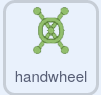

## The handwheel puzzle

<div style="display: flex; flex-wrap: wrap">
<div style="flex-basis: 200px; flex-grow: 1; margin-right: 15px;">
In this step, you will create a puzzle where a handwheel needs to be turned.
</div>
<div>
{:width="300px"}
</div>
</div>

The scripts for this puzzle are quite similar to the button puzzle, so you can copy those scripts over and then edit them.

--- task ---

Drag the two scripts you created for the **button** sprite on to the **handwheel** sprite, to copy them to that sprite.

--- /task ---

The `when flag clicked`{:class='block3events'} script is the first one that needs to be changed.

--- task ---

Create a new variable called `handwheel turned`{:class="block3variables"}, and use that variable instead of the `button pressed`{:class="block3variables"} variable.

**Choose:** Change the completion number to whatever you would like it to be. We chose `3` in the example.



```blocks3
when flag clicked
+ set [handwheel turned v] to (0)
+ repeat until <(handwheel turned) = (3)>
+ say (join [handwheel turned] (join (handwheel turned) [times])
end
+ say [task complete] for (2) seconds
```

--- /task ---

Like a real handwheel, the **handwheel** sprite will only be able to turn a small number of degrees at a time, so the angle it has been turned will need to be stored.

--- task ---

Create a new variable called `turned`{:class="block3variables"} and set it to `0` when the game starts.


```blocks3
when flag clicked
+ set [turned v] to (0)
set [handwheel turned v] to (0)
repeat until <(handwheel turned) = (3)>
say (join [handwheel turned] (join (handwheel turned) [times])
end
say [task complete] for (2) seconds
```

--- /task ---

Now you can edit the `when this sprite clicked`{:class="block3events"} script, so that when the **handwheel** sprite is clicked repeatedly it turns a small amount each time until it completes a full revolution. When it has completed the right number of full turns (`3` times in the example), the puzzle will be solved.

--- task ---

Add blocks so that each time the **handwheel** sprite is clicked, it turns `15` degrees and the `turned`{:class="block3variables"} variable increases by `15`.


```blocks3
when this sprite clicked
if <(distance to (Monet v)) < (50)> then
+ change [turned v] by (15) //Store the turnes of the wheel
+ turn cw (15) degrees
else
+ set [handwheel turned v] to (0)
```

--- /task ---

**Test**: Move the **Monet** sprite (or your character sprite) close to the **handwheel** and then click on the **handwheel** sprite. It helps to be in fullscreen mode, so that you can't drag the **handwheel** sprite around.

When the `turned`{:class="block3variables"} variable reaches `360`, then the handwheel has been turned once; this can now be stored in the `handwheel turned`{:class="block3variables"} variable.

--- task ---

Use a **nested** `if`{:class="block3control"} to change the `handwheel turned`{:class="block3variables"} and reset the `turned`{:class="block3variables"} variables. A **nested** `if`{:class="block3control"} is when one `if`{:class="block3control"} is placed inside another.


```blocks3
when this sprite clicked
if <(distance to (Monet v)) < (50)> then
change [turned v] by (15)
turn cw (15) degrees
+ if <(turned) = (360)> then //The handwheel has turned a full circle
+ change [handwheel turned v] by (1) //Store the total number of turns
+ set [turned v] to (0) //Reset the angle that it has been turned
end
else
set [handwheel turned v] to (0)
```

--- /task ---

--- task ---

**Test:** Move your character sprite close to the handwheel, and then click on it. You might have to adjust the distance that the character needs to be from the handwheel.


```blocks3
<(distance to (Monet v)) < (150)>
```

--- /task ---

**Tip**: You can click and drag your **Monet** (or character) sprite around, to bring it closer to the handwheel, for instance. This will save you time, as you won't keep on having to use the controls.

--- save ---
