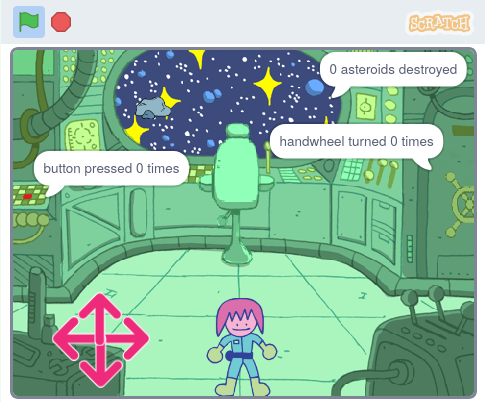

## Introduction

In this project, you will create a spaceship puzzle room with a character that solves puzzles.

**Puzzle rooms**, or **escape rooms**, are rooms containing puzzles that you must solve to get out of the room, or to get into the next room. They can be online or real rooms, but the idea is usually the same: complete the mission as quickly as you can!

You will:
+ Use a `repeat until`{:class="block3control"} block to control when an action stops
+ Use multiple `join`{:class="block3operators"} blocks to output the value of a `variable`{:class="block3variables"}
+ Combine `and`{:class="block3operators"}, `or`{:class="block3operators"}, and `not`{:class="block3operators"} conditions to solve problems

Boxout (conditions)

<mark>Image of many different examples in a strip</mark>

--- no-print ---

--- task ---

  

### Try it 

Uh oh, the spaceship is encountering some difficulties! Use the arrows to get the engineer character to move around the spaceship. Can you help them solve all the puzzles and help the spaceship?

**Puzzle room**: [See inside](https://scratch.mit.edu/projects/536877672/editor){:target="_blank"}

  <iframe allowtransparency="true" width="485" height="402" src="https://scratch.mit.edu/projects/embed/536877672/?autostart=false" frameborder="0"></iframe>

--- collapse ---
---
title: Tips for playing
---
1. You need to be close to the button and click it five times
2. You need to be close to the chair and then use the crosshairs to destroy ten asteroids
3. You need to be close to the handwheel and click it to turn it a total of three full turns

--- /collapse ---

--- /task ---

--- /no-print ---

--- print-only ---

--- /print-only ---

