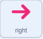

## Who's in the puzzle room?

<div style="display: flex; flex-wrap: wrap">
<div style="flex-basis: 200px; flex-grow: 1; margin-right: 15px;">
In this step you will add a character to a puzzle room, and create controls to move them around.
</div>
<div>
{:width="300px"}
</div>
</div>

--- task ---

Open a [the Scratch starter project](https://scratch.mit.edu/projects/531567946/editor/){:target="_blank"}. Scratch will open in another browser tab. 

If you are working offline, you can download the starter project at [rpf.io/p/en/puzzle-room](https://rpf.io/p/en/puzzle-room).

[[[working-offline]]]

You should see a scene from inside a spaceship. Several sprites have been made for you, and their positions have been set.

--- /task ---

--- task ---

You need a character to interact with the puzzles you are making. Add a new sprite to your project. In this example you will see the character Monet.


--- /task ---

--- task ---

If your character is too large or too small for the scene, then you should change it's size. You can also pick a starting position for the character.


```blocks3
when flag clicked
set size to (60) %
go to x: (0) y: (-130)
```

--- /task ---

You will need onscreen controls, to be able to move your character around.

--- task ---

Add and arrow sprite to your project. The sprite should have it's mode set to `non dragable`{:class="block3sensing"} when the flag is clicked. When the sprite is clicked on it should broadcast the direction it is pointing.


```blocks3
when flag clicked
set drag mode [not draggable v]

when this sprite clicked
broadcast (right v)
```

--- /task ---

--- task ---

Duplicate the arrow sprite three times. Then for each sprite, change the costume so it points in a different direction.

Change each sprite's name to the direction it is pointing and the broadcast to the direction it is pointing

Then arrange them all in the corner of the screen.


--- /task ---

--- task ---

Your sprite should move when it receives broadcasts to go `left, right, up and down`{:class="block3events"}.


```blocks3
when I receive [up v]
change y by (10)

when I receive [down v]
change y by (-10)

when I receive [right v]
change x by (10)

when I receive [left v]
change x by (-10)
```
--- /task ---

--- task ---

**Test:** Click the green flag and then click on the arrows to move your character around.

--- /task ---


--- save ---
