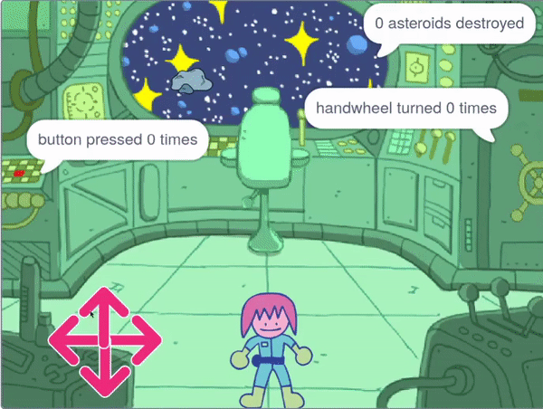

## The asteroids puzzle

<div style="display: flex; flex-wrap: wrap">
<div style="flex-basis: 200px; flex-grow: 1; margin-right: 15px;">
In this step you will create the most challenging puzzle. You will create a puzzle to destroy dangerous asteroids.
</div>
<div>
{:width="300px"}
</div>
</div>

You will need a crosshair that you can use to target the asteroids.

--- task ---

Paint a new sprite called **crosshair**. A really simple example is shown below, using a circle and two lines.


--- /task ---

The crosshair will follow the mouse, but it should only be visible through the window into space.

--- task ---

Use the following blocks so that the **crosshair** follows the mouse-pointer.


```blocks3
when flag clicked
forever
go to (mouse-pointer v)
```

**Test:** click the green flag and make sure that the **crosshair** follows the mouse pointer.

--- /task ---

You can use an `if`{:class="block3control"} block to test if the crosshair is touching the **port** sprite, so that it hides when it is **not** touching it.

--- task ---

Add a test, to make sure that the **crosshair** is touching the **port**


```blocks3
when flag clicked
forever
+ show
go to (mouse-pointer v)
+ if <not <touching (port v) ?>> then
hide
```

**Test:** click the green flag and make sure that the **crosshair** hides when it is not touching the **port**

--- /task ---

You might notice that the crosshair cap appears at the very edge of the **port** and so appears to be inside the spaceship. This can be fixed by checking it's not touching a colour of the backdrop.

--- task ---

Add an `or`{:class="block3operators"} block to the `if`{:class="block3control"} block. The second condition is if the **crosshair** is touching the green colour that surrounds the port.


```blocks3
when flag clicked
forever
show
go to (mouse-pointer v)
+ if <<not <touching (port v) ?>> or <touching color (#69B486) ?>> then
hide
```

**Tip:** As the crosshair is following the mouse-pointer, make sure you stop your project before using the colour picker.
--- /task ---

Now it's time to create the asteroid.

--- task ---

Find a **Rocks** sprite and add it to your project. Resize the sprite so that it is not too big.

--- /task ---

You may have seen how **functions** help keep code organised in the [Nature Rover project](https://projects.raspberrypi.org/en/projects/nature-rover). 

Functions also help by making it so you do not have to write the same code over and over again. You can use a function for the **Rocks** to position them in the spaceship's port.

--- task ---

Create a new `block`{:class="block3custom"} and call it `go to position`{:class="block3custom"}. The starting position can be anywhere on the screen.


```blocks3
define go to position
go to (random position v)
```

--- /task ---

The **Rocks** sprite needs to keep finding a random position until it is touching the **port** and not touching the edge of the **port**. This is similar to the code you used on the **crosshair** but this time you will use an `and`{:class="block3operators"} block.

--- task ---

Add a `repeat until`{:class="block3control"} and an `and`{:class="block3operators"} block to make sure that the **Rocks** keep moving until they ae in the correct position.


```blocks3
define go to position
go to (random position v)
+ repeat until <<touching (port v) ?> and <not<touching color (#69B486) ?>>
go to (random position v)

```

**Test:** click on your function definition and you should see the rock move randomly around the screen, until it stops in the port.
--- /task ---

The **Rocks** need to be hidden from view as they move, but if they are hidden, they won't be touching the **Port**, so a `ghost`{:class="block3looks"} effect can be used to make them invisible.

--- task ---

Set the `ghost`{:class="block3looks"} effect on the **Rocks** to `100` while the sprite is moving, and then clear the graphical effect.


```blocks3
define go to position
go to (random position v)
repeat until <<touching (port v) ?> and <not<touching color (#69B486) ?>>
+ set [ghost v] effect to (100)
end
+ clear graphic effects
```

--- /task ---

The last part is similar to the other puzzles. Using a variable called `asteroids`{:class="block3variables"}, count how often the **crosshair** touches the **Rocks**. Each time it does, the asteroid variable can increase and the **Rocks** can move to a new position. This should only work if your character is at the chair though.

--- task ---

On your **character** sprite, create a new variable called `at chair`{:class="block3variables"}, and set it to `true` when the character is touching the chair and `false` when they are not.


```blocks3
when flag clicked
set size to (60) %
go to x: (0) y: (-130)
+ forever
if <touching (chair v) ?> then
set [at chair v] to [true]
else
set [at chair v] to [false]
```
--- /task ---

--- task ---

Add the following blocks to the **Rocks** sprite to set when the task is complete.


```blocks3
when flag clicked
set [asteroids v] to (0)
go to position ::custom
repeat until <(asteroids) > (10)>
```

--- /task ---

--- task ---

Use another `and`{:class="block3operators"} block in an `if`{:class="block3control"} block to check that the **crosshair** is touching the rock and that the `at chair`{:class="block3variables"} variable is `true`


```blocks3
when flag clicked
set [asteroids v] to (0)
go to position ::custom
repeat until <(asteroids) > (10)>
if <<(at chair) = [true]> and <touching (crosshair v)>> then
```

--- /task ---

--- task ---

If the condition has been met, then the `asteroids`{:class="block3variabels"} variable can be increased by `1` and the function can be called again so the **Rocks** move to a new position.


```blocks3
when flag clicked
set [asteroids v] to (0)
go to position ::custom
repeat until <(asteroids) = (10)>
if <<(at chair) = [true]> and <touching (crosshair v)>> then
change [asteroids v] by (1)
go to position ::custom
```

--- /task ---

The last thing to do is tell the player about the task. This can be done on the **Port** sprite.

--- task ---

Add blocks to tell the player how many asteroids have been destroyed.


```blocks3
when flag clicked
go to x: (-15) y: (122)
repeat until <(asteroids) = (10)>
say (join (asteroids) [asteroids destroyed])
end
say [task completed]
```

--- /task ---

--- save ---


