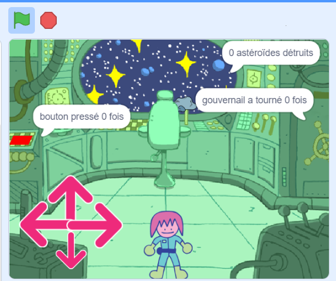

## Tu feras

Créer une salle des énigmes de vaisseau spatial avec un personnage qui résout des énigmes.

Les **salles des énigmes**, ou **salles d'évasion**, sont des salles contenant des énigmes que tu dois résoudre pour sortir de la pièce ou pour entrer dans la pièce suivante. Il peut s'agir de salles en ligne ou de salles réelles, mais l'idée est généralement la même : terminer la mission le plus rapidement possible !

Tu vas devoir :
+ Utiliser un bloc `répéter jusqu'à ce que`{:class="block3control"} pour contrôler quand une action s'arrête
+ Utiliser plusieurs blocs `regrouper` {:class="block3operators"} pour afficher la valeur d'une `variable`{:class="block3variables"}
+ Combiner les conditions `et`{:class="block3operators"}, `ou`{:class="block3operators"}, et `pas`{:class="block3operators"} pour résoudre les problèmes

--- no-print ---

### Joue ▶️

--- task ---

  
Euh, le vaisseau spatial rencontre quelques difficultés ! Utilise les flèches pour que le personnage de l'ingénieur se déplace dans le vaisseau spatial. Peux-tu les aider à résoudre toutes les énigmes et aider le vaisseau spatial ?

  <iframe allowtransparency="true" width="485" height="402" src="" frameborder="0"></iframe>

--- collapse ---
---
title: Conseils pour jouer
---

1. Tu dois être proche du bouton et cliquer dessus cinq fois
2. Tu dois être proche de la chaise et ensuite utiliser les viseurs pour détruire dix astéroïdes
3. Tu dois être à proximité du gouvernail et cliquer dessus pour le faire tourner au total trois tours complets

--- /collapse ---

--- /task ---

--- /no-print ---

--- print-only ---

--- /print-only ---

