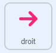
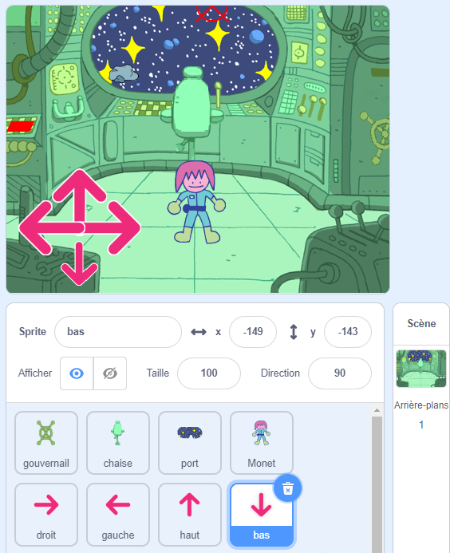

## Qui est dans la salle des énigmes ?

<div style="display: flex; flex-wrap: wrap">
<div style="flex-basis: 200px; flex-grow: 1; margin-right: 15px;">
Dans cette étape, tu vas ajouter un personnage à une salle des énigmes et créer des contrôles pour les déplacer.
</div>
<div>
{:width="300px"}
</div>
</div>

--- task ---

Ouvre [le projet de démarrage Scratch](https://scratch.mit.edu/projects/740758575/editor/){:target="_blank"}. Scratch s'ouvrira dans un autre onglet du navigateur.

Si tu travailles hors ligne, tu peux télécharger le projet de démarrage à [rpf.io/p/fr-FR/puzzle-room-go](https://rpf.io/p/fr-FR/puzzle-room-go).

[[[working-offline]]]

--- /task ---

Tu devrais voir une scène à l'intérieur d'un vaisseau spatial. Plusieurs sprites ont été faits pour toi, et leurs positions ont été définies.

**Choisir :** Qui est dans le vaisseau spatial ? Il pourrait s'agir d'une mission solo depuis la Terre, d'un vaisseau spatial extraterrestre ou même d'un futur où les chats règnent sur le monde.

Tu as besoin d'un personnage pour interagir avec les énigmes que tu fais.

--- task ---

Ajoute un nouveau sprite à ton projet. Dans cet exemple, tu verras le personnage **Monet**.


--- /task ---

Si ton personnage est trop grand ou trop petit pour la scène, tu devrais changer sa taille. Tu peux également choisir une position de départ pour le personnage.

--- task ---

Ajoute du code pour configurer la taille et la position de départ de ton personnage.

--- /task ---

Tu auras besoin de contrôles à l'écran pour te permettre de déplacer ton personnage.

--- task ---

Sélectionne l'un des sprites **flèches**. Quand le sprite est cliqué, il devrait diffuser sa direction pour qu'il puisse faire bouger le personnage dans cette direction.



```blocks3
when this sprite clicked
broadcast (droite v) //Direction vers laquelle la flèche pointe
```

--- /task ---

**Astuce :** Si les sprites des **flèches** sont trop difficiles à cliquer lors de l'utilisation d'une tablette ou d'un mobile, tu peux alors changer leurs costumes. Chaque sprite **flèche** a également un grand cercle violet qui peut être utilisé à la place.

Ajoute maintenant plus de commandes de direction pour déplacer ton personnage principal.

--- task ---

Duplique le sprite **flèche** trois fois. Ensuite, pour chaque sprite, change le costume pour qu'il pointe dans une direction différente.

Change le nom de chaque sprite dans la direction qu'il pointe et change la `diffusion`{:class="block3events"} dans la direction qu'il pointe.

Dispose tous les sprites **flèche** dans le coin de l'écran.



--- /task ---

Ton personnage principal doit se déplacer lorsque les flèches sont pressées.

--- task ---

Code le sprite de ton personnage principal pour qu'il se déplace lorsqu'il reçoit des indications pour qu'il aille `à gauche, à droite, en haut et en bas`{:class="block3events"}.


```blocks3
when I receive [haut v]
change y by (10)

when I receive [bas v]
change y by (-10)

when I receive [droite v]
change x by (10)

when I receive [gauche v]
change x by (-10)
```

--- /task ---

--- task ---

**Test :** Clique sur le drapeau vert puis clique sur les flèches pour déplacer ton personnage.

--- /task ---


--- save ---
