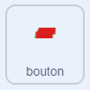

## L'énigme du bouton

<div style="display: flex; flex-wrap: wrap">
<div style="flex-basis: 200px; flex-grow: 1; margin-right: 15px;">
Dans cette étape, tu ajouteras ta première énigme, qui sera d'appuyer sur le bouton un certain nombre de fois.
</div>
<div>
{:width="300px"}
</div>
</div>

Quand le jeu démarre, le bouton doit rester au même endroit, et toujours être visible sur le devant.

--- task ---

Ajoute les blocs suivants au sprite **bouton**.

```blocks3
when flag clicked
forever
go to x: (-225) y (27)
go to [front v] layer //The button is visible
```

--- /task ---

Le bouton devra être appuyé plusieurs fois pour que l'énigme soit terminée. Pour cela, tu auras besoin d'une `variable`{:class="block3variables"} pour mémoriser le nombre de pressions.

--- task ---

Crée une nouvelle `variable`{:class="block3variables"} et appelle-la `bouton pressé`{:class="block3variables"}.

--- /task ---

Au début du jeu, le `bouton pressé`{:class="block3variables"} devrait être `0`.

--- task ---

Ajoute les blocs suivants au sprite **bouton**.



```blocks3
when flag clicked
set [button pressed v] to (0) //Button presses set to 0 at start
```

--- /task ---

Un bloc `répéter jusqu'à ce que`{:class="block3control"} est une boucle qui se répète jusqu'à ce qu'une certaine condition soit remplie.

**Choisis :** Combien de fois le bouton doit-il être appuyé pour résoudre l'énigme ? Dans cet exemple, il faudra appuyer `5 ` fois, mais tu peux choisir un nombre différent.

--- task ---

Ajoute une boucle `répéter jusqu'à ce que`{:class="block3control"}, et règle sa condition lorsque le `bouton pressé`{:class="block3variables"} est `égal à`{:class="block3operators"} `5`.


```blocks3
when flag clicked
set [button pressed v] to (0)
+ repeat until <(button pressed) = (5)> //Keep repeating until button is pressed 5 times
```

--- /task ---

Maintenant, le joueur doit pouvoir appuyer sur le bouton. Il ne devrait être en mesure de le presser que lorsque le personnage est à proximité du bouton !

--- task ---

Ajoute des blocs pour détecter si le personnage est proche du bouton lorsque le sprite **bouton** est cliqué.


```blocks3
when this sprite clicked
if <(distance to (Monet v)) < (50)> then
else
```

--- /task ---

Si le personnage est proche et que le bouton est enfoncé, alors le `bouton pressé `{:class="block3variables"} peut être augmentée. Si le personnage n'est pas proche, l'énigme devrait se réinitialiser ; le joueur doit appuyer sur le bouton cinq fois de suite, avant d'essayer d'autres énigmes.

**Astuce :** Dans Scratch, la distance entre deux sprites est calculée à partir du centre des sprites. Cela signifie que de grands sprites peuvent donner l'impression de se toucher, mais que leurs centres peuvent être très éloignés les uns des autres.

--- task ---

Ajoute du code pour modifier la valeur de la variable `bouton pressé`{:class="block3variables"}.


```blocks3
quand ce sprite est cliqué 
si <(distance jusqu'à (Monet v)) < (50)> alors
+ changer [bouton appuyé v] de (1) //Si près de Monet, alors augmenter le nombre de boutons pressés
sinon
+ mettre [bouton appuyé v] à (0) //Si loin du Monet, alors réinitialiser le nombre de boutons pressés
```

--- /task ---

--- task ---

**Test :** Exécute ton projet et rapproche le personnage du bouton. Lorsque tu cliques sur le bouton, la variable ` bouton pressé`{:class='block3variables'} devrait augmenter. Tu peux ajuster la valeur de la `distance de Monet`{:class='block3sensing'} vers le haut ou le bas, jusqu'à ce que tu trouves un nombre qui a un sens pour toi.

--- /task ---

Tu peux utiliser le bloc `regrouper`{:class="block3operators"} pour `dire`{:class="block3looks"} au joueur combien de fois le bouton a été pressé.

--- task ---

Place un bloc `regrouper`{:class="block3operators"} à l'intérieur d'un autre bloc. Ajoute ensuite le texte que tu veux, et la variable `bouton pressé`{:class="block3variables"}, le tout à l'intérieur d'un bloc `dire`{:class="block3looks"}.

Par exemple :


```blocks3
when flag clicked
set [button pressed v] to (0)
repeat until <(button pressed) = (5)> 
+ say (join [button pressed] (join (button pressed) [times])
```

**Astuce :** Assure-toi d'ajouter des espaces dans le texte de ton bloc `regrouper`{:class="block3operators"}.

--- /task ---

La boucle se terminera lorsque le bouton aura été appuyé `5` fois, puis le dernier bloc du script sera exécuté. Cela peut dire au joueur que la tâche est terminée.

--- task ---

Utilise un bloc `dire`{:class="block3looks"} pour dire au joueur que la tâche a été terminée.


```blocks3
when flag clicked
set [button pressed v] to (0)
repeat until <(button pressed) = (5)>
say (join [button pressed] (join (button pressed) [times])
end
+ say [task complete] for (2) seconds
```

--- /task ---


--- task ---

**Test:** Exécute ton projet et déplace le personnage près du bouton. Lorsque tu cliques sur le bouton cinq fois, la tâche doit être terminée.

--- /task ---

--- save ---

