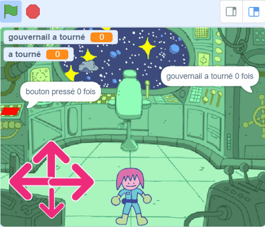
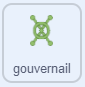

## L'énigme du gouvernail

<div style="display: flex; flex-wrap: wrap">
<div style="flex-basis: 200px; flex-grow: 1; margin-right: 15px;">
Dans cette étape, tu vas créer une énigme où un gouvernail doit être tourné.
</div>
<div>
{:width="300px"}
</div>
</div>

Les scripts pour cette énigme sont assez similaires à l'énigme du bouton, donc tu peux copier les scripts et les éditer.

--- task ---

Fais glisser les deux scripts que tu as créés pour le sprite **bouton** sur le sprite **gouvernail** pour les copier vers ce sprite.

--- /task ---

Le script `quand le drapeau est cliqué`{:class='block3events'} est le premier à devoir être changé.

--- task ---

Crée une nouvelle variable appelée `gouvernail a tourné`{:class="block3variables"}, et utilise cette variable au lieu de la variable `bouton pressé`{:class="block3variables"}.

**Choisis :** Change le numéro d'achèvement pour celui que tu veux. Nous avons choisi `3` dans l'exemple.



```blocks3
when flag clicked
+ set [handwheel turned v] to (0)
+ repeat until <(handwheel turned) = (3)>
+ say (join [handwheel turned] (join (handwheel turned) [times])
end
+ say [task complete] for (2) seconds
```

--- /task ---

Comme un vrai gouvernail, le sprite **gouvernail** ne pourra tourner que d'un petit nombre de degrés à la fois, donc l'angle qu'il a été tourné devra être mémorisé.

--- task ---

Crée une nouvelle variable appelée `a tourné`{:class="block3variables"} et mets-la à `0` lorsque le jeu démarre.


```blocks3
when flag clicked
+ set [turned v] to (0)
set [handwheel turned v] to (0)
repeat until <(handwheel turned) = (3)>
say (join [handwheel turned] (join (handwheel turned) [times])
end
say [task complete] for (2) seconds
```

--- /task ---

Maintenant tu peux éditer le script `quand ce sprite est cliqué `{:class="block3events"}, de sorte que lorsque le sprite **gouvernail** est cliqué à plusieurs reprises, il tourne un peu à chaque fois jusqu'à ce qu'il effectue une révolution complète. Quand il aura terminé le bon nombre de tours complets (`3` fois dans l’exemple), l'énigme sera résolue.

--- task ---

Ajoute des blocs pour que chaque fois que le sprite **gouvernail** est cliqué, il tourne de `15 ` degrés et la variable `a tourné`{:class="block3variables"} augmente de `15`.


```blocks3
when this sprite clicked
if <(distance to (Monet v)) < (50)> then
+ change [turned v] by (15) //Store the turnes of the wheel
+ turn cw (15) degrees
else
+ set [handwheel turned v] to (0)
```

--- /task ---

**Test**: Déplace le sprite **Monet** (ou ton sprite personnage) près du **gouvernail** et clique ensuite sur le sprite **gouvernail**. Cela aide d'être en mode plein écran, de sorte que tu ne peux pas faire glisser le sprite **gouvernail** autour.

Lorsque la variable `a tourné`{:class="block3variables"} atteint `360`, alors le gouvernail a été tourné une fois; ceci peut maintenant être mémorisé dans la variable `gouvernail a tourné`{:class="block3variables"}.

--- task ---

Utilise un `si`{:class="block3control"} **imbriqué** pour changer le `gouvernail a tourné`{:class="block3variables"} et réinitialiser les variables `a tourné`{:class="block3variables"}. Un `si`{:class="block3control"} **imbriqué** est lorsqu'un `si`{:class="block3control"} est placé à l'intérieur d'un autre.


```blocks3
when this sprite clicked
if <(distance to (Monet v)) < (50)> then
change [turned v] by (15)
turn cw (15) degrees
+ if <(turned) = (360)> then //The handwheel has turned a full circle
+ change [handwheel turned v] by (1) //Store the total number of turns
+ set [turned v] to (0) //Reset the angle that it has been turned
end
else
set [handwheel turned v] to (0)
```

--- /task ---

--- task ---

**Test :** Rapproche le sprite de ton personnage du gouvernail, puis clique dessus. Il se peut que tu doives ajuster la distance à laquelle le personnage doit se trouver par rapport au gouvernail.


```blocks3
<(distance to (Monet v)) < (150)>
```

--- /task ---

**Astuce**: Tu peux cliquer et faire glisser ton sprite **Monet** (ou ton personnage) autour, pour le rapprocher du gouvernail, par exemple. Cela te fera gagner du temps, car tu n'auras pas à utiliser les contrôles.

--- save ---
