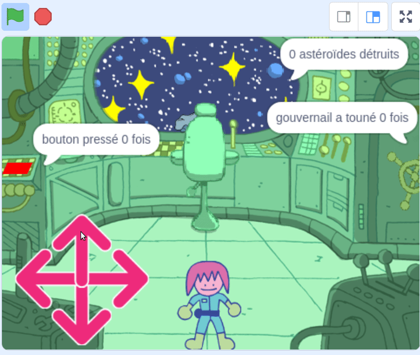
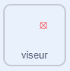
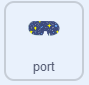

## L'énigme des astéroïdes

<div style="display: flex; flex-wrap: wrap">
<div style="flex-basis: 200px; flex-grow: 1; margin-right: 15px;">
Dans cette étape, tu vas créer l'énigme la plus difficile. Tu vas créer une énigme pour détruire des astéroïdes dangereux.
</div>
<div>
{:width="300px"}
</div>
</div>

Tu auras besoin d'un viseur que tu pourras utiliser pour cibler les astéroïdes.

--- task ---

Peins un nouveau sprite appelé **viseur**. Un exemple est montré ci-dessous, en utilisant un cercle et deux lignes. Rends le cercle solide initialement puis ajuste son **remplissage** à transparent, une fois que tu l'as dimensionné et positionné.


Redimensionne ton sprite **viseur** si tu en as besoin.

**Astuce**: Tu peux zoomer sur l'éditeur de peinture, en utilisant les symboles **+** et **-**, pour faciliter le positionnement, surtout si tu es sur un appareil mobile ou sur tablette.

--- /task ---

Le viseur suivra la souris, mais il ne devrait être visible à travers la fenêtre que dans l'espace.

--- task ---

Utilise les blocs suivants pour que le **viseur** suive le pointeur de souris.



```blocks3
when flag clicked
forever
go to (mouse-pointer v)
```

**Test :** Clique sur le drapeau vert et assure-toi que le **viseur** suit le pointeur de souris.

--- /task ---

Tu peux utiliser un bloc `si`{:class="block3control"} pour tester si le **viseur** touche le sprite **port**, de sorte qu'il soit caché quand il ne le touche **pas**.

--- task ---

Ajoute un test, pour t'assurer que le **viseur** touche le **port**.


```blocks3
when flag clicked
forever
+ show
go to (mouse-pointer v)
+ if <not <touching (port v) ?>> then //Only show the crosshair when the mouse is touching the port
hide
```

**Test :** Clique sur le drapeau vert et assure-toi que le **viseur** se cache quand il ne touche pas le **port**.

--- /task ---

Tu remarqueras peut-être que le viseur apparaît au bord même du **port** et semble donc être à l'intérieur du vaisseau spatial. Cela peut être corrigé en vérifiant qu'il ne touche pas une couleur de l'arrière-plan.

--- task ---

Ajoute un bloc `ou`{:class="block3operators"} au bloc `si`{:class="block3control"}. La seconde condition est si le **viseur** touche la couleur verte qui entoure le **port**.


```blocks3
when flag clicked
forever
show
go to (mouse-pointer v)
+ if <<not <touching (port v) ?>> or <touching color (#69B486) ?>> then //Also not touching the edge of the port
hide
```

**Astuce :** Comme le viseur suit le pointeur de souris, assure-toi d'arrêter ton projet avant d'utiliser le sélecteur de couleurs.

--- /task ---

Maintenant, il est temps de créer les astéroïdes.

--- task ---

Trouve un sprite **rochers** et ajoute-le à ton projet. Redimensionne le sprite pour qu'il ne soit pas trop grand.

--- /task ---

Tu as peut-être vu comment `mes blocs`{:class="block3myblocks"} aident à organiser le code dans le projet [Rover Nature](https://projects.raspberrypi.org/en/projects/nature-rover){:target="_blank"}.

`Mes blocs`{:class="block3myblocks"} aident aussi en faisant en sorte que tu n'aies pas à écrire le même code encore et encore. Tu peux utiliser `mes blocs`{:class="block3myblocks"} pour les **rochers** pour les placer dans le port du vaisseau spatial.

--- task ---

Crée un nouveau `bloc`{:class="block3myblocks"} et appelle-le `aller à la position`{:class="block3myblocks"}. La position de départ peut être n'importe où à l'écran.


```blocks3
define go to position
go to (random position v)
```

--- /task ---

Le sprite **rochers** doit continuer à trouver une position aléatoire jusqu'à ce qu'il touche le **port** `et`{:class="block3operators"} sans toucher au bord du **port**. Ceci est similaire au code que tu as utilisé sur le **viseur**, mais cette fois, tu utiliseras un bloc `et`{:class="block3operators"}.

--- task ---

Ajoute un bloc `répéter jusqu'à ce que`{:class="block3control"} et un bloc `et`{:class="block3operators"} pour s'assurer que les **rochers** continuent de bouger jusqu'à ce qu'ils soient dans la bonne position.


```blocks3
define go to position
go to (random position v)
+ repeat until <<touching (port v) ?> and <not <touching color (#69B486) ?>>
go to (random position v)

```

**Test :** Clique sur ton `mes blocs`{:class="block3myblocks"} et tu devrais voir le rocher se déplacer aléatoirement sur l'écran, jusqu'à ce qu'il s'arrête dans le port.

--- /task ---

Les **rochers** doivent être cachés de la vue au fur et à mesure qu'ils se déplacent, mais s'ils sont cachés, ils ne toucheront pas le **port**, donc un effet `fantôme`{:class="block3looks"} peut être utilisé pour les rendre invisibles.

--- task ---

Définis l'effet `fantôme`{:class="block3looks"} sur les **rochers** à `100` pendant que le sprite se déplace, puis efface l'effet graphique.


```blocks3
define go to position
go to (random position v)
repeat until <<touching (port v) ?> and <not <touching color (#69B486) ?>>
+ set [ghost v] effect to (100) //Hide the sprite
end
+ clear graphic effects
```

--- /task ---

La dernière partie est similaire aux autres énigmes. En utilisant une variable appelée `astéroïdes`{:class="block3variables"}, compte combien de fois le **viseur** touche les **Rochers**. Chaque fois que cela se produit, la variable astéroïde augmente et les **rochers** se déplacent vers une nouvelle position. Cela ne devrait fonctionner que si ton personnage est à la chaise.

--- task ---

Sur ton sprite **personnage**, crée une nouvelle variable appelée `à la chaise`{:class="block3variables"}, et mets le à `true` lorsque le personnage touche la chaise et `false` quand il ne l'est pas.


```blocks3
when flag clicked
set size to (60) %
go to x: (0) y: (-130)
+ forever //Check that Monet is at the chair
if <touching (chair v) ?> then
set [at chair v] to [true]
else
set [at chair v] to [false]
```

--- /task ---

--- task ---

Ajoute les blocs suivants au sprite **Rochers** à définir lorsque la tâche est terminée.


```blocks3
when flag clicked
set [asteroids v] to (0)
go to position ::custom
repeat until <(asteroids) = (10)> //10 asteroids have been destroyed
```

--- /task ---

--- task ---

Utilise un autre bloc `et`{:class="block3operators"} dans un bloc `si`{:class="block3control"} pour vérifier que le **viseur** touche le rocher et que la variable `à la chaise`{:class="block3variables"} est `vrai`.


```blocks3
when flag clicked
set [asteroids v] to (0)
go to position ::custom
+ repeat until <(asteroids) = (10)>
+ if <<(at chair) = [true]> and <touching (crosshair v)>> then //Monet is at chair and crosshair is touching asteroid
```

--- /task ---

--- task ---

Si la condition est remplie, alors la variable `astéroïdes`{:class="block3variables"} peut être augmentée de `1` et `mon bloc`{:class="block3custom"} peut être appelé de nouveau pour que les **rochers** se déplacent vers une nouvelle position.


```blocks3
when flag clicked
set [asteroids v] to (0)
go to position ::custom
repeat until <(asteroids) = (10)>
if <<(at chair) = [true]> and <touching (crosshair v)>> then
+ change [asteroids v] by (1) //Store the number of asteroids destroyed
+ go to position ::custom //Reset asteroid position
```

--- /task ---

La dernière chose à faire est de parler au joueur de la tâche. Cela peut être fait sur le sprite **port**.

--- task ---

Ajoute des blocs pour dire au joueur combien d'astéroïdes ont été détruits.



```blocks3
when flag clicked
go to x: (-15) y: (122)
repeat until <(asteroids) = (10)>
say (join (asteroids) [asteroids destroyed])
end
say [task completed] for (2) seconds
```

--- /task ---

--- task ---

**Test :** Déplace ton personnage près de la chaise, puis déplace le viseur et essaye de détruire quelques astéroïdes. Tu peux ensuite ajuster n'importe quelle valeurs dans ton code pour le faire fonctionner correctement selon les tailles de tes sprites.

--- /task ---

--- save ---


