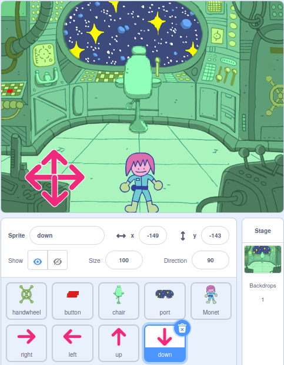

## पज़ल रूम (पहेली कक्ष) में कौन है?

<div style="display: flex; flex-wrap: wrap">
<div style="flex-basis: 200px; flex-grow: 1; margin-right: 15px;">
इस चरण में, आप पज़ल रूम में एक पात्र जोड़ेंगे, और उन्हें इधर-उधर घुमाने के लिए नियंत्रण बनाएंगे।
</div>
<div>
{:width="300px"}
</div>
</div>

--- task ---

[स्क्रैच स्टार्टर प्रोजेक्ट](https://scratch.mit.edu/projects/531567946/editor/){:target="_blank"} खोलें। Scratch दूसरे ब्राउज़र टैब में खुलेगा।

अगर आप ऑफलाइन काम कर रहे हैं, तो आप स्टार्टर प्रोजेक्ट को [rpf.io/p/en/puzzle-room](https://rpf.io/p/en/puzzle-room)पर डाउनलोड कर सकते हैं।

[[[working-offline]]]

--- /task ---

आपको एक अंतरिक्ष यान के अंदर से एक दृश्य दिखना चाहिए। तुम्हारे लिए बहुत से स्प्राइट्स बनाए गए हैं, और उनकी स्थिति सेट की गई है।

**चुनें:** अंतरिक्ष यान में कौन है? यह पृथ्वी से एक एकल मिशन हो सकता है, यह एक विदेशी अंतरिक्ष यान हो सकता है, या यह भविष्य में भी मौजूद हो सकता है जहां बिल्लियां दुनिया पर राज करती हैं।

आपके द्वारा बनाई जा रही पहेलियों के साथ बातचीत करने के लिए आपको एक चरित्र की आवश्यकता है।

--- task ---

अपने प्रोजेक्ट में एक नया स्प्राइट जोड़ें। इस उदाहरण में, आप **Monet** चरित्र देखेंगे।


--- /task ---

यदि आपका चरित्र दृश्य के लिए बहुत बड़ा या बहुत छोटा है, तो आपको उनका आकार बदलना चाहिए। आप चरित्र के लिए एक प्रारंभिक स्थिति भी चुन सकते हैं।

--- task ---

अपने चरित्र के आकार और प्रारंभिक स्थिति को सेट करने के लिए कोड जोड़ें।

--- /task ---

आपको अपने पात्र को इधर-उधर घुमाने में सक्षम बनाने के लिए ऑन-स्क्रीन नियंत्रणों की आवश्यकता होगी।

--- task ---

**arrow** स्प्राइट में से किसी एक का चयन करें। जब स्प्राइट पर क्लिक किया जाता है, तो उसे अपनी दिशा प्रसारित करनी चाहिए ताकि वह चरित्र को उस दिशा में ले जा सके।


```blocks3
when this sprite clicked
broadcast (right v) //Direction the arrow is pointing
```

--- /task ---

**सलाह:** यदि मोबाइल या टैबलेट का उपयोग करते वक्त **arrow** स्प्राइट्स पर क्लिक करना बहुत मुश्किल है, तो आप उनकी पोशाक बदल सकते हैं। प्रत्येक **arrow** स्प्राइट में एक बड़ा बैंगनी वृत्त भी होता है जिसका उपयोग इसके बजाय किया जा सकता है।

अब अपने मुख्य चरित्र को स्थानांतरित करने के लिए अधिक दिशा नियंत्रण जोड़ें।

--- task ---

**arrow** स्प्राइट को तीन बार डुप्लिकेट करें। फिर, प्रत्येक स्प्राइट के लिए, पोशाक बदलें ताकि यह एक अलग दिशा में इंगित करे।

प्रत्येक स्प्राइट का नाम उस दिशा में बदलें जो वह इंगित कर रहा है और `broadcast`{:class="block3events"} को उस दिशा में बदलें जो वह इंगित कर रहा है।

स्क्रीन के कोने में **arrow** स्प्राइट को व्यवस्थित करें।



--- /task ---

जब तीरों को दबाया जाता है तो आपके मुख्य चरित्र को चाहिए।

--- task ---

जब यह प्रसारण ग्रहण करता है तो अपने मुख्य चरित्र स्प्राइट को `left, right, up, and down`{:class="block3events"} स्थानांतरित करने के लिए कोड करें ।


```blocks3
when I receive [up v]
change y by (10)

when I receive [down v]
change y by (-10)

when I receive [right v]
change x by (10)

when I receive [left v]
change x by (-10)
```

--- /task ---

--- task ---

**परीक्षण:** हरे झंडे पर क्लिक करें और फिर अपने चरित्र को इधर-उधर करने के लिए तीरों पर क्लिक करें।

--- /task ---


--- save ---
