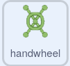

## हैंडव्हील पहेली

<div style="display: flex; flex-wrap: wrap">
<div style="flex-basis: 200px; flex-grow: 1; margin-right: 15px;">
इस चरण में, आप एक पहेली बनाएँगे जहाँ एक हाथ के पहिये को घुमाना होगा।
</div>
<div>
{:width="300px"}
</div>
</div>

इस पहेली की स्क्रिप्ट बटन पहेली से काफी मिलती-जुलती हैं, इसलिए आप उन स्क्रिप्ट को कॉपी कर सकते हैं और फिर उन्हें संपादित कर सकते हैं।

--- task ---

उन्हें उस स्प्राइट में कॉपी करने के लिए **button** स्प्राइट के लिए आपके द्वारा बनाई गई दो स्क्रिप्ट **handwheel** स्प्राइट पर खींचें।

--- /task ---

`when flag clicked`{:class='block3events'} स्क्रिप्ट वह पहली स्क्रिप्ट होती है जिसे बदलने की आवश्यकता होती है।

--- task ---

`handwheel turned`{:class="block3variables"} नामक एक नया वेरिएबल बनाएं और `button pressed`{:class="block3variables"} वेरिएबल के बजाय उस वेरिएबल का उपयोग करें।

**चुनें:** पूर्ति संख्या को आप जो चाहें उसमें बदलें। हमने उदाहरण में `3` चुना है।



```blocks3
when flag clicked
+ set [handwheel turned v] to (0)
+ repeat until <(handwheel turned) = (3)>
+ say (join [handwheel turned] (join (handwheel turned) [times])
end
+ say [task complete] for (2) seconds
```

--- /task ---

एक वास्तविक हैंडव्हील की तरह, **handwheel** स्प्राइट एक बार में केवल कुछ ही डिग्री मुड़ सकता है, इसलिए जिस कोण को घुमाया गया है उसे संग्रहीत करने की आवश्यकता होगी।

--- task ---

`turned`{:class="block3variables"} नामक एक नया वेरिएबल बनाएं और गेम शुरू होने पर इसे `0` पर सेट करें।


```blocks3
when flag clicked
+ set [turned v] to (0)
set [handwheel turned v] to (0)
repeat until <(handwheel turned) = (3)>
say (join [handwheel turned] (join (handwheel turned) [times])
end
say [task complete] for (2) seconds
```

--- /task ---

अब आप `when this sprite clicked`{:class="block3events"} स्क्रिप्ट को संपादित कर सकते हैं ताकि जब **handwheel** स्प्राइट को बार-बार क्लिक किया जाए तो यह हर बार एक छोटी राशि में मुड़ता है जब तक कि यह एक पूरे चक्कर को पूरा नहीं कर लेता। जब यह पूर्ण घुमावों की सही संख्या (उदहारण में `3` बार) पूरा कर लेता है, तो पहेली हल हो जाएगी।

--- task ---

ब्लॉक जोड़ें ताकि हर बार **handwheel** स्प्राइट पर क्लिक किया जाए, यह `15` डिग्री मुड़ जाये और ``{:class="block3variables"} वेरिएबल `15` बढ़ जाये।


```blocks3
when this sprite clicked
if <(distance to (Monet v)) < (50)> then
+ change [turned v] by (15) //Store the turnes of the wheel
+ turn cw (15) degrees
else
+ set [handwheel turned v] to (0)
```

--- /task ---

**परिक्षण **: **Monet** स्प्राइट (या आपका चरित्र स्प्राइट) को **handwheel** के पास ले जाएँ और फिर **हैंडव्हील** स्प्राइट पर क्लिक करें। फ़ुलस्क्रीन मोड में रहना मददगार होगा, ताकि आप **handwheel** स्प्राइट को इधर-उधर न खींच सकें।

जब `turned`{:class="block3variables"} वेरिएबल `360` तक पहुंच जाता है, तो हैंडव्हील को एक बार घुमा दिया गया है; इसे अब `handwheel turned`{:class="block3variables"} वेरिएबल में स्टोर किया जा सकता है।

--- task ---

`handwheel turned`{:class="block3variables"} को बदलने के लिए **nested** `if`{:class="block3control"} का उपयोग करें और `turned`{:class="block3variables"} वेरिएबल को रीसेट करें। एक **nested** `if`{:class="block3control"} तब होता है जब एक `if`{:class="block3control"} दूसरे के अंदर रखा जाता है।


```blocks3
when this sprite clicked
if <(distance to (Monet v)) < (50)> then
change [turned v] by (15)
turn cw (15) degrees
+ if <(turned) = (360)> then //The handwheel has turned a full circle
+ change [handwheel turned v] by (1) //Store the total number of turns
+ set [turned v] to (0) //Reset the angle that it has been turned
end
else
set [handwheel turned v] to (0)
```

--- /task ---

--- task ---

**परिक्षण:** अपने चरित्र स्प्राइट को हैंडव्हील के करीब ले जाएं और फिर उस पर क्लिक करें। आपको उस दूरी को समायोजित करना पड़ सकता है जो चरित्र की हैंडव्हील से होनी चाहिए।


```blocks3
<(distance to (Monet v)) < (150)>
```

--- /task ---

**सलाह:** आप **Monet** (या चरित्र) स्प्राइट को क्लिक करके खींच सकते हैं, उदाहरण के लिए, इसे हैंडव्हील के करीब लाने के लिए। इससे आपका समय बचेगा, क्योंकि आपको नियंत्रणों का उपयोग नहीं करना पड़ेगा।

--- save ---
