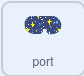

## क्षुद्रग्रह पहेली

<div style="display: flex; flex-wrap: wrap">
<div style="flex-basis: 200px; flex-grow: 1; margin-right: 15px;">
इस चरण में, आप सबसे चुनौतीपूर्ण पहेली बनाएंगे। आप खतरनाक क्षुद्रग्रहों को नष्ट करने के लिए एक पहेली तैयार करेंगे।
</div>
<div>
{:width="300px"}
</div>
</div>

आपको एक क्रॉसहेयर की आवश्यकता होगी जिसका उपयोग आप क्षुद्रग्रहों को लक्षित करने के लिए कर सकते हैं।

--- task ---

**crosshair** नामक एक नया स्प्राइट पेंट करें। एक वृत्त और दो पंक्तियों का उपयोग करते हुए जैसे की नीचे दिए गए उदाहरण में दिखाया गया है। प्रारंभ में वृत्त को ठोस बनाएं और फिर जब आप उसके आकार और स्थिति निर्धारण से संतुष्ट हो जाएँ तो उसके **fill** को पारदर्शी पर समयोजित करें


यदि आपको आवश्यकता हो तो **crosshair** स्प्राइट का आकार बदलें।

**सलाह**: स्थिति निर्धारण को आसान बनाने के लिए, विशेष रूप से यदि आप मोबाइल या टैबलेट डिवाइस पर हैं, तो आप **+** and **-** प्रतीकों का उपयोग करके पेंट संपादक पर ज़ूम इन कर सकते हैं।

--- /task ---

क्रॉसहेयर माउस का अनुसरण करेगा, लेकिन यह केवल खिड़की के माध्यम से अंतरिक्ष में दिखाई देना चाहिए।

--- task ---

निम्न ब्लॉक का उपयोग करें ताकि **crosshair** माउस-पॉइंटर का अनुसरण करे।


```blocks3
when flag clicked
forever
go to (mouse-pointer v)
```

**परिक्षण:** हरे झंडे पर क्लिक करें और सुनिश्चित करें कि **crosshair** माउस-पॉइंटर का अनुसरण करता है।

--- /task ---

आप एक `if`{:class="block3control"} ब्लॉक का उपयोग यह जांचने के लिए कर सकते हैं कि **crosshair** **port** स्प्राइट को छू रहा है या नहीं, ताकि जब यह **not** छू रहा हो तो यह छिपा हो।

--- task ---

एक परीक्षण जोड़ें, यह सुनिश्चित करने के लिए कि **crosshair** **port** को स्पर्श कर रहा है।


```blocks3
when flag clicked
forever
+ show
go to (mouse-pointer v)
+ if <not <touching (port v) ?>> then //क्रॉसहेयर केवल तभी दिखाएं जब चूहा पोर्ट को छू रहा हो
hide
```

**परिक्षण:** हरे झंडे पर क्लिक करें और सुनिश्चित करें कि **crosshair** छिप जाता है जब वह **port** को नहीं छू रहा हो।

--- /task ---

आपने ध्यान दिया होगा कि क्रॉसहेयर **port** के बिल्कुल किनारे पर दिखाई देता है और ऐसा प्रतीत होता है कि यह अंतरिक्ष यान के अंदर है। इसे यह जांच कर कि यह पृष्ठभूमि के रंग को स्पर्श नहीं कर रहा है, इसे ठीक किया जा सकता है।

--- task ---

एक `or`{:class="block3operators"} ब्लॉक को `if`{:class="block3control"} ब्लॉक में जोड़ें। दूसरी शर्त यह है कि यदि **crosshair** हरे रंग को छू रहा है जो **port** को घेरे हुए है।


```blocks3
when flag clicked
forever
show
go to (mouse-pointer v)
+ if <<not <touching (port v) ?>> or <touching color (#69B486) ?>> then //और तब भी जब पोर्ट के किनारों को नहीं छू रहा है
hide
```

**युक्ति:** चूंकि क्रॉसहेयर माउस-पॉइंटर का अनुसरण करता है, रंग पिकर का उपयोग करने से पहले सुनिश्चित करें कि आपने अपना प्रोजेक्ट रोक दिया है।

--- /task ---

अब क्षुद्रग्रहों को बनाने का समय आ गया है।

--- task ---

**Rocks** स्प्राइट ढूंढें और इसे अपने प्रोजेक्ट में जोड़ें। स्प्राइट का आकार बदलें ताकि यह बहुत बड़ा न हो।

--- /task ---

आपने देखा होगा कि कैसे `my blocks`{:class="block3myblocks"} [Nature rover project](https://projects.raspberrypi.org/hi-IN/projects/nature-rover){:target="_blank"} में कोड को व्यवस्थित रखने में मदद करते हैं।

`My blocks`{:class="block3myblocks"} भी इसे बनाने में मदद करता है ताकि आपको एक ही कोड को बार-बार न लिखना पड़े। आप `my blocks`{:class="block3myblocks"} का उपयोग **Rocks** को स्पेसशिप के पोर्ट में रखने के लिए कर सकते हैं ।

--- task ---

एक नया `block`{:class="block3myblocks"} बनाएं और इसे `go to position`{:class="block3myblocks"} का नाम दें । प्रारंभिक स्थिति स्क्रीन पर कहीं भी हो सकती है।


```blocks3
define go to position
go to (random position v)
```

--- /task ---

**Rocks** स्प्राइट को एक यादृच्छिक जगह खोजने की जरूरत है जब तक कि यह **port** `और`{:class="block3operators"} को छू रहा हो और **port** >के किनारे को न छू रहा हो। यह **crosshair** पर उपयोग किए गए कोड के समान है, लेकिन इस बार आप `and`{:class="block3operators"} ब्लॉक का उपयोग करेंगे।

--- task ---

एक `repeat until`{:class="block3control"} और एक `and`{:class="block3operators"} ब्लॉक जोड़ें यह सुनिश्चित करने के लिए कि **Rocks** तब तक चलते रहें जब तक कि वे सही स्थिति में न हों।


```blocks3
define go to position
go to (random position v)
+ repeat until <<touching (port v) ?> and <not <touching color (#69B486) ?>>
go to (random position v)

```

**परिक्षण:** `my blocks`{:class="block3myblocks"} डेफिनिशन पर क्लिक करें और आपको स्क्रीन के चारों ओर रॉक बेतरतीब ढंग से घूमते हुए दिखना चाहिए, जब तक कि वह पोर्ट में रुक न जाए।

--- /task ---

**Rocks** को दृश्य से छिपाने की आवश्यकता होती है, लेकिन यदि वे छिपे हुए हैं, तो वे **port** स्पर्श नहीं करेंगे, इसलिए एक `ghost`{:class="block3looks"} प्रभाव का उपयोग उन्हें अदृश्य करने के लिए किया जा सकता है ।

--- task ---

जब स्प्राइट हिल रहा तब **Rocks**> से `100` तक `ghost`{:class="block3looks"} इफेक्ट सेट करें और फिर ग्राफिकल इफेक्ट को क्लियर करें।


```blocks3
define go to position
go to (random position v)
repeat until <<touching (port v) ?> and <not <touching color (#69B486) ?>>
+ set [ghost v] effect to (100) //स्प्राइट को छिपाएँ
end
+ clear graphic effects
```

--- /task ---

अंतिम भाग अन्य पहेलियों के समान है। `asteroids`{:class="block3variables"} नामक एक वेरिएबल का उपयोग करते हुए गिनें की **crosshair** **Rocks** को कितनी बार छूता है। हर बार ऐसा होने पर, क्षुद्रग्रह वेरियबल बढ़ता है और **Rocks** एक नई जगह में चली जाती हैं। यह तभी काम करना चाहिए जब आपका चरित्र कुर्सी पर हो।

--- task ---

अपने **character** स्प्राइट पर, `at chair`{:class="block3variables"} नामक एक नया वेरिएबल बनाएं और इसे `true` सेट करें जब चरित्र कुर्सी को छू रहा हो और `false` जब वे नहीं छू रहा हो।


```blocks3
when flag clicked
set size to (60) %
go to x: (0) y: (-130)
+ forever //जांचें कि Monet कुर्सी पर है
if <touching (chair v) ?> then
set [at chair v] to [true]
else
set [at chair v] to [false]
```

--- /task ---

--- task ---

कार्य पूरा होने पर सेट करने के लिए निम्न ब्लॉकों को **Rocks** में जोड़ें ।


```blocks3
when flag clicked
set [asteroids v] to (0)
go to position ::custom
repeat until <(asteroids) = (10)> //10 क्षुद्रग्रहों को नष्ट कर दिया गया है
```

--- /task ---

--- task ---

एक अन्य `and`{:class="block3operators"} का प्रयोग `if`{:class="block3control"} ब्लॉक में करें यह देखने के लिए कि **crosshair** रॉक छू रहा है और `at chair`{:class="block3variables"} `true` को।


```blocks3
when flag clicked
set [asteroids v] to (0)
go to position ::custom
+ repeat until <(asteroids) = (10)>
+ if <<(at chair) = [true]> and <touching (crosshair v)>> then //Monet कुर्सी पर है और क्रॉसहेयर क्षुद्रग्रह को छू रहा है
```

--- /task ---

--- task ---

यदि शर्त पूरी हो गई है, तो `asteroids`{:class="block3variables"} वेरिएबल को `1` से बढ़ाया जा सकता है और `my ब्लॉक`{:class="block3custom"} को फिर से कॉल किया जा सकता है ताकि **Rocks** एक नई स्थिति में चले जाएँ।


```blocks3
when flag clicked
set [asteroids v] to (0)
go to position ::custom
repeat until <(asteroids) = (10)>
if <<(at chair) = [true]> and <touching (crosshair v)>> then
+ change [asteroids v] by (1) //नष्ट किए गए क्षुद्रग्रहों की संख्या को स्टोर करें
+ go to position ::custom //क्षुद्रग्रह की स्थिति रीसेट करें
```

--- /task ---

आखिरी काम खिलाड़ी को कार्य के बारे में बताना है। यह **port** स्प्राइट पर किया जा सकता है।

--- task ---

खिलाड़ी को यह बताने के लिए ब्लॉक जोड़ें कि कितने क्षुद्रग्रह नष्ट हो गए हैं।



```blocks3
when flag clicked
go to x: (-15) y: (122)
repeat until <(asteroids) = (10)>
say (join (asteroids) [asteroids destroyed])
end
say [task completed] for (2) seconds
```

--- /task ---

--- task ---

**परिक्षण:** अपने चरित्र को कुर्सी के पास ले जाएँ, फिर क्रॉसहेयर को इधर-उधर घुमाएँ और कुछ क्षुद्रग्रहों को नष्ट करने का प्रयास करें। फिर आप अपने कोड में किसी भी मान को समायोजित कर सकते हैं जो आपको अपने स्प्राइट आकार के लिए अच्छी तरह से काम करने के लिए आवश्यक है।

--- /task ---

--- save ---


