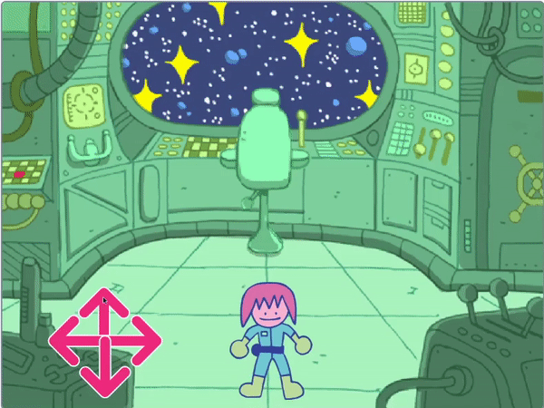

## ಪಝಲ್‌ ಕೊಠಡಿಯಲ್ಲಿ ಯಾರಿದ್ದಾರೆ?

<div style="display: flex; flex-wrap: wrap">
<div style="flex-basis: 200px; flex-grow: 1; margin-right: 15px;">
ಈ ಹಂತದಲ್ಲಿ, ನೀವು ಪಜಲ್ ಕೊಠಡಿಗೆ ಪಾತ್ರವನ್ನು ಸೇರಿಸುತ್ತೀರಿ ಮತ್ತು ಅವುಗಳನ್ನು ಸುತ್ತಲೂ ಚಲಿಸಲು ನಿಯಂತ್ರಣಗಳನ್ನು ರಚಿಸುತ್ತೀರಿ.
</div>
<div>
{:width="300px"}
</div>
</div>

--- task ---

[ Scratch ನ ಪ್ರಾರಂಭಿಕ ಪ್ರಾಜೆಕ್ಟ್](https://scratch.mit.edu/projects/531567946/editor/){:target="_blank"} ತೆರೆಯಿರಿ. Scratch ಇನ್ನೊಂದು ಬ್ರೌಸರ್ ಟ್ಯಾಬ್‌ನಲ್ಲಿ ತೆರೆಯುತ್ತದೆ.

ನೀವು ಆಫ್‌ಲೈನ್‌ನಲ್ಲಿ ಕೆಲಸ ಮಾಡುತ್ತಿದ್ದರೆ, ನೀವು ಪ್ರಾರಂಭಿಕ ಪ್ರಾಜೆಕ್ಟ್‌ನ್ನು [rpf.io/p/kn-IN/puzzle-room-go](https://rpf.io/p/kn-IN/puzzle-room-go)ರಲ್ಲಿ ಡೌನ್‌ಲೋಡ್ ಮಾಡಬಹುದು.

[[[working-offline]]]

--- /task ---

ನೀವು ಗಗನನೌಕೆಯ ಒಳಗಿನಿಂದ ಒಂದು ದೃಶ್ಯವನ್ನು ನೋಡಬೇಕು. ಹಲವಾರು ಸ್ಪ್ರೈಟ್‌ಗಳನ್ನು ನಿಮಗಾಗಿ ಮಾಡಲಾಗಿದೆ ಮತ್ತು ಅವುಗಳ ಸ್ಥಾನಗಳನ್ನು ಹೊಂದಿಸಲಾಗಿದೆ.

**ಆಯ್ಕೆ ಮಾಡಿಕೊಳ್ಳಿ:** ಗಗನನೌಕೆಯಲ್ಲಿ ಯಾರಿದ್ದಾರೆ? ಅದು ಭೂಮಿಯಿಂದ ಏಕವ್ಯಕ್ತಿ ಕಾರ್ಯಾಚರಣೆಯಾಗಿರಬಹುದು, ಅದು ಅನ್ಯಲೋಕದ ಗಗನನೌಕೆಯಾಗಿರಬಹುದು, ಅಥವಾ ಅದು ಮುಂದೆ ಬೆಕ್ಕುಗಳು ಜಗತ್ತನ್ನು ಆಳುವಾಗ ಅಸ್ತಿತ್ವಕ್ಕೆ ಬರುವುದಾಗಿರಬಹುದು.

ನೀವು ರಚಿಸುವ ಪಝಲ್‌ ಜೊತೆ ಸಂವಹನ ಮಾಡಲು ನಿಮಗೆ ಒಂದು ಪಾತ್ರ ಬೇಕಾಗುತ್ತದೆ.

--- task ---

ನಿಮ್ಮ ಪ್ರಾಜೆಕ್ಟ್‌ಗೆ ಹೊಸ ಸ್ಪ್ರೈಟ್‌ ಸೇರಿಸಿ. ಈ ಉದಾಹರಣೆಯಲ್ಲಿ, ನೀವು **Monet** ಪಾತ್ರವನ್ನು ನೋಡುತ್ತೀರಿ.


--- /task ---

ನಿಮ್ಮ ಪಾತ್ರವು ದೃಶ್ಯಕ್ಕೆ ತುಂಬಾ ದೊಡ್ಡದು ಅಥವಾ ಚಿಕ್ಕದು ಆಗಿದ್ದರೆ, ನೀವು ಅವುಗಳ ಗಾತ್ರವನ್ನು ಬದಲಾಯಿಸಬೇಕು. ನೀವು ಪಾತ್ರಕ್ಕೆ ಪ್ರಾರಂಭಿಕ ಸ್ಥಾನವನ್ನು ಸಹ ಆಯ್ಕೆ ಮಾಡಬಹುದು.

--- task ---

ನಿಮ್ಮ ಪಾತ್ರದ ಗಾತ್ರ ಮತ್ತು ಪ್ರಾರಂಭಿಕ ಸ್ಥಾನವನ್ನು ಹೊಂದಿಸಲು ಕೋಡ್‌ ಸೇರಿಸಿ.

--- /task ---

ನಿಮ್ಮ ಪಾತ್ರವನ್ನು ಸುತ್ತಲೂ ಚಲಿಸಲು ನಿಮಗೆ ಪರದೆಯ-ಮೇಲಿನ (ಆನ್‌-ಸ್ಕ್ರೀನ್) ನಿಯಂತ್ರಣಗಳು ಬೇಕು.

--- task ---

ಯಾವುದಾದರೊಂದು **arrow** ಸ್ಪ್ರೈಟ್‌ನ್ನು ಆಯ್ಕೆ ಮಾಡಿಕೊಳ್ಳಿ. ಸ್ಪ್ರೈಟ್‌ನ್ನು ಕ್ಲಿಕ್‌ ಮಾಡಿದಾಗ, ಅದು ತನ್ನ ದಿಕ್ಕನ್ನು ಪ್ರಸಾರ ಮಾಡಬೇಕು, ಅದರಿಂದ ಅದು ಪಾತ್ರವು ಅದೇ ದಿಕ್ಕಲ್ಲಿ ಚಲಿಸುವಂತೆ ಮಾಡಬಹುದು.


```blocks3
when this sprite clicked
broadcast (right v) //Direction the arrow is pointing
```

--- /task ---

**ಸಲಹೆ:** ಮೊಬೈಲ್‌ ಅಥವಾ ಟ್ಯಾಬ್ಲೆಟ್‌ ಉಪಯೋಗಿಸುವಾಗ **arrow** ಸ್ಪ್ರೈಟ್‌ಗಳ ಮೇಲೆ ಕ್ಲಿಕ್‌ ಮಾಡಲು ತುಂಬಾ ಕಷ್ಟವಾದರೆ, ಆಗ ನೀವು ಅವುಗಳ ಉಡುಪುಗಳನ್ನು ಬದಲಾಯಿಸಬಹುದು. ಪ್ರತಿಯೊಂದು **arrow** ಸ್ಪ್ರೈಟ್‌ ದೊಡ್ಡ್‌ ನೇರಳೆಬಣ್ಣದ ವೃತ್ತವನ್ನೂ ಸಹ ಹೊಂದಿದೆ, ಅದನ್ನೂ ಉಪಯೋಗಿಸಬಹುದು.

ಈಗ ನಿಮ್ಮ ಮುಖ್ಯ ಪಾತ್ರವನ್ನು ಚಲಿಸಲು ಇನ್ನಷ್ಟು ದಿಕ್ಕು ನಿಯಂತ್ರಣಗಳನ್ನು ಸೇರಿಸಿ.

--- task ---

**arrow** ಸ್ಪ್ರೈಟ್‌ನ್ನು ಮೂರು ಬಾರಿ ನಕಲು ಮಾಡಿ. ನಂತರ, ಪ್ರತಿಯೊಂದು ಸ್ಪ್ರೈಟ್‌ಗೆ, ಅವುಗಳು ಬೇರೆ ಬೇರೆ ದಿಕ್ಕನ್ನು ಸೂಚಿಸುವಂತೆ ಉಡುಪುಗಳನ್ನು ಬದಲಾಯಿಸಿ.

ಪ್ರತಿಯೊಂದು ಸ್ಪ್ರೈಟ್‌ನ ಹೆಸರನ್ನು ಅದು ಸೂಚಿಸುತ್ತಿರುವ ದಿಕ್ಕಿಗೆ ಬದಲಾಯಿಸಿ ಮತ್ತು `broadcast`{:class="block3events"} ನ್ನು ಅದು ಸೂಚಿಸುತ್ತಿರುವ ದಿಕ್ಕಿಗೆ ಬದಲಾಯಿಸಿ.

ಎಲ್ಲಾ **arrow** ಸ್ಪ್ರೈಟ್‌ಗಳನ್ನೂ ಪರದೆಯ ಮೂಲೆಯಲ್ಲಿ ಜೋಡಿಸಿ.


--- /task ---

ಬಾಣಗಳನ್ನು ಒತ್ತಿದಾಗ ನಿಮ್ಮ ಮುಖ್ಯ ಪಾತ್ರ ಚಲಿಸಬೇಕು.

--- task ---

ನಿಮ್ಮ ಮುಖ್ಯ ಪಾತ್ರದ ಸ್ಪ್ರೈಟ್‌ ಅದು `left, right, up, and down`{:class="block3events"} ಪ್ರಸಾರವನ್ನು ಸ್ವೀಕರಿಸಿದಾಗ ಅದು ಚಲಿಸಲು ಕೋಡ್‌ ಮಾಡಿ.


```blocks3
when I receive [up v]
change y by (10)

when I receive [down v]
change y by (-10)

when I receive [right v]
change x by (10)

when I receive [left v]
change x by (-10)
```

--- /task ---

--- task ---

**ಪರೀಕ್ಷೆ:** ಹಸಿರು ಬಾವುಟವನ್ನು ಕ್ಲಿಕ್‌ ಮಾಡಿ ಮತ್ತು ನಂತರ ನಿಮ್ಮ ಪಾತ್ರವನ್ನು ಸುತ್ತಲೂ ಚಲಿಸಲು ಬಾಣಗಳ ಮೇಲೆ ಕ್ಲಿಕ್‌ ಮಾಡಿ.

--- /task ---


--- save ---
