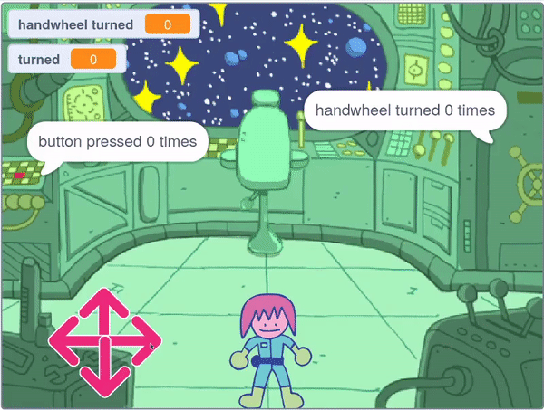

## ಕೈಚಕ್ರದ ಪಝಲ್

<div style="display: flex; flex-wrap: wrap">
<div style="flex-basis: 200px; flex-grow: 1; margin-right: 15px;">
ಈ ಹಂತದಲ್ಲಿ, ನೀವು ಕೈಚಕ್ರವನ್ನು ತಿರುಗಿಸಬೇಕಾದ ಪಝಲ್‌ನ್ನು ರಚಿಸುತ್ತೀರಿ.
</div>
<div>
{:width="300px"}
</div>
</div>

ಈ ಪಝಲ್‌ನ ಬರಹವು ಬಟನ್‌ ಪಝಲ್‌ನ ಬರಹಕ್ಕೆ ಸರಿಸುಮಾರು ಹೋಲುತ್ತದೆ, ನೀವು ಆ ಬರಹಗಳನ್ನು ನಕಲು ಮಾಡಿ ನಂತರ ಅವುಗಳನ್ನು ಎಡಿಟ್‌ ಮಾಡಬಹುದು.

--- task ---

ನೀವು **button** ಸ್ಪ್ರೈಟ್‌ಗೆ ರಚಿಸಿದ ಎರಡು ಬರಹಗಳನ್ನು ಆ ಸ್ಪ್ರೈಟ್‌ಗೆ ನಕಲು ಮಾಡಲು **handwheel** ಸ್ಪ್ರೈಟ್‌ ಮೇಲೆ ಎಳೆಯಿರಿ.

--- /task ---

`when flag clicked`{:class='block3events'} ಬರಹವೇ ಮೊದಲು ಬದಲಾಯಿಸಬೇಕಾದುದು.

--- task ---

`handwheel turned`{:class="block3variables"} ಎನ್ನುವ ಹೊಸ ವೇರಿಯೇಬಲ್‌ನ್ನು ರಚಿಸಿ, ಮತ್ತು ಆ ವೇರಿಯೇಬಲ್‌ನ್ನು `button pressed`{:class="block3variables"}ವೇರಿಯೆಬಲ್‌ ಬದಲಾಗಿ ಉಪಯೋಗಿಸಿ.

**ಆಯ್ಕೆ ಮಾಡಿ:** ಪೂರ್ಣಗೊಳಿಸುವಿಕೆಯ ಸಂಖ್ಯೆಯನ್ನು ನಿಮಗೆ ಯಾವುದು ಬೇಕೋ ಅದಕ್ಕೆ ಬದಲಾಯಿಸಿ. ನಾವು ಉದಾಃರಣೆಯಲ್ಲಿ `3` ಆಯ್ಕೆ ಮಾಡಿದ್ದೇವೆ.


```blocks3
when flag clicked
+ set [handwheel turned v] to (0)
+ repeat until <(handwheel turned) = (3)>
+ say (join [handwheel turned] (join (handwheel turned) [times])
end
+ say [task complete] for (2) seconds
```

--- /task ---

ನಿಜವಾದ ಕೈಚಕ್ರದಂತೆ, **handwheel** ಸ್ಪ್ರೈಟ್‌ ಒಮ್ಮೆ ಕಡಿಮೆ ಸಂಖ್ಯೆಯ ಡಿಗ್ರಿಗಳನ್ನು ಮಾತ್ರ ತಿರುಗಬಲ್ಲದು, ಆದುದರಿಂದ ಅದು ತಿರುಗಿದ ಕೋನವನ್ನು ಸಂಗ್ರಹಮಾಡಬೇಕು.

--- task ---

`turned`{:class="block3variables"} ಎನ್ನುವ ಹೊಸ ವೇರಿಯೇಬಲ್‌ನ್ನು ರಚಿಸಿ ಮತ್ತು ಆಟವು ಪ್ರಾರಂಭವಾದಾಗ ಅದನ್ನು `0` ಗೆ ಹೊಂದಿಸಿ.


```blocks3
when flag clicked
+ set [turned v] to (0)
set [handwheel turned v] to (0)
repeat until <(handwheel turned) = (3)>
say (join [handwheel turned] (join (handwheel turned) [times])
end
say [task complete] for (2) seconds
```

--- /task ---

ಈಗ ನೀವು `when this sprite clicked`{:class="block3events"} ಬರಹವನ್ನು ಎಡಿಟ್‌ ಮಾಡಹುದು, ಅದರಿಂದ **handwheel** ಸ್ಪ್ರೈಟ್‌ನ್ನು ಪದೆ ಪದೆ ಕ್ಲಿಕ್‌ ಮಾಡಿದಾಗ ಅದು ಒಂದು ಸಂಪೂರ್ಣ ಆವರ್ತನ ಮುಗಿಯುವವರೆಗೂ ಪ್ರತಿಬಾರಿ ಸ್ವಲ್ಪ ಪ್ರಮಾಣದಲ್ಲಿ ತಿರುಗುತ್ತದೆ. ಅದು ಸರಿಯಾದ ಸಂಖ್ಯೆಯ ಸಂಪೂರ್ಣ ಆವರ್ತನಗಳನ್ನು ಮುಗಿಸಿದಾಗ (`3` ಬಾರಿ ಈ ಉದಾಹರಣೆಯಲ್ಲಿ), ಪಝಲ್‌ ಪರಿಹಾರವಾಗುತ್ತದೆ.

--- task ---

ಪ್ರತಿಬಾರಿ **handwheel** ಸ್ಪ್ರೈಟ್‌ನ್ನು ಕ್ಲಿಕ್‌ ಮಾಡಿದಾಗ, ಅದು `15` ಡಿಗ್ರಿಗಳು ತಿರುಗುವಂತೆ ಮತ್ತು `turned`{:class="block3variables"} ವೇರಿಯೇಬಲ್‌ `15`ರಿಂದ ಹೆಚ್ಚಾಗುವಂತೆ ಬ್ಲಾಕ್‌ಗಳನ್ನು ಸೇರಿಸಿ.


```blocks3
when this sprite clicked
if <(distance to (Monet v)) < (50)> then
+ change [turned v] by (15) //Store the turnes of the wheel
+ turn cw (15) degrees
else
+ set [handwheel turned v] to (0)
```

--- /task ---

**ಪರೀಕ್ಷೆ**: **Monet** ಸ್ಪ್ರೈಟ್‌ನ್ನು (ಅಥವಾ ನಿಮ್ಮ ಪಾತ್ರದ ಸ್ಪ್ರೈಟ್‌ನ್ನು) **handwheel** ಗೆ ಹತ್ತಿರ ಚಲಿಸಿ ಮತ್ತು ನಂತರ **handwheel** ಸ್ಪ್ರೈಟ್‌ ಮೇಲೆ ಕ್ಲಿಕ್‌ ಮಾಡಿ. ಫುಲ್‌ಸ್ಕ್ರೀನ್‌ ಮೋಡ್‌ಲ್ಲಿರುವುದು ಸಹಾಯಕವಾಗುತ್ತದೆ, ಅದರಿಂದ ನೀವು **handwheel** ಸ್ಪ್ರೈಟ್‌ನ್ನು ಸುತ್ತಲೂ ಎಳೆಯಲು ಸಾಧ್ಯವಾಗುವುದಿಲ್ಲ.

`turned`{:class="block3variables"} ವೇರಿಯೇಬಲ್‌ `360` ತಲುಪಿದಾಗ, ಆಗ ಕೈಚಕ್ರವನ್ನು ಒಂದು ಬಾರಿ ತಿರುಗಿಸಲಾಗಿದೆ; ಇದನ್ನು ಈಗ `handwheel turned`{:class="block3variables"} ವೇರಿಯೇಬಲ್‌ನಲ್ಲಿ ಸಂಗ್ರಹಿಸಬಹುದು.

--- task ---

`handwheel turned`{:class="block3variables"} ನ್ನು ಬದಲಾಯಿಸಲು **nested** `if`{:class="block3control"} ಉಪಯೋಗಿಸಿ ಮತ್ತು `turned`{:class="block3variables"} ವೇರಿಯೇಬಲ್‌ನ್ನು ಮರುಹೊಂದಿಸಿ. **nested** `if`{:class="block3control"} ಎಂದರೆ `if`{:class="block3control"}ನ್ನು ಒಂದನ್ನು ಇನ್ನೊಂದರ ಒಳಗೆ ಇರಿಸುವುದು.


```blocks3
when this sprite clicked
if <(distance to (Monet v)) < (50)> then
change [turned v] by (15)
turn cw (15) degrees
+ if <(turned) = (360)> then //The handwheel has turned a full circle
+ change [handwheel turned v] by (1) //Store the total number of turns
+ set [turned v] to (0) //Reset the angle that it has been turned
end
else
set [handwheel turned v] to (0)
```

--- /task ---

--- task ---

**ಪರೀಕ್ಷೆ:** ನಿಮ್ಮ ಪಾತ್ರದ ಸ್ಪ್ರೈಟ್‌ನ್ನು ಕೈಚಕ್ರದ ಹತ್ತಿರ ಚಲಿಸಿ ಮತ್ತು ನಂತರ ಅದರ ಮೇಲೆ ಕ್ಲಿಕ್‌ ಮಾಡಿ. ಪಾತ್ರವು ಕೈಚಕ್ರದಿಂದ ಇರಬೇಕಾದ ದೂರವನ್ನು ನೀವು ಹೊಂದಿಸಬೇಕಾಗಬಹುದು.


```blocks3
<(distance to (Monet v)) < (150)>
```

--- /task ---

**ಸಲಹೆ**: ಉದಾಃರಣೆಗೆ ನೀವು ನಿಮ್ಮ **Monet** (ಅಥವಾ ಪಾತ್ರ) ಸ್ಪ್ರೈಟ್‌ನ್ನು ಕೈಚಕ್ರಕ್ಕೆ ಹತ್ತಿರ ತರಲು ಅದನ್ನು ಕ್ಲಿಕ್‌ ಮಾಡಿ ಸುತ್ತಲೂ ಎಳೆಯಬಹುದು. ಇದು ನಿಮ್ಮ ಸಮಯವನ್ನು ಉಳಿಸುತ್ತದೆ, ಏಕೆಂದರೆ ನೀವು ನಿಯಂತ್ರಣಗಳನ್ನು ಉಪಯೋಗಿಸುತ್ತಲೇ ಇರಬೇಕಾಗಿಲ್ಲ.

--- save ---
