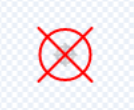

## ಕ್ಷುದ್ರಗ್ರಹಗಳ ಪಝಲ್

<div style="display: flex; flex-wrap: wrap">
<div style="flex-basis: 200px; flex-grow: 1; margin-right: 15px;">
ಈ ಹಂತದಲ್ಲಿ, ನೀವು ಅತ್ಯಂತ ಸವಾಲಿನ ಪಝಲ್‌ ರಚಿಸುತ್ತೀರಿ. ನೀವು ಅಪಾಯಕಾರಿ ಕ್ಷುದ್ರಗ್ರಹಗಳನ್ನು ನಾಶಮಾಡಲು ಪಝಲ್‌ ರಚಿಸುತ್ತೀರಿ.
</div>
<div>
{:width="300px"}
</div>
</div>

ನೀವು ಕ್ಷುದ್ರಗ್ರಹಗಳಿಗೆ ಗುರಿ ಇಡಲು ನಿಮಗೆ ಒಂದು ಕ್ರಾಸ್‌ಹೇರ್‌ ಬೇಕಾಗುತ್ತದೆ.

--- task ---

**crosshair** ಎನ್ನುವ ಹೊಸ ಸ್ಪ್ರೈಟ್‌ಗೆ ಬಣ್ಣಹಚ್ಚಿ. ಒಂದು ವೃತ್ತ ಮತ್ತು ಎರಡು ಗೆರೆಗಳನ್ನು ಉಪಯೋಗಿಸಿ, ಒಂದು ಉದಾಹರಣೆಯನ್ನು ಇಲ್ಲಿ ತೋರಿಸಲಾಗಿದೆ. ಪ್ರಾರಂಭದಲ್ಲಿ ವೃತ್ತವನ್ನು ಘನವಾಗಿಸಿ ಮತ್ತು ನಂತರ ಒಮ್ಮೆ ನೀವು ಅದರ ಗಾತ್ರವನ್ನು ಸರಿಪಡಿಸಿ ಸರಿಯಾದ ಸ್ಥಾನದಲ್ಲಿರಿಸಿದ ನಂತರ ಅದರ **fill** ನ್ನು ಪಾರದರ್ಶಕಕ್ಕೆ ಹೊಂದಿಸಿ.



ನಿಮಗೆ ಬೇಕಾದಲ್ಲಿ ನಿಮ್ಮ **crosshair** ಸ್ಪ್ರೈಟ್‌ನ ಗಾತ್ರವನ್ನು ಮರುಹೊಂದಿಸಿ.

**ಸಲಹೆ**: ಪೇಂಟ್‌ ಎಡಿಟರ್‌ನ್ನು ಝೂಮ್‌ ಮಾಡಬಹುದು, ವಿಶೇಷವಾಗಿ ನೀವು ಮೊಬೈಲ್‌ ಅಥವಾ ಟ್ಯಾಬ್ಲೆಟ್‌ ಉಪಕರಣ ಉಪಯೋಗಿಸುತ್ತಿದ್ದರೆ, **+** ಮತ್ತು **-** ಸಂಕೇತಗಳನ್ನು ಉಪಯೋಗಿಸುವುದು, ಸರಿಯಾದ ಸ್ಥಾನದಲ್ಲಿಡಲು ಸುಭವಾಗುತ್ತದೆ.

--- /task ---

ಕ್ರಾಸ್‌ಹೇರ್‌ ಮೌಸ್‌ನ್ನು ಅನುಸರಿಸುತ್ತದೆ, ಆದರೆ ಅದು ಬಾಹ್ಯಾಕಾಶದಲ್ಲಿ ಕಿಟಕಿಯ ಮೂಲಕ ಮಾತ್ರ ಕಾಣಿಸಬೇಕು.

--- task ---

**crosshair** ಮೌಸ್‌ ಪಾಯಿಂಟರ್‌ನ್ನು ಅನುಸರಿಸುವಂತೆ ಮಾಡಲು ಈ ಕೆಳಗಿನ ಬ್ಲಾಕ್‌ಗಳನ್ನು ಉಪಯೋಗಿಸಿ.


```blocks3
when flag clicked
forever
go to (mouse-pointer v)
```

**ಪರೀಕ್ಷೆ:** ಹಸಿರು ಬಾವುಟವನ್ನು ಕ್ಲಿಕ್‌ ಮಾಡಿ ಮತ್ತು **crosshair** ಮೌಸ್-ಪಾಯಿಂಟರ್‌ನ್ನು ಅನುಸರಿಸುತ್ತಿದೆಯೇ ಎಂದು ಖಚಿತಪಡಿಸಿಕೊಳ್ಳಿ.

--- /task ---

ನೀವು **crosshair**, **port** ಸ್ಪ್ರೈಟ್‌ನ್ನು ಸ್ಪರ್ಶಿಸುತ್ತಿದೆಯೇ ಎಂದು ಪರೀಕ್ಷಿಸಲು `if`{:class="block3control"} ಬ್ಲಾಕ್‌ನ್ನು ಉಪಯೋಗಿಸಬಹುದು, ಅದರಿಂದ ಅದು ಅದನ್ನು ಸ್ಪರ್ಶಿಸುತ್ತ **ಇಲ್ಲ**ದಾಗ ಅದು ಮರೆಯಾಗಿರಬಹುದು.

--- task ---

**crosshair** **port**ನ್ನು ಸ್ಪರ್ಶಿಸುತ್ತಿದೆ ಎಂದು ಖಚಿತಪಡಿಸಿಕೊಳ್ಳಲು, ಪರೀಕ್ಷೆಯನ್ನು ಸೇರಿಸಿ.


```blocks3
when flag clicked
forever
+ show
go to (mouse-pointer v)
+ if <not <touching (port v) ?>> then //ಮೌಸ್‌ ಪೋರ್ಟ್‌ನ್ನು ಸ್ಪರ್ಶಿಸುತ್ತಿರುವಾಗ ಕ್ರಾಸ್‌ಹೇರ್‌ನ್ನು ಮಾತ್ರ ತೋರಿಸಿ
hide
```

**ಪರೀಕ್ಷೆ:** ಹಸಿರು ಬಾವುಟವನ್ನು ಕ್ಲಿಕ್‌ ಮಾಡಿ ಮತ್ತು **crosshair**, **port** ನ್ನು ಸ್ಪರ್ಶಿಸುತ್ತಿಲ್ಲದಾಗ ಅದು ಮರೆಯಾಗುತ್ತದೆ ಎಂದು ಖಚಿತಪಡಿಸಿಕೊಳ್ಳಿ.

--- /task ---

ಕ್ರಾಸ್‌ಹೇರ್‌ **port**ನ ತುಂಬಾ ಅಂಚಿನಲ್ಲಿ ಕಾಣಿಸುವುದನ್ನು ಮತ್ತು ಅದರಿಂದ ಅದು ಗಗನನೌಕೆಯ ಒಳಗಿರುವಂತೆ ಕಾಣಿಸುವುದನ್ನು ನೀವು ಗಮನಿಸಬಹುದು. ಅದು ಹಿನ್ನೆಲೆಯ ಬಣ್ಣವನ್ನು ಸ್ಪರ್ಶಿಸುತ್ತಿಲ್ಲ ಎಂಬುವುದನ್ನು ಪರಿಶೀಲಿಸಿ ಅದನ್ನು ಸರಿಪಡಿಸಬಹುದು.

--- task ---

`or`{:class="block3operators"} ಬ್ಲಾಕ್‌ನ್ನು `if`{:class="block3control"} ಬ್ಲಾಕ್‌ಗೆ ಸೇರಿಸಿ. ಎರಡನೆಯ ಷರತ್ತು **crosshair** **port** ನ್ನು ಸುತ್ತುವರಿದಿರುವ ಹಸಿರು ಬಣ್ಣವನ್ನು ಸ್ಪರ್ಶಿಸುತ್ತಿದ್ದರೆ.


```blocks3
when flag clicked
forever
show
go to (mouse-pointer v)
+ if <<not <touching (port v) ?>> or <touching color (#69B486) ?>> then //ಪೋರ್ಟ್‌ನ ಅಂಚನ್ನು ಸ್ಪರ್ಶಿಸುವುದಿಲ್ಲ
hide
```

**ಸಲಹೆ:** ಕ್ರಾಸ್‌ಹೇರ್‌ ಮೌಸ್‌-ಪಾಯಿಂಟರ್‌ನ್ನು ಅನುಸರಿಸುವುದರಿಂದ, ಕಲರ್‌ ಪಿಕ್ಕರ್‌ನ್ನು ಉಪಯೋಗಿಸುವ ಮೊದಲು ನಿಮ್ಮ ಪ್ರಾಜೆಕ್ಟ್‌ನ್ನು ನಿಲ್ಲಿಸಲು ಮರೆಯಬೇಡಿ.

--- /task ---

ಈಗ ಕ್ಷುದ್ರಗ್ರಹಗಳನ್ನು ರಚಿಸುವ ಸಮಯ.

--- task ---

**Rocks** ಸ್ಪ್ರೈಟ್‌ನ್ನು ಪತ್ತೆ ಮಾಡಿ ಮತ್ತು ಅದನ್ನು ನಿಮ್ಮ ಪ್ರಾಜೆಕ್ಟ್‌ಗೆ ಸೇರಿಸಿ. ಸ್ಪ್ರೈಟ್‌ ತುಂಬಾ ದೊಡ್ಡದಾಗಿಲ್ಲದಂತೆ ಅದರ ಗಾತ್ರವನ್ನು ಮರುಹೊಂದಿಸಿ.

--- /task ---

`my blocks`{:class="block3myblocks"} ಹೇಗೆ ಕೋಡ್‌ಗಳನ್ನು ಅಚ್ಚುಕಟ್ಟಾಗಿ ಜೋಡಿಸಲು ಸಹಾಯಮಾಡುತ್ತದೆ ಎಂದು ನೀವು [Nature rover project](https://projects.raspberrypi.org/kn-IN/projects/nature-rover){:target="_blank"} ನಲ್ಲಿ ನೋಡಿರಬಹುದು.

ಆ ರೀತಿ ಮಾಡಿ `My blocks`{:class="block3myblocks"} ಒಂದೇ ಕೋಡ್‌ನ್ನು ಪದೆ ಪದೆ ಬರೆಯುವುದನ್ನು ತಪ್ಪಿಸಿಯೂ ಸಹ ಸಹಾಯಮಾಡುತ್ತದೆ. **Rocks**ಗಳಿಗೆ ಗಗನನೌಕೆಯ ಪೋರ್ಟ್‌ನಲ್ಲಿ ಸ್ಥಾನ ನೀಡಲು `my blocks`{:class="block3myblocks"} ನ್ನು ನೀವು ಉಪಯೋಗಿಸಬಹುದು.

--- task ---

ಹೊಸ `block`{:class="block3myblocks"} ನ್ನು ರಚಿಸಿ ಮತ್ತು ಅದನ್ನು `go to position`{:class="block3myblocks"} ಎಂದು ಕರೆಯಿರಿ. ಪ್ರಾರಂಭಿಕ ಸ್ಥಾನವು ಪರದೆಯ ಮೇಲೆ ಎಲ್ಲಿಯಾದರೂ ಅಗಬಹುದು.


```blocks3
define go to position
go to (random position v)
```

--- /task ---

**Rocks** ಸ್ಪ್ರೈಟ್‌ ಅದು **port** `and`{:class="block3operators"} ನ್ನು ಸ್ಪರ್ಶಿಸುತ್ತಿರುವವರೆಗೆ ಮತ್ತು **port** ನ ಅಂಚನ್ನು ಸ್ಪರ್ಶಿಸುತ್ತಿಲ್ಲದವರೆಗೆ ಯಾದೃಚ್ಛಿಕ ಸ್ಥಾನವನ್ನು ಕಂಡುಕೊಳ್ಳುತ್ತಲೇ ಇರಬೇಕು. ಇದು ನೀವು **crosshair** ನಲ್ಲಿ ಉಪಯೋಗಿಸಿದ ಕೋಡ್‌ನ್ನು ಹೋಲುತ್ತದೆ, ಆದರೆ ಈ ಬಾರಿ ನೀವು `and`{:class="block3operators"} ಬ್ಲಾಕ್‌ ಉಪಯೋಗಿಸುತ್ತೀರಿ.

--- task ---

**Rocks** ಗಳು ಅವುಗಳು ಸರಿಯಾದ ಸ್ಥಾನದಲ್ಲಿರುವವರೆಗೆ ಚಲಿಸುತ್ತಲೇ ಇರುವುದನ್ನು ಖಚಿತಪಡಿಸಿಕೊಳ್ಳಲು `repeat until`{:class="block3control"} ಮತ್ತು `and`{:class="block3operators"} ಬ್ಲಾಕ್‌ನ್ನು ಸೇರಿಸಿ.


```blocks3
define go to position
go to (random position v)
+ repeat until <<touching (port v) ?> and <not <touching color (#69B486) ?>>
go to (random position v)

```

**ಪರೀಕ್ಷೆ:** ನಿಮ್ಮ `my blocks`{:class="block3myblocks"} ವ್ಯಾಖ್ಯಾನದ ಮೇಲೆ ಕ್ಲಿಕ್‌ ಮಾಡಿ ಮತ್ತು ರಾಕ್‌ ಪೋರ್ಟ್‌ನಲ್ಲಿ ನಿಲ್ಲುವವೆರೆಗೆ ಯಾದೃಚ್ಛಿಕವಾಗಿ ಪರದೆಯ ಮೇಲೆ ಚಲಿಸುವುದನ್ನು ನೀವು ನೋಡಬೇಕು.

--- /task ---

**Rocks** ಗಳನ್ನು ಅವುಗಳು ಚಲಿಸುತ್ತಿರುವಾಗ ವೀಕ್ಷಣೆಯಿಂದ ಮರೆಮಾಡಬೇಕು, ಆದರೆ ಅವುಗಳನ್ನು ಮರೆಮಾಡಿದರೆ, ಅವುಗಳು **port**ನ್ನು ಸ್ಪರ್ಶಿಸುತ್ತಿರುವುದಿಲ್ಲ, ಆದುದರಿಂದ `ghost`{:class="block3looks"} ಪರಿಣಾಮವನ್ನು ಅವುಗಳು ಕಾಣಿಸುವಂತೆ ಮಾಡಲು ಉಪಯೋಗಿಸಬಹುದು.

--- task ---

ಸ್ಪ್ರೈಟ್‌ ಚಲಿಸುತ್ತಿರುವಾಗ **Rocks**ಗಳ ಮೇಲಿನ `ghost`{:class="block3looks"} ಪರಿಣಾಮವನ್ನು `100`ಕ್ಕೆ ಹೊಂದಿಸಿ, ಮತ್ತು ನಂತರ ಗ್ರಾಫಿಕಲ್‌ ಪರಿಣಾಮವನ್ನು ತೆಗೆಯಿರಿ.


```blocks3
define go to position
go to (random position v)
repeat until <<touching (port v) ?> and <not <touching color (#69B486) ?>>
+ set [ghost v] effect to (100) //ಸ್ಪ್ರೈಟ್‌ನ್ನು ಮರೆಮಾಡಿ
end
+ clear graphic effects
```

--- /task ---

ಕೊನೆಯ ಭಾಗವು ಉಳಿದ ಪಝಲ್‌ಗಳನ್ನು ಹೋಲುತ್ತದೆ. `asteroids`{:class="block3variables"} ಎನ್ನುವ ವೇರಿಯೇಬಲ್‌ನ್ನು ಉಪಯೋಗಿಸಿ, **crosshair** **Rocks** ನ್ನು ಎಷ್ಟು ಬಾರಿ ಸ್ಪರ್ಶಿಸುತ್ತದೆ ಎಂದು ಎಣಿಸಿ. ಪ್ರತಿಬಾರಿ ಅದು ಮಾಡಿದಾಗ, ಕ್ಷುದ್ರಗ್ರಹ ವೇರಿಯೇಬಲ್‌ ಹೆಚ್ಚುತ್ತದೆ ಮತ್ತು **Rocks** ಹೊಸ ಸ್ಥಾನಕ್ಕೆ ಚಲಿಸುತ್ತದೆ. ನಿಮ್ಮ ಪಾತ್ರವು ಕುರ್ಚಿಯಲ್ಲಿದ್ದರೆ ಮಾತ್ರ ಇದು ಕಾರ್ಯನಿರ್ವಹಿಸಬೇಕು.

--- task ---

ನಿಮ್ಮ **character** ಸ್ಪ್ರೈಟ್‌ ಮೇಲೆ, `at chair`{:class="block3variables"} ಎನ್ನುವ ಹೊಸ ವೇರಿಯೇಬಲ್‌ನ್ನು ರಚಿಸಿ, ಮತ್ತು ಅದನ್ನು ಪಾತ್ರವು ಕುರ್ಚಿಯನ್ನು ಸ್ಪರ್ಶಿಸುತ್ತಿರುವಾಗ `true` ಎಂದು ಮತ್ತು ಸ್ಪರ್ಶಿಸುತ್ತಿಲ್ಲದಿರುವಾಗ `false` ಎಂದು ಹೊಂದಿಸಿ.


```blocks3
when flag clicked
set size to (60) %
go to x: (0) y: (-130)
+ forever //Monet ಕುರ್ಚಿಯ ಮೇಲಿದೆ ಎಂದು ಪರಿಶೀಲಿಸಿ
if <touching (chair v) ?> then
set [at chair v] to [true]
else
set [at chair v] to [false]
```

--- /task ---

--- task ---

ಕಾರ್ಯವು ಪೂರ್ಣಗೊಂಡಾಗ ಹೊಂದಿಸಲು **Rocks** ಸ್ಪ್ರೈಟ್‌ಗೆ ಈ ಕೆಳಗಿನ ಬ್ಲಾಕ್‌ಗಳನ್ನು ಸೇರಿಸಿ.


```blocks3
when flag clicked
set [asteroids v] to (0)
go to position ::custom
repeat until <(asteroids) = (10)> //10 ಕ್ಷುದ್ರಗ್ರಹಗಳನ್ನು ನಾಶಪಡಿಸಲಾಗಿದೆ
```

--- /task ---

--- task ---

**crosshair** ರಾಕ್‌ನ್ನು ಸ್ಪರ್ಶಿಸುತ್ತಿದೆ ಮತ್ತು `at chair`{:class="block3variables"} ವೇರಿಯೇಬಲ್‌ `true` ಆಗಿದೆ ಎಂದು ಪರಿಶೀಲಿಸಲು ಇನ್ನೊಂದು `and`{:class="block3operators"} ಬ್ಲಾಕ್‌ನ್ನು `if`{:class="block3control"} ಬ್ಲಾಕ್‌ ಒಳಗೆ ಉಪಯೋಗಿಸಿ.


```blocks3
when flag clicked
set [asteroids v] to (0)
go to position ::custom
+ repeat until <(asteroids) = (10)>
+ if <<(at chair) = [true]> and <touching (crosshair v)>> then //Monet ಕುರ್ಚಿಯ ಮೇಲಿದೆ ಮತ್ತು ಕ್ರಾಸ್‌ಹೇರ್‌ ಕ್ಷುದ್ರಗ್ರಹವನ್ನು ಸ್ಪರ್ಶಿಸುತ್ತಿದೆ
```

--- /task ---

--- task ---

ಷರತ್ತು ಪೂರೈಕೆಯಾಗಿದ್ದರೆ, ಆಗ `asteroids`{:class="block3variables"} ವೇರಿಯೇಬಲ್‌ನ್ನು `1` ರಷ್ಟು ಹೆಚ್ಚಿಸಬಹುದು ಮತ್ತು **Rocks** ಹೊಸ ಸ್ಥಾನಕ್ಕೆ ಚಲಿಸಲು `my block`{:class="block3custom"} ನ್ನು ಮತ್ತೆ ಆಹ್ವಾನಿಸಬಹುದು.


```blocks3
when flag clicked
set [asteroids v] to (0)
go to position ::custom
repeat until <(asteroids) = (10)>
if <<(at chair) = [true]> and <touching (crosshair v)>> then
+ change [asteroids v] by (1) //ನಾಶಪಡಿಸಿದ ಕ್ಷುದ್ರಗ್ರಹಗಳ ಸಂಖ್ಯೆಯನ್ನು ಸಂಗ್ರಹಿಸಿ
+ go to position ::custom //ಕ್ಷುದರಗ್ರಹದ ಸ್ಥಾನವನ್ನು ಮರುಹೊಂದಿಸಿ
```

--- /task ---

ಕೊನೆಯದಾಗಿ ಮಾಡಬೇಕಾಗಿರುವುದು ಆಟಗಾರನಿಗೆ ಕಾರ್ಯದ ಬಗೆಗೆ ಹೇಳುವುದು. ಇದನ್ನು **port** ಸ್ಪ್ರೈಟ್‌ ಮೇಲೆ ಮಾಡಬಹುದು.

--- task ---

ಎಷ್ಟು ಕ್ಷುದ್ರಗ್ರಹಗಳನ್ನು ನಾಶಪಡಿಸಲಾಗಿದೆ ಎಂದು ಆಟಗಾರನಿಗೆ ಹೇಳಲು ಬ್ಲಾಕ್‌ಗಳನ್ನು ಸೇರಿಸಿ.


```blocks3
when flag clicked
go to x: (-15) y: (122)
repeat until <(asteroids) = (10)>
say (join (asteroids) [asteroids destroyed])
end
say [task completed] for (2) seconds
```

--- /task ---

--- task ---

**ಪರೀಕ್ಷೆ:** ನಿಮ್ಮ ಪಾತ್ರವನ್ನು ಕುರ್ಚಿಗೆ ಹತ್ತಿರ ಚಲಿಸಿ, ನಂತರ ಕ್ರಾಸ್‌ಹೇರ್‌ನ್ನು ಸುತ್ತಲೂ ಚಲಿಸಿ ಕೆಲವು ಕ್ಷುದ್ರಗ್ರಹಗಳನ್ನು ನಾಶಪಡಿಸಲು ಪ್ರಯತ್ನಿಸಿ. ನಿಮ್ಮ ಸ್ಪ್ರೈಟ್‌ ಗಾತ್ರಗಳಿಗೆ ಉತ್ತಮವಾಗಿ ಕಾರ್ಯನಿರ್ವಹಿಸುವಂತೆ ಮಾಡಲು ನಿಮಗೆ ಬೇಕಾದ ಮೌಲ್ಯಗಳನ್ನು ನಿಮ್ಮ ಕೋಡ್‌ನಲ್ಲಿ ನೀವು ಹೊಂದಿಸಬಹುದು.

--- /task ---

--- save ---


