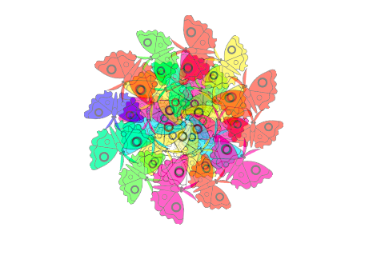

## ಮುಂದೆ ಏನು?

ನೀವು [Further Scratch](https://projects.raspberrypi.org/en/pathways/further-scratch) ಮಾರ್ಗವನ್ನು ಅನುಸರಿಸುತ್ತಿದ್ದರೆ, ನೀವು [Mandala](https://projects.raspberrypi.org/en/projects/mandala) ಪ್ರಾಜೆಕ್ಟ್‌ಗೆ ಹೋಗಬಹುದು. ಈ ಪ್ರಾಜೆಕ್ಟ್‌ನಲ್ಲಿ, ನೀವು ಕಂಪ್ಯೂಟರ್‌ನಿಂದ ರಚಿತವಾಗುವ ಮಂಡಲಗಳನ್ನು ಮಾಡುವಿರಿ.

--- print-only ---

--- /print-only ---

--- no-print ---

  <iframe allowtransparency="true" width="485" height="402" src="https://scratch.mit.edu/projects/embed/536953224/?autostart=false" frameborder="0"></iframe>

--- /no-print ---

ನೀವು Scratch ನ್ನು ಇನ್ನೂ ಅನ್ವೇಷಿಸಿ ಆನಂದಿಸುವುದಾಧರೆ [ಈ ಪ್ರಾಜೆಕ್ಟ್‌ಗಳ](https://projects.raspberrypi.org/en/projects?software%5B%5D=scratch&curriculum%5B%5D=%201)ಲ್ಲಿ ಯಾವುದಾದರೂ ಪ್ರಯತ್ನಿಸಬಹುದು.
