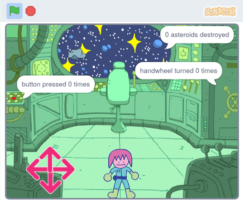

## परिचय

या प्रोजेक्टमध्ये, तुम्ही कॅरेक्टरसह स्पेस शिप पझल रूम तयार कराल जी कोडे सोडवेल.

**पझल रूम्स**, किंवा **एस्केप रूम्स**, या पझल असलेल्या रूम्स आहेत ज्या तुम्हाला रूम मधून बाहेर पडण्यास आणि पुढील रूम मध्ये जाण्यास सोडवणे आवश्यक आहे. त्या ऑनलाइन किंवा प्रत्यक्ष रूम्स असू शकतात, परंतु कल्पना सामान्यपणे सारखीच असते: शक्य तेवढ्या लवकर मिशन पूर्ण करा!

तुम्ही हे कराल:
+ कृती केव्हा थांबते हे नियंत्रीत करण्यासाठी `repeat until`{:class="block3control"} ब्लॉक वापरा
+ विविध `join`{:class="block3operators"} ब्लॉक्सचा `variable`{:class="block3variables"} ची व्हॅल्यू आऊटपुट करण्यासाठी वापर करा
+ `and`{:class="block3operators"}, `or`{:class="block3operators"}, आणि `not`{:class="block3operators"} स्थिती प्रॉब्लेम सोडविण्यासाठी एकत्र करा

--- no-print ---

--- task ---

  

### याचा प्रयत्न करा 

अरे, स्पेसशिपला काही अडचणी येत आहेत! स्पेसशिप भोवती फिरण्यास कॅरेक्टर तयार करण्यासाठी ऍरोचा वापर करा. सर्व कोडी सोडविण्यासाठी आणि स्पेसशिपला मदत करण्यासाठी तुम्ही त्यांना मदत करू शकता का?

**पझल रूम**: [आत बघा](https://scratch.mit.edu/projects/536877672/editor){:target="_blank"}

  <iframe allowtransparency="true" width="485" height="402" src="https://scratch.mit.edu/projects/embed/536877672/?autostart=false" frameborder="0"></iframe>

--- collapse ---
---
title: खेळण्यासाठी टीप
---

1. तुम्ही बटनच्या जवळ असणे आणि ते पाच वेळा दाबणे आवश्यक आहे
2. तुम्ही खुर्चीच्या जवळ असणे आणि त्यानंतर दहा ऍस्ट्रॉइड्स नष्ट करण्यासाठी क्रॉसहेअरचा वापर करणे आवश्यक आहे
3. तुम्ही हँडव्हीलच्या जवळ असणे आणि एकूण तीन पूर्ण वळणात ते वळवण्यासाठी त्यावर क्लिक करणे आवश्यक आहे

--- /collapse ---

--- /task ---

--- /no-print ---

--- print-only ---

--- /print-only ---

