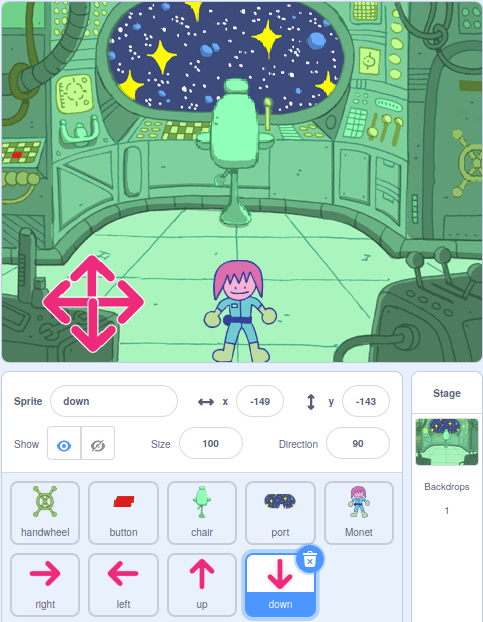

## पझल रूम मध्ये कोण आहे?

<div style="display: flex; flex-wrap: wrap">
<div style="flex-basis: 200px; flex-grow: 1; margin-right: 15px;">
या टप्प्यात, तुम्ही पझल रूममध्ये कॅरेक्टर जोडाल, आणि ते सभोवताली फिरवण्यासाठी कंट्रोल्स तयार कराल.
</div>
<div>
{:width="300px"}
</div>
</div>

--- task ---

[Scratch स्टार्टर प्रोजेक्ट](https://scratch.mit.edu/projects/531567946/editor/){:target="_blank"} उघडा. Scratch दुसऱ्या ब्राऊजर टॅबमध्ये उघडेल.

तुम्ही ऑफलाईन कार्य करत असलात, तर तुम्ही स्टार्टर प्रोजेक्ट [rpf.io/p/mr-IN/puzzle-room](https://rpf.io/p/mr-IN/puzzle-room) येथे डाऊनलोड करू शकता.

[[[working-offline]]]

--- /task ---

तुम्ही स्पेसशिपच्या आतून दृश्य बघायला हवे. तुमच्यासाठी अनेक sprites बनवले आहेत, आणि त्यांची पोजिशन सेट केली आहे.

**निवडा:** स्पेसशिप मध्ये कोण आहे? ते पृथ्वीवरील सोलो मिशन असू शकते, ते एलियन स्पेसशिप असू शकते, किंवा ते भविष्यात अस्तित्वात सुद्धा येऊ शकते जेथे कॅट जगावार राज्य करेल.

तुम्ही तयार करत असलेल्या पझलसह संवाद करण्यासाठी तुम्हाला एक कॅरेक्टरची आवश्यकता आहे.

--- task ---

तुमच्या प्रोजेक्टमध्ये नवीन स्प्राईट जोडा. या उदाहरणात, तुम्हाला **Monet**हे कॅरेक्टर दिसेल.


--- /task ---

तुमचे कॅरेक्टर सीनसाठी फार मोठे किंवा फार लहान असेल, तर तुम्ही त्यांची साईज बदलायला हवी. तुम्ही कॅरेक्टर साठी सुरूवातीची पोजिशन सुद्धा निवडू शकता.

--- task ---

कॅरेक्टरची साईज आणि सुरूवातीची पोजिशन सेट करण्यासाठई कोड जोडा.

--- /task ---

तुमचे कॅरेक्टर सभोवताली हलू शकण्यासाठी ऑन-स्क्रीन कंट्रोल्सची तुम्हाला आवश्यकता असेल.

--- task ---

एक **arrow** स्प्राईट्स निवडा. स्प्राईटवर क्लिक केल्यावर, त्याने तीची दिशा ब्रॉडकास्ट करायला हवी जेणेकरून तो त्या दिशेत हलण्यासाठी कॅरेक्टर तयार करू शकेल.


```blocks3
when this sprite clicked
broadcast (right v) //ऍरो दाखवत असलेली दिशा
```

--- /task ---

**टीप:** जर **arrow** स्प्राईट्सवर मोबाईल किंवा टॅबलेटवर वापरतांना क्लिक करणे फार कठीण असेल, तर तुम्ही त्यांचे कॉश्चुम बदलू शकता. प्रत्येक **arrow** स्प्राईटला मोठा जांभळा वर्तुळ असतो ज्याचा त्याऐवजी वापर केला जाऊ शकतो.

आता, तुमचे मुख्य कॅरेक्टर हलवण्यासाठी अधिक दिशा कंट्रोल्स जोडा.

--- task ---

**arrow** स्प्राईटला तीन वेळा डुप्लीकेट करा. त्यानंतर, प्रत्येक स्प्राईटसाठी, कॉश्चुम बदला जेणेकरून तो वेगवेगळ्या दिशा दाखवेल.

तो दाखवत असलेल्या दिशेत प्रत्येक स्प्राईटचे नाव बदला आणि तो दाखवत असलेल्या दिशेत `broadcast`{:class="block3events"} बदला.

स्क्रीनच्या कोपऱ्यात सर्व **arrow** स्प्राईट्सची व्यवस्था करा.



--- /task ---

ऍरो दाबल्यावर तुमचे मुख्य कॅरेक्टर हलायला हवे.

--- task ---

तुमचे मुख्य कॅरेक्टर स्प्राईटला ब्रॉडकास्ट मिळाल्यावर `left, right, up, and down`{:class="block3events"} जाण्यासाठी कोड करा.


```blocks3
when I receive [up v]
change y by (10)

when I receive [down v]
change y by (-10)

when I receive [right v]
change x by (10)

when I receive [left v]
change x by (-10)
```

--- /task ---

--- task ---

**चाचणी:** हिरव्या झेंड्यावर क्लिक करा आणि त्यानंतर तुमचे कॅरेक्टर भोवती फिरण्यासाठी ऍरोवर क्लिक करा.

--- /task ---


--- save ---
