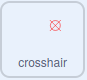

## ऍस्ट्रॉइड्स पझल

<div style="display: flex; flex-wrap: wrap">
<div style="flex-basis: 200px; flex-grow: 1; margin-right: 15px;">
या टप्प्यात, तुम्ही अधिक आव्हानात्मक कोडे तयार कराल. तुम्ही धोकादायक ऍस्ट्रॉइड्स तयार करण्यासाठी कोडे तयार कराल.
</div>
<div>
{:width="300px"}
</div>
</div>

तुम्हाला क्रॉसहेअरची आवश्यकता असेल ज्याचा वापर तुम्ही ऍस्ट्रॉइड्सना लक्ष्य करण्यासाठी करू शकता.

--- task ---

नवीन स्प्राईट पेंट करा त्याला म्हणा **crosshair**. वर्तुळ आणि दोन रेषा वापरून खाली उदाहरण दिले आहे. वर्तुळाकृती घन सुरूवातीला बनवा आणि त्यानंतर त्याचे **फिल** पारदर्शक येण्यासाठी तो ऍडजस्ट करा, तुम्ही त्याला साईज आणि पोजिशन दिल्यानंतर.


तुम्हाला आवश्यक वाटल्यास तुमचा **crosshair** स्प्राईट रीसाईज करा.

**टीप**: तुम्ही पेंट एडिटरवर पोजिशनींग सोपे होण्यासाठी, विशेष करून तुम्ही मोबाईल किंवा टॅबलेट डिव्हाईसवर असतांना **+** आणि **-** सिम्बॉलचा वापर करून झूम इन करू शकता.

--- /task ---

क्रॉसहेअर माऊसचे पालन करेल, परंतु ते अंतराळामध्ये केवळ विंडो मधून दिसायला हवे.

--- task ---

खालील ब्लॉक्सचा वापर करा जेणेकरून **crosshair** माऊस-पॉइंटर फॉलो करेल.



```blocks3
when flag clicked
forever
go to (mouse-pointer v)
```

**चाचणी:** हिरव्या झेंड्यावर क्लिक करा आणि **crosshair** माऊस-पॉइंटर फॉलो करत असल्याची खात्री करा.

--- /task ---

तुम्ही `if`{:class="block3control"} ब्लॉक वापरू शकता चाचणी करण्यासाठी की **crosshair** स्पर्श करत आहे **पोर्ट** स्प्राईटला, जेणेकरून तो स्पर्श करत **नसल्यास** लपला जाईल.

--- task ---

चाचणी जोडा, खात्री करण्यासाठी की **crosshair** हा **port** ला स्पर्श करत आहे.


```blocks3
when flag clicked
forever
+ show
go to (mouse-pointer v)
+ if <not <touching (port v) ?>> then //Only show the crosshair when the mouse is touching the port
hide
```

**चाचणी:** हिरव्या झेंड्यावर क्लिक करा आणि खात्री करा की **crosshair** लपतो जेव्हा तो **port** ला स्पर्श करत नाही.

--- /task ---

तुम्हाला कदाचीत लक्षात येईल की, क्रॉसहेअर **port** च्या अगदी कडेला दिसतो आणि तो स्पेसशिपच्या आत दिसतो. तो बॅकड्रॉपच्या रंगाला स्पर्श करत नाही हे तपासून ते ठीक केल्या जाऊ शकते.

--- task ---

`or`{:class="block3operators"} ब्लॉक `if`{:class="block3control"} ब्लॉकला जोडा. दुसरी स्थिती ही आहे की, **क्रॉसहेअर** हा **पोर्ट** च्या भोवतालच्या हिरव्या रंगाला स्पर्श करत आहे का.


```blocks3
when flag clicked
forever
show
go to (mouse-pointer v)
+ if <<not <touching (port v) ?>> or <touching color (#69B486) ?>> then //Also not touching the edge of the port
hide
```

**टीप:** क्रॉसहेअर माऊस-पॉइंटरला फॉलो करत असल्यास, तुम्ही कलर पिकरचा वापर करण्याआधी तुमचा प्रोजेक्ट थांबवण्याची खात्री करा.

--- /task ---

आता ऍस्ट्रॉइड्स तयार करण्याची वेळ आहे.

--- task ---

**Rocks** स्प्राईट शोधा आणि तो तुमच्या प्रोजेक्टमध्ये जोडा. स्प्राईट रीसाईज करा जेणेकरून तो फार मोठा नसेल.

--- /task ---

तुम्ही कदाचीत बघू शकता कसाे `my blocks`{:class="block3myblocks"} हे कोडला [Nature rover project](https://projects.raspberrypi.org/en/projects/nature-rover){:target="_blank"} मध्ये व्यवस्थित ठेवण्यात मदत करतात.

`My blocks`{:class="block3myblocks"} हे ते तुम्हाला असे तयार करून मदत करतात जेणेकरून तुम्हाला ते पुन्हा पुन्हा लिहावे लागणार नाहीत. तुम्ही `my blocks`{:class="block3myblocks"} चा **Rocks** ला स्पेसशिप पोर्ट मध्ये पोजिशन देण्यासाठी वापर करू शकता.

--- task ---

नवीन `block`{:class="block3myblocks"} तयार करा आणि त्याला म्हणा `go to position`{:class="block3myblocks"}. सुरूवातीची पोजिशन स्क्रीनवर कोठेही असू शकते.


```blocks3
define go to position
go to (random position v)
```

--- /task ---

**Rocks** स्प्राईटला तो **port** `and`{:class="block3operators"} **port** च्या कडेला स्पर्श करेपर्यंत कोणत्याही दिशेला शोधत रहाणे आवश्यक आहे. हे तुम्ही **crosshair** वर वापरलेल्या कोड प्रमाणेच आहे, परंतु यावेळी तुम्ही `and`{:class="block3operators"} ब्लॉक वापराल.

--- task ---

`repeat until`{:class="block3control"} आणि `and`{:class="block3operators"} ब्लॉक जोडा **Rocks** ते योग्य पोजिशन मध्ये पोहोचेपर्यंत हलत रहातात याची खात्री करण्यासाठी.


```blocks3
define go to position
go to (random position v)
+ repeat until <<touching (port v) ?> and <not <touching color (#69B486) ?>>
go to (random position v)

```

**चाचणी:** तुमच्या `my blocks`{:class="block3myblocks"} व्याख्येवर क्लिक करा आणि तुम्हाला खडक पोर्टमध्ये थांबेपर्यंत स्क्रीनच्या भोवती कोठेही फिरतांना दिसायला हवे.

--- /task ---

**Rocks** ते हलतात त्या व्हीव मधून लपणे आवश्यक आहेत, परंतु ते लपले तर, ते **port** ला स्पर्श करणार नाही, त्यामुळे `ghost`{:class="block3looks"} इफेक्टचा ते अदृश्य होण्यासाठी वापर केला जाऊ शकतो.

--- task ---

स्प्राईट हलतांना **Rocks** वरील `ghost`{:class="block3looks"} इफेक्ट `100` वर सेट करा, आणि त्यानंतर ग्राफिकल इफेक्ट पूसा.


```blocks3
define go to position
go to (random position v)
repeat until <<touching (port v) ?> and <not <touching color (#69B486) ?>>
+ set [ghost v] effect to (100) //स्प्राईट लपवा
end
+ clear graphic effects
```

--- /task ---

शेवटचा भाग इतर कोड्यांसारखाच आहे. व्हेरिएबलचा वापर करून ज्याला `asteroids`{:class="block3variables"} म्हणतात, कितीवेळा **crosshair** **Rocks** स्पर्श करतो ते मोजा. प्रत्येक वेळी, ऍस्ट्रॉइड्स व्हेरिएबल वाढतो आणि **Rocks** नवीन पोजिशनला हलतात. तुमचा कॅरेक्टर खुर्चीत असल्यासच केवळ त्याने काम करायला हवे.

--- task ---

तुमच्या **character** स्प्राईटवर, नवीन व्हेरिएबल तयार करा ज्याला `at chair`{:class="block3variables"} म्हणतात, आणि तो `true` वर सेट करा जेव्हा कॅरेक्टर खुर्चीला स्पर्श करतो आणि `false` वर सेट करा जेव्हा तो स्पर्श करत नाही.


```blocks3
when flag clicked
set size to (60) %
go to x: (0) y: (-130)
+ forever //Check that Monet is at the chair
if <touching (chair v) ?> then
set [at chair v] to [true]
else
set [at chair v] to [false]
```

--- /task ---

--- task ---

कार्य पूर्ण झाल्यावर **Rocks** स्प्राईट सेट करण्यासाठी खालील ब्लॉक्स जोडा.


```blocks3
when flag clicked
set [asteroids v] to (0)
go to position ::custom
repeat until <(asteroids) = (10)> //10 asteroids have been destroyed
```

--- /task ---

--- task ---

दुसरा `and`{:class="block3operators"} ब्लॉक `if`{:class="block3control"} ब्लॉकमध्ये वापरा **crosshair** खडकाला स्पर्श करतात का आणि `at chair`{:class="block3variables"} व्हेरिएबल `true` आहे का ते तपासण्यासाठी.


```blocks3
when flag clicked
set [asteroids v] to (0)
go to position ::custom
+ repeat until <(asteroids) = (10)>
+ if <<(at chair) = [true]> and <touching (crosshair v)>> then //Monet is at chair and crosshair is touching asteroid
```

--- /task ---

--- task ---

स्थिती जुळल्यास, `asteroids`{:class="block3variables"} व्हेरिएबल `1` ने वाढू शकतो आणि `my block`{:class="block3custom"} ला पुन्हा बोलावले जाऊ शकते जेणेकरून **Rocks** नवीन पोजिशनवर हलतील.


```blocks3
when flag clicked
set [asteroids v] to (0)
go to position ::custom
repeat until <(asteroids) = (10)>
if <<(at chair) = [true]> and <touching (crosshair v)>> then
+ change [asteroids v] by (1) //Store the number of asteroids destroyed
+ go to position ::custom //Reset asteroid position
```

--- /task ---

शेवटची गोष्ट म्हणजे प्लेयरला कार्याबद्दल सांगणे. हे **port** स्प्राईटवर केले जाऊ शकते.

--- task ---

किती ऍस्ट्रॉईड्स नष्ट केले हे प्लेयरला सांगण्यासाठी ब्लॉक्स जोडा.


```blocks3
when flag clicked
go to x: (-15) y: (122)
repeat until <(asteroids) = (10)>
say (join (asteroids) [asteroids destroyed])
end
say [task completed] for (2) seconds
```

--- /task ---

--- task ---

**चाचणी:** तुमचे कॅरेक्टर खुर्चीजवळ हलवा, त्यानंतर crosshair भोवती फिरवा आणि काही ऍस्ट्रॉईड्स नष्ट करण्याचा प्रयत्न करा. त्यानंतर तुम्ही तुमच्या कोडमधील कोणतीही व्हॅल्यू ऍडजस्ट करू शकता जे तुम्हाला तुमच्या स्प्राइट आकारांसाठी चांगले काम करण्यासाठी आवश्यक आहे.

--- /task ---

--- save ---


