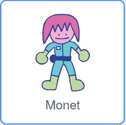
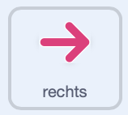
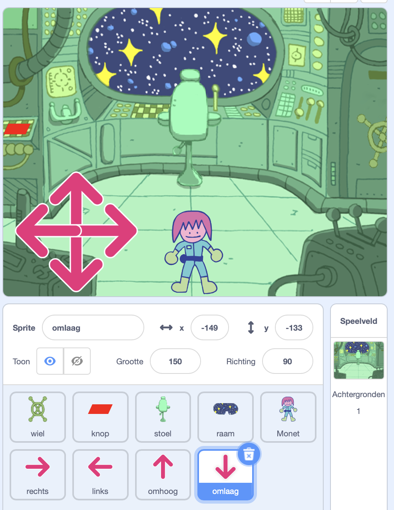

## Wie zit er in de puzzelkamer?

<div style="display: flex; flex-wrap: wrap">
<div style="flex-basis: 200px; flex-grow: 1; margin-right: 15px;">
In deze stap voeg je een personage toe aan een puzzelkamer en maak je besturingselementen om het te verplaatsen.
</div>
<div>
{:width="300px"}
</div>
</div>

--- task ---

Open [het Scratch-starter project](https://scratch.mit.edu/projects/740768934/editor/){:target="_blank"}. Scratch wordt in een nieuw browsertabblad geopend.

Als je offline werkt, kun je het startersproject downloaden op [rpf.io/p/nl-NL/puzzle-room](https://rpf.io/p/nl-NL/puzzle-room).

[[[working-offline]]]

--- /task ---

Je zou een scène moeten zien vanuit de binnenkant van een ruimteschip. Er zijn verschillende sprites voor je gemaakt en hun posities zijn ingesteld.

**Kies:** Wie zit er in het ruimteschip? Het zou een solo-missie van de aarde kunnen zijn, het zou een buitenaards ruimteschip kunnen zijn, of het zou zelfs kunnen bestaan in een toekomst waar katten de wereld regeren.

Je hebt een personage nodig om te communiceren met de puzzels die je maakt.

--- task ---

Voeg een nieuwe sprite toe aan je project. In dit voorbeeld zie je het personage **Monet**.



--- /task ---

Als je personage te groot of te klein is voor de scène, moet je de grootte ervan wijzigen. Je kunt ook een beginpositie voor het personage kiezen.

--- task ---

Voeg code toe om de grootte en startpositie van je personage in te stellen.

--- /task ---

Je hebt besturingselementen op het scherm nodig om je personage te verplaatsen.

--- task ---

Selecteer een van de **pijl** sprites. Wanneer op de sprite wordt geklikt, moet deze zijn richting uitzenden zodat het personage in die richting kan bewegen.



```blocks3
when this sprite clicked
broadcast (rechts v) //Richting waarin de pijl wijst
```

--- /task ---

**Tip:** als de **pijl** sprites te moeilijk zijn om op te klikken wanneer je een mobiel of tablet gebruikt, kun je hun uiterlijk wijzigen. Elke **pijl** sprite heeft ook een grote paarse cirkel die in plaats daarvan kan worden gebruikt.

Voeg nu meer richtingstoetsen toe om je hoofdpersonage te verplaatsen.

--- task ---

Kopieer de **pijl** sprite drie keer. Verander vervolgens voor elke sprite het uiterlijk zodat het in een andere richting wijst.

Verander de naam van elke sprite in de richting waarin deze wijst en wijzig de `zend signaal`{:class="block3events"} in de richting waarin deze wijst.

Rangschik alle **pijl** sprites in de hoek van het scherm.



--- /task ---

Je hoofdpersonage zou moeten bewegen wanneer de pijlen worden ingedrukt.

--- task ---

Codeer je hoofdpersonage sprite om te bewegen wanneer het signalen ontvangt om `links, rechts, omhoog en omlaag te gaan`{:class="block3events"}.


```blocks3
when I receive [omhoog v]
change y by (10)

when I receive [omlaag v]
change y by (-10)

when I receive [rechts v]
change x by (10)

when I receive [links v]
change x by (-10)
```

--- /task ---

--- task ---

**Test:** Klik op de groene vlag en klik vervolgens op de pijlen om je personage te verplaatsen.

--- /task ---


--- save ---
