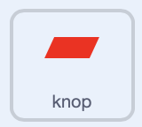

## De knop puzzel

<div style="display: flex; flex-wrap: wrap">
<div style="flex-basis: 200px; flex-grow: 1; margin-right: 15px;">
In deze stap voeg je je eerste puzzel toe, om een bepaald aantal keer op de knop te drukken.
</div>
<div>
{:width="300px"}
</div>
</div>

Wanneer het spel begint, moet de knop op dezelfde plaats blijven en altijd zichtbaar zijn op de voorgrond.

--- task ---

Voeg de volgende blokken toe aan de **knop** sprite.

```blocks3
when flag clicked
forever
go to x: (-225) y (27)
go to [front v] layer //The button is visible
```

--- /task ---

De knop moet een aantal keer worden ingedrukt om de puzzel te voltooien. Hiervoor heb je een `variabele`{:class="block3variables"} nodig om het aantal keren op te slaan.

--- task ---

Maak een nieuwe `variabele`{:class="block3variables"} en noem deze `op knop geduwd`{:class="block3variables"}.

--- /task ---

Aan het begin van het spel moet `op knop geduwd`{:class="block3variables"} `0` zijn.

--- task ---

Voeg de volgende blokken toe aan de **knop** sprite.



```blocks3
when flag clicked
set [button pressed v] to (0) //Button presses set to 0 at start
```

--- /task ---

Een `herhaal tot`{:class="block3control"} blok is een lus die blijft herhalen totdat aan een bepaalde voorwaarde is voldaan.

**Kies:** Hoe vaak moet de knop worden ingedrukt om de puzzel op te lossen? In dit voorbeeld moet de knop `5` keer worden ingedrukt, maar je kunt natuurlijk ook een ander getal kiezen.

--- task ---

Voeg een `herhaal tot`{:class="block3control"} lus toe en stel de voorwaarde in op wanneer `op knop geduwd`{:class="block3variables"} `gelijk is aan`{:class="block3operators"} `5`.


```blocks3
when flag clicked
set [button pressed v] to (0)
+ repeat until <(button pressed) = (5)> //Keep repeating until button is pressed 5 times
```

--- /task ---

Nu moet de speler op de knop kunnen drukken. Ze zouden er alleen op moeten kunnen drukken als het personage dicht genoeg bij de knop staat!

--- task ---

Voeg blokken toe om waar te nemen of het personage dicht genoeg bij de knop staat wanneer op de **knop** sprite wordt geklikt.


```blocks3
when this sprite clicked
if <(distance to (Monet v)) < (50)> then
else
```

--- /task ---

Als het personage dichtbij genoeg staat en de knop wordt ingedrukt, kan de `op knop geduwd`{:class="block3variables"} variabele worden verhoogd. Als het personage niet dichtbij geneg is, moet de puzzel gereset worden; de speler moet de knop vijf keer achter elkaar indrukken voordat hij andere puzzels kan spelen.

**Tip:** in Scratch wordt de afstand tussen twee sprites berekend uit de middelpunten van de sprites. Voor grote sprites kan het daarom soms lijken alsof ze elkaar al raken, maar hun centra kunnen nog steeds ver uit elkaar liggen waardoor ze elkaar dus nog niet raken.

--- task ---

Voeg code toe om de waarde van de variabele `op knop geduwd`{:class="block3variables"} te wijzigen.


```blocks3
when this sprite clicked
if <(distance to (Monet v)) < (50)> then
+ change [button pressed v] by (1) //If close to Monet, then increase button press count
else
+ set [button press v] to (0) //If far from Monet, then reset button press count
```

--- /task ---

--- task ---

**Test:** Voer je project uit en beweeg het personage dicht genoeg bij de knop. Als je op de knop klikt, moet de `op knop geduwd`{:class='block3variables'} variabele groter worden. Je kunt de waarde van `afstand tot Monet`{:class='block3sensing'} veranderen, totdat je een getal vindt dat jij goed vindt.

--- /task ---

Je kunt het `voeg samen`{:class="block3operators"} blok gebruiken om de speler met een `zeg`{:class="block3looks"} blok te laten weten hoe vaak de knop is ingedrukt.

--- task ---

Plaats een `voeg samen`{:class="block3operators"} blok in een ander blok. Voeg vervolgens de gewenste tekst toe en de `op knop geduwd`{:class="block3variables"} variabele, allemaal in een `zeg`{:class="block3looks"} blok.

Bijvoorbeeld:


```blocks3
when flag clicked
set [button pressed v] to (0)
repeat until <(button pressed) = (5)> 
+ say (join [button pressed] (join (button pressed) [times])
```

**Tip:** Zorg ervoor dat je spaties toevoegt in de tekst in je `voeg samen`{:class="block3operators"} blok.

--- /task ---

De lus eindigt wanneer de knop `5` keer is ingedrukt, waarna het laatste blok in het script wordt uitgevoerd. Zo kun je de speler laten weten dat de opdracht is voltooid.

--- task ---

Gebruik een `zeg`{:class="block3looks"} blok om de speler te vertellen dat de taak is voltooid.


```blocks3
when flag clicked
set [button pressed v] to (0)
repeat until <(button pressed) = (5)>
say (join [button pressed] (join (button pressed) [times])
end
+ say [task complete] for (2) seconds
```

--- /task ---


--- task ---

**Test:** Voer je project uit en beweeg het personage dicht genoeg bij de knop. Wanneer je vijf keer op de knop klikt, zou de opdracht voltooid moeten zijn.

--- /task ---

--- save ---

