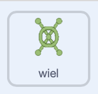

## De wielpuzzel

<div style="display: flex; flex-wrap: wrap">
<div style="flex-basis: 200px; flex-grow: 1; margin-right: 15px;">
In deze stap maak je een puzzel waar een wiel moet worden gedraaid.
</div>
<div>
{:width="300px"}
</div>
</div>

De scripts voor deze puzzel lijken op de knoppuzzel, dus je kunt die scripts kopiëren en ze vervolgens bewerken.

--- task ---

Sleep de twee scripts die je hebt gemaakt voor de **knop** sprite naar de **wiel** sprite om ze naar die sprite te te kopiëren.

--- /task ---

Het `wanneer op de groene vlag wordt geklikt`{:class='block3events'} script is het eerste script dat moet worden gewijzigd.

--- task ---

Maak een nieuwe variabele met de naam `wiel gedraaid`{:class="block3variables"}, en gebruik die variabele in plaats van de `knop ingedrukt`{:class="block3variables"} variabele.

**Kies:** Kies zelf het getal dat aangeeft wanneer de opdracht is voltooid. We kozen `3` in het voorbeeld.



```blocks3
when flag clicked
+ set [handwheel turned v] to (0)
+ repeat until <(handwheel turned) = (3)>
+ say (join [handwheel turned] (join (handwheel turned) [times])
end
+ say [task complete] for (2) seconds
```

--- /task ---

Net als bij een echt wiel kan de **wiel** sprite slechts een klein aantal graden tegelijk draaien, dus de hoek waarin het is gedraaid moet worden opgeslagen.

--- task ---

Maak een nieuwe variabele met de naam `gedraaid`{:class="block3variables"} en stel deze in op `0` wanneer het spel begint.


```blocks3
when flag clicked
+ set [turned v] to (0)
set [handwheel turned v] to (0)
repeat until <(handwheel turned) = (3)>
say (join [handwheel turned] (join (handwheel turned) [times])
end
say [task complete] for (2) seconds
```

--- /task ---

Nu kun je het `wanneer op deze sprite wordt geklikt`{:class="block3events"} script aanpassen, zodat wanneer op de**wiel** sprite wordt geklikt, het telkens een kleine hoeveelheid draait totdat het een volledige omwenteling voltooit. Wanneer het het juiste aantal volledige slagen (`3` keer in het voorbeeld) heeft voltooid, wordt de puzzel opgelost.

--- task ---

Voeg blokken toe zodat telkens wanneer op de **wiel** sprite wordt geklikt, deze `15` graden draait en de `gedraaid`{:class="block3variables"} variabele met `15` toeneemt.


```blocks3
when this sprite clicked
if <(distance to (Monet v)) < (50)> then
+ change [turned v] by (15) //Store the turnes of the wheel
+ turn cw (15) degrees
else
+ set [handwheel turned v] to (0)
```

--- /task ---

**Test**: Beweeg de **Monet** sprite (of je personage sprite) dicht genoeg bij het **wiel** en klik vervolgens op de **wiel** sprite. Het helpt om de volledig scherm weergave modus te gebruiken, zodat je de **wiel** sprite niet kunt verslepen.

Wanneer de variabele `gedraaid`{:class="block3variables"} `360` bereikt, is het wiel eenmaal gedraaid; dit kan nu worden opgeslagen in de variabele `wiel gedraaid`{:class="block3variables"}.

--- task ---

Gebruik een **geneste** `als`{:class="block3control"} om de waarde van de `wiel gedraaid`{:class="block3variables"} variabele te veranderen en de `gedraaid`{:class="block3variables"} variabelen te resetten. Een **geneste** `als`{:class="block3control"} maak je door een `als`{:class="block3control"} in een andere als blok te plaatsen.


```blocks3
when this sprite clicked
if <(distance to (Monet v)) < (50)> then
change [turned v] by (15)
turn cw (15) degrees
+ if <(turned) = (360)> then //The handwheel has turned a full circle
+ change [handwheel turned v] by (1) //Store the total number of turns
+ set [turned v] to (0) //Reset the angle that it has been turned
end
else
set [handwheel turned v] to (0)
```

--- /task ---

--- task ---

**Test:** beweeg je personage-sprite dicht genoeg bij het wiel en klik erop. Mogelijk moet je de afstand van het personage tot het wiel aanpassen.


```blocks3
<(distance to (Monet v)) < (150)>
```

--- /task ---

**Tip**: Je kunt bijvoorbeeld op je **Monet** (of personage) klikken en slepen om deze dichter bij het wiel te brengen. Dit zal je tijd besparen, omdat je de besturingselementen niet langer hoeft te gebruiken.

--- save ---
