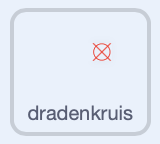
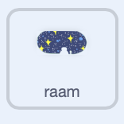

## De asteroïden puzzel

<div style="display: flex; flex-wrap: wrap">
<div style="flex-basis: 200px; flex-grow: 1; margin-right: 15px;">
In deze stap maak je de meest uitdagende puzzel. Je maakt een puzzel om gevaarlijke asteroïden te vernietigen.
</div>
<div>
{:width="300px"}
</div>
</div>

Je hebt een dradenkruis nodig dat je kunt gebruiken om op de asteroïden te richten.

--- task ---

Teken een nieuwe sprite met de naam **dradenkruis**. Hieronder wordt een voorbeeld weergegeven met een cirkel en twee lijnen. Vul de cirkel eerst volledig in en pas dan de **vulling** aan tot transparant, zodra je de grootte en positie hebt.


Wijzig de grootte van de **dradenkruis** sprite als dat nodig is.

**Tip**: Je kunt in de verf-editor inzoomen met behulp van de **+** en **-** symbolen, om positionering gemakkelijker te maken, vooral als je op een mobiel apparaat of tablet werkt.

--- /task ---

Het dradenkruis volgt de muis, maar het zou alleen zichtbaar moeten zijn door het raam in de ruimte.

--- task ---

Gebruik de volgende blokken zodat het **dradenkruis** de muisaanwijzer volgt.



```blocks3
when flag clicked
forever
go to (mouse-pointer v)
```

**Test:** Klik op de groene vlag en zorg ervoor dat het **dradenkruis** de muisaanwijzer volgt.

--- /task ---

Je kunt een `als`{:class="block3control"} blok gebruiken om te testen of het **dradenkruis** de **raam** sprite raakt, zodat het verborgen is wanneer hij het raam**niet** raakt.

--- task ---

Voeg een test toe om ervoor te zorgen dat het **dradenkruis** het **raam** raakt.


```blocks3
when flag clicked
forever
+ show
go to (mouse-pointer v)
+ if <not <touching (port v) ?>> then //Only show the crosshair when the mouse is touching the port
hide
```

**Test:** Klik op de groene vlag en zorg ervoor dat het **dradenkruis** verborgen is wanneer deze het **raam** niet raakt.

--- /task ---

Je hebt misschien al gezien dat het dradenkruis helemaal aan de rand van het **raam** verschijnt en zo binnen het ruimteschip lijkt te zijn. Dit kan worden opgelost door te controleren of het een kleur van de achtergrond niet raakt.

--- task ---

Voeg een `of`{:class="block3operators"} blok toe aan het `als`{:class="block3control"} blok. De tweede voorwaarde is dat het **dradenkruis** de groene kleur raakt die het **raam** omringt.


```blocks3
when flag clicked
forever
show
go to (mouse-pointer v)
+ if <<not <touching (port v) ?>> or <touching color (#69B486) ?>> then //Also not touching the edge of the port
hide
```

**Tip:** als het dradenkruis de muisaanwijzer volgt, zorg er dan voor dat je het project stopt voordat je de kleurkiezer gebruikt.

--- /task ---

Nu is het tijd om de asteroïden te maken.

--- task ---

Zoek een **Rocks** sprite en voeg deze toe aan je project. Verklein de sprite zodat deze niet te groot is.

--- /task ---

Je hebt misschien gezien hoe `mijn blokken`{:class="block3myblocks"} helpen om code georganiseerd te houden in het [Nature rover project](https://projects.raspberrypi.org/en/projects/nature-rover){:target="_blank"}.

`Mijn blokken`{:class="block3myblocks"} kunnen je ook helpen zodat je niet steeds opnieuw dezelfde code hoeft te schrijven. Je kunt `mijn blokken`{:class="block3myblocks"} gebruiken voor de **Rocks** om ze in het raam van het ruimteschip te plaatsen.

--- task ---

Maak een nieuw `blok`{:class="block3myblocks"} en noem het `ga naar positie`{:class="block3myblocks"}. De beginpositie kan overal op het scherm zijn.


```blocks3
define go to position
go to (random position v)
```

--- /task ---

De **Rocks** sprite moet een willekeurige positie blijven zoeken totdat deze het **raam** raakt `en`{:class="block3operators"} niet de rand van het **raam**. Dit is vergelijkbaar met de code die je hebt gebruikt op het **dradenkruis**, maar deze keer gebruik je een `en`{:class="block3operators"} blok.

--- task ---

Voeg een `herhaal tot`{:class="block3control"} en een `en`{:class="block3operators"} blok toe om ervoor te zorgen dat de **Rocks** blijven bewegen totdat ze in de juiste positie staan.


```blocks3
define go to position
go to (random position v)
+ repeat until <<touching (port v) ?> and <not <touching color (#69B486) ?>>
go to (random position v)

```

**Test:** Klik op je `mijn blokken`{:class="block3myblocks"} definitie en je zou de steen willekeurig over het scherm moeten zien bewegen, totdat deze stopt in het raam.

--- /task ---

De **Rocks** moeten tijdens het bewegen voor het zicht worden verborgen, maar als ze verborgen zijn, raken ze het **raam** niet, dus een `spook`{:class="block3looks"} effect kan worden gebruikt om ze onzichtbaar te maken.

--- task ---

Stel het `transparant`{:class="block3looks"} effect op de **Rocks** in op `100` terwijl de sprite beweegt, en wis vervolgens het grafische effect.


```blocks3
define go to position
go to (random position v)
repeat until <<touching (port v) ?> and <not <touching color (#69B486) ?>>
+ set [ghost v] effect to (100) //Hide the sprite
end
+ clear graphic effects
```

--- /task ---

Het laatste deel is vergelijkbaar met de andere puzzels. Tel met behulp van een variabele genaamd `asteroïden`{:class="block3variables"} hoe vaak het **dradenkruis** de **Rocks** raakt. Elke keer dat dit gebeurt, neemt de asteroïde variabele toe en beweegt de **Rocks** naar een nieuwe positie. Dit zou dus alleen moeten werken als je personage bij de stoel is.

--- task ---

Maak op je **personage** sprite een nieuwe variabele met de naam `bij de stoel`{:class="block3variables"}, en stel deze in op `waar` wanneer het personage de stoel raakt en `niet waar` wanneer dat niet het geval is.


```blocks3
when flag clicked
set size to (60) %
go to x: (0) y: (-130)
+ forever //Check that Monet is at the chair
if <touching (chair v) ?> then
set [at chair v] to [true]
else
set [at chair v] to [false]
```

--- /task ---

--- task ---

Voeg de volgende blokken toe aan de **Rocks** sprite om in te stellen wanneer de opdracht is voltooid.


```blocks3
when flag clicked
set [asteroids v] to (0)
go to position ::custom
repeat until <(asteroids) = (10)> //10 asteroids have been destroyed
```

--- /task ---

--- task ---

Gebruik een ander `en`{:class="block3operators"} blok in een `als`{:class="block3control"} blok om te controleren of het **dradenkruis** de rock raakt en of de `bij de stoel`{:class="block3variables"} variabele `code>code>waar`{:class="block3variables"} is.


```blocks3
when flag clicked
set [asteroids v] to (0)
go to position ::custom
+ repeat until <(asteroids) = (10)>
+ if <<(at chair) = [true]> and <touching (crosshair v)>> then //Monet is at chair and crosshair is touching asteroid
```

--- /task ---

--- task ---

Als aan deze voorwaarde is voldaan, kan de `asteroïden`{:class="block3variables"} variabele worden verhoogd met `1` en kan de `mijn blok`{:class="block3custom"} opnieuw worden opgeroepen zodat de **Rocks** naar een nieuwe positie kunnen bewegen.


```blocks3
when flag clicked
set [asteroids v] to (0)
go to position ::custom
repeat until <(asteroids) = (10)>
if <<(at chair) = [true]> and <touching (crosshair v)>> then
+ change [asteroids v] by (1) //Store the number of asteroids destroyed
+ go to position ::custom //Reset asteroid position
```

--- /task ---

Het laatste wat je moet doen is de speler vertellen over de opdracht. Dit kan worden gedaan op de **raam** sprite.

--- task ---

Voeg blokken toe om de speler te vertellen hoeveel asteroïden zijn vernietigd.



```blocks3
when flag clicked
go to x: (-15) y: (122)
repeat until <(asteroids) = (10)>
say (join (asteroids) [asteroids destroyed])
end
say [task completed] for (2) seconds
```

--- /task ---

--- task ---

**Test:** Beweeg je personage dicht bij de stoel, beweeg vervolgens het dradenkruis rond en probeer een aantal asteroïden te vernietigen. Je kunt dan alle waarden in je code aanpassen die je nodig hebt om het goed te laten werken voor je sprite grootte.

--- /task ---

--- save ---


