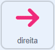
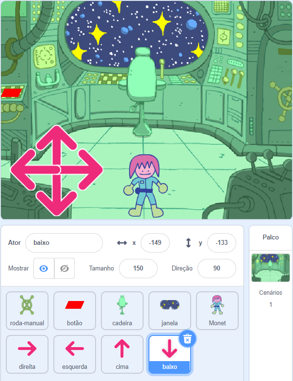

## Quem está na sala do quebra-cabeças?

<div style="display: flex; flex-wrap: wrap">
<div style="flex-basis: 200px; flex-grow: 1; margin-right: 15px;">
Nesta etapa, você adicionará um personagem a uma sala de quebra-cabeças e criará controles para movê-lo.
</div>
<div>
{:width="300px"}
</div>
</div>

--- task ---

Abra [o projeto inicial do Scratch](https://scratch.mit.edu/projects/1087033605/editor/){:target="_blank"}. O Scratch será aberto em outra aba do navegador.

Se estiver trabalhando offline, você pode baixar o projeto inicial em [rpf.io/p/pt-BR/puzzle-room-go](https://rpf.io/p/pt-BR/puzzle-room-go).

[[[working-offline]]]

--- /task ---

Você deverá ver uma cena de dentro de uma nave espacial. Vários atores foram criados para você e suas posições foram definidas.

**Escolha:** Quem está na espaçonave? Poderia ser uma missão solo da Terra, poderia ser uma nave alienígena, ou poderia até mesmo existir em um futuro onde os gatos dominassem o mundo.

Você precisa de um personagem para interagir com os quebra-cabeças que está criando.

--- task ---

Adicione um novo ator ao seu projeto. Neste exemplo, você verá o caractere **Monet**.


--- /task ---

Se o seu personagem for muito grande ou muito pequeno para a cena, você deverá alterar seu tamanho. Você também pode escolher uma posição inicial para o personagem.

--- task ---

Adicione o código para definir o tamanho e a posição inicial do seu personagem.

--- /task ---

Você precisará de controles na tela para poder mover seu personagem.

--- task ---

Selecione um dos atores de **seta**. Quando o ator é clicado, ele deve transmitir sua direção para fazer o personagem se mover naquela direção.



```blocks3
when this sprite clicked
broadcast (direita v) // Direção que a seta está apontando
```

--- /task ---

**Dica:** Se a **seta** dos atores forem muito difíceis de clicar ao usar um celular ou tablet, então você pode mudar suas fantasias. Cada ator de **seta** também tem um grande círculo roxo que pode ser usado em seu lugar.

Agora adicione mais controles de direção para mover seu personagem principal.

--- task ---

Duplique o ator de **seta** três vezes. Então, para cada ator, mude a fantasia para que aponte em uma direção diferente.

Mude o nome de cada ator de seta para a direção que ele está apontando e mude a `transmissão`{:class="block3events"} para a direção que ele está apontando.

Organize todos os sprites de **seta** no canto da tela.



--- /task ---

Seu personagem principal deve se mover quando as setas forem pressionadas.

--- task ---

Codifique seu ator de personagem principal para se mover quando receber transmissões para `esquerda, direita, para cima e para baixo`{:class="block3events"}.


```blocks3
when I receive [acima v]
change y by (10)

when I receive [abaixo v]
change y by (-10)

when I receive [direita v]
change x by (10)

when I receive [esquerda v]
change x by (-10)
```

--- /task ---

--- task ---

**Teste:** Clique na bandeira verde e depois clique nas setas para mover seu personagem.

--- /task ---


--- save ---
