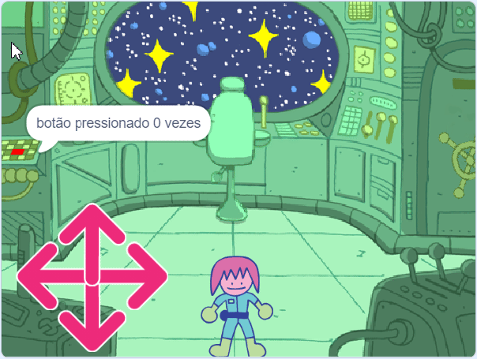
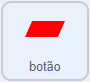

## O quebra-cabeça do botão

<div style="display: flex; flex-wrap: wrap">
<div style="flex-basis: 200px; flex-grow: 1; margin-right: 15px;">
Neste passo, você vai adicionar seu primeiro quebra-cabeça, que será apertar o botão um certo número de vezes.
</div>
<div>
{:width="300px"}
</div>
</div>

Quando o jogo inicia, o botão precisa ficar no estacionado no mesmo lugar e sempre estar visível na camada frontal.

--- task ---

Adicione os seguintes blocos ao ator **botão**.

```blocks3
when flag clicked
forever
go to x: (-225) y (27)
go to [front v] layer //The button is visible
```

--- /task ---

O botão deverá ser pressionado várias vezes para que o quebra-cabeça seja concluído. Para isso, você vai precisar de uma `variável`{:class="block3variables"} para armazenar o número de vezes que o botão foi pressionado.

--- task ---

Crie uma nova `variável`{:class="block3variables"} e chame-a de `botão pressionado`{:class="block3variables"}.

--- /task ---

No início do jogo, a variável `botão pressionado`{:class="block3variables"} deve ser `0`.

--- task ---

Adicione os seguintes blocos ao ator **botão**.



```blocks3
when flag clicked
set [button pressed v] to (0) //Button presses set to 0 at start
```

--- /task ---

Um bloco `repita até que`{:class="block3control"} é um loop que continua repetindo até que uma determinada condição seja atendida.

**Escolha:** Quantas vezes o botão precisará ser pressionado para resolver o desafio? Neste exemplo, será necessário pressionar `5` vezes, mas você pode escolher um número diferente.

--- task ---

Adicione um laço `repita até que`{:class="block3control"}, e defina sua condição para ser quando a variável `botão pressionado`{:class="block3variables"} é `igual`{:class="block3operators"} a `5`.


```blocks3
when flag clicked
set [button pressed v] to (0)
+ repeat until <(button pressed) = (5)> //Keep repeating until button is pressed 5 times
```

--- /task ---

Agora, o jogador precisa ser capaz de apertar o botão. Eles só devem poder pressioná-lo quando o personagem estiver perto o suficiente do botão!

--- task ---

Adicione blocos para detectar se o personagem está perto do botão quando o **botão** é clicado.


```blocks3
when this sprite clicked
if <(distance to (Monet v)) < (50)> then
else
```

--- /task ---

Se o personagem estiver próximo e o botão for pressionado, então a variável `botão pressionado`{:class="block3variables"} pode ser aumentada. Se o personagem não estiver próximo, o quebra-cabeça deve redefinir; o jogador precisa apertar o botão cinco vezes seguidas, antes de tentar qualquer outro quebra-cabeça.

**Dica:** No Scratch, a distância entre quaisquer dois atores é calculada a partir dos centros dos atores. Isto significa que os atores grandes podem parecer estar se tocando, mas os seus centros ainda podem estar muito distantes.

--- task ---

Adicione código para alterar o valor da variável `botão pressionado`{:class="block3variables"}.


```blocks3
when this sprite clicked
if <(distance to (Monet v)) < (50)> then
+ change [button pressed v] by (1) //If close to Monet, then increase button press count
else
+ set [button pressed v] to (0) //If far from Monet, then reset button press count
```

--- /task ---

--- task ---

**Teste:** Execute seu projeto e mova o personagem para perto do botão. Enquanto você clica no botão, a variável `botão pressionado`{:class='block3variables'} deve aumentar. Você pode ajustar o valor de `distância até Monet`{:class='block3sensing'} para cima ou para baixo, até que você encontre um número que faça sentido para você.

--- /task ---

Você pode usar o bloco `junte`{:class="block3operators"} para `mostrar`{:class="block3looks"} para o jogador quantas vezes o botão foi pressionado.

--- task ---

Coloque um bloco `junte`{:class="block3operators"} dentro de outro. Em seguida, adicione o texto que quiser, e a variável`botão pressionado`{:class="block3variables"}, tudo dentro de um bloco `diga`{:class="block3looks"}.

Por exemplo:


```blocks3
when flag clicked
set [button pressed v] to (0)
repeat until <(button pressed) = (5)> 
+ say (join [button pressed] (join (button pressed) [times])
```

**Dica:** Certifique-se de adicionar espaços no texto em seu bloco `junte`{:class="block3operators"}.

--- /task ---

O laço terminará quando o botão for pressionado `5` vezes, então o último bloco no script será executado. Isto pode dizer ao jogador que a tarefa foi completada.

--- task ---

Use um bloco `diga`{:class="block3looks"} para dizer ao jogador que a tarefa foi completada.


```blocks3
when flag clicked
set [button pressed v] to (0)
repeat until <(button pressed) = (5)>
say (join [button pressed] (join (button pressed) [times])
end
+ say [task complete] for (2) seconds
```

--- /task ---


--- task ---

**Teste:** Execute seu projeto e mova o personagem para perto do botão. Quando você clicar no botão cinco vezes, a tarefa deve ser concluída.

--- /task ---

--- save ---

