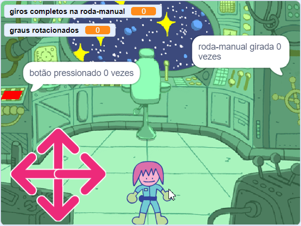
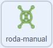

## O quebra-cabeça da roda-manual

<div style="display: flex; flex-wrap: wrap">
<div style="flex-basis: 200px; flex-grow: 1; margin-right: 15px;">
Nesse passo, você criará um quebra-cabeça onde uma roda-manual precisa ser virada.
</div>
<div>
{:width="300px"}
</div>
</div>

Os blocos para esse quebra-cabeça são bem semelhantes ao desafio do botão, então você pode copiar esses blocos e então editá-los.

--- task ---

Arraste os dois scripts que você criou para o ator **botão** para o ator **roda-manual**, para copiá-los.

--- /task ---

O bloco `quando bandeira for clicado`{:class='block3events'} é o primeiro que precisa ser alterado.

--- task ---

Crie uma nova variável chamada `giros completos na roda-manual`{:class="block3variables"}, e use essa variável em vez do `botão pressionado`{:class=" variável block3variables"}.

**Escolha:** Altere o número de conclusão para o que você gostaria que fosse. Escolhemos `3` no exemplo.



```blocks3
when flag clicked
+ set [handwheel turned v] to (0)
+ repeat until <(handwheel turned) = (3)>
+ say (join [handwheel turned] (join (handwheel turned) [times])
end
+ say [task complete] for (2) seconds
```

--- /task ---

Como uma roda-manual real, o ator **roda-manual** só será capaz de virar um pequeno número de graus por vez, então o ângulo que foi girado deverá ser armazenado.

--- task ---

Crie uma nova variável chamada `graus rotacionados`{:class="block3variables"} e defina como `0` quando o jogo começar.


```blocks3
when flag clicked
+ set [turned v] to (0)
set [handwheel turned v] to (0)
repeat until <(handwheel turned) = (3)>
say (join [handwheel turned] (join (handwheel turned) [times])
end
say [task complete] for (2) seconds
```

--- /task ---

Agora você pode editar o script `quando este ator for clicado`{:class="block3events"}, para que, quando o ator **roda-manual** for clicado repetidamente, vire uma pequena quantidade de cada vez até completar uma volta completa. Quando completar o número giros completos (`3` vezes no exemplo), o desafio será resolvido.

--- task ---

Adicione blocos para que cada vez que o ator **roda-manual** for clicado, ele gire `15` graus e a variável `graus rotacionados`{:class="block3variables"} aumenta em `15`.


```blocks3
when this sprite clicked
if <(distance to (Monet v)) < (50)> then
+ change [turned v] by (15) //Store the turnes of the wheel
+ turn cw (15) degrees
else
+ set [handwheel turned v] to (0)
```

--- /task ---

**Teste**: Mova o ator**Monet** (ou o ator do seu personagem) perto da **roda-manual** e então clique no ator da **roda-manual**. Ajuda estar no modo de tela cheia, para que você não arraste o ator da **roda-manual** pela tela.

Quando a variável `graus rotacionados`{:class="block3variables"} atinge `360`, então a roda-manual está ativada; isso agora pode ser armazenado na variável `giros completos na roda-manual`{:class="block3variables"}.

--- task ---

Use um `se`{:class="block3control"} **aninhado** para alterar o volante `giros completos na roda-manual`{:class ="block3variables"} e redefina as variáveis `graus rotacionados`{:class="block3variables"}. Um `se`{:class="block3control"} **aninhado** é quando um `se`{:class="block3control"} é colocado dentro de outro.


```blocks3
when this sprite clicked
if <(distance to (Monet v)) < (50)> then
change [turned v] by (15)
turn cw (15) degrees
+ if <(turned) = (360)> then //The handwheel has turned a full circle
+ change [handwheel turned v] by (1) //Store the total number of turns
+ set [turned v] to (0) //Reset the angle that it has been turned
end
else
set [handwheel turned v] to (0)
```

--- /task ---

--- task ---

**Teste:** Mova seu ator para perto da roda-manual, e então clique nele. Você pode ter que ajustar a distância que o personagem precisa estar da roda-manual.


```blocks3
<(distance to (Monet v)) < (150)>
```

--- /task ---

**Dica**: Você pode clicar e arrastar seu ator **Monet** (ou personagem), para aproximá-lo do volante, por exemplo. Isso irá te economizar tempo, pois você não vai ter que usar os controles.

--- save ---
