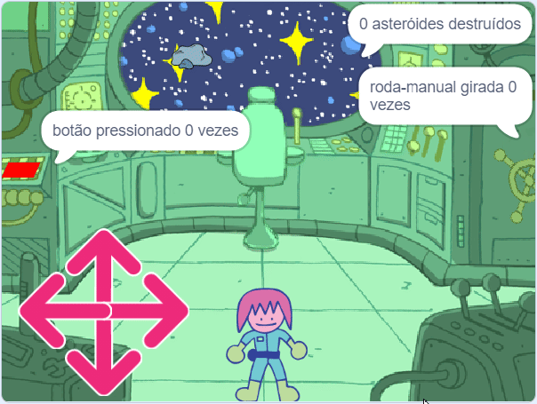

## O quebra-cabeça dos asteróides

<div style="display: flex; flex-wrap: wrap">
<div style="flex-basis: 200px; flex-grow: 1; margin-right: 15px;">
Neste passo, você vai criar o quebra-cabeça mais desafiador. Você criará um quebra-cabeça para destruir asteroides perigosos.
</div>
<div>
{:width="300px"}
</div>
</div>

Você precisará de uma mira que possa usar para mirar nos asteroides.

--- task ---

Pinte um novo ator chamado **mira**. Um exemplo é mostrado abaixo, usando um círculo e duas linhas. Torne o círculo sólido inicialmente e então ajuste o **preencher** para transparente, uma vez que você o tenha no tamanho certo e posicionado.


Redimensione seu ator **mira** se precisar.

**Dica**: Você pode ampliar no editor de fantasias, usando o ** + ** e ** - ** símbolos, para facilitar o posicionamento, especialmente se você estiver em um dispositivo móvel ou tablet.

--- /task ---

A mira seguirá o mouse, mas ele só deve ser visível através da janela para o espaço.

--- task ---

Use os seguintes blocos para que a **mira** siga o ponteiro do mouse.


```blocks3
when flag clicked
forever
go to (mouse-pointer v)
```

**Teste:** Clique na bandeira verde e certifique-se de que a **mira** siga o ponteiro do mouse.

--- /task ---

Você pode usar um bloco `se`{:class="block3control"} para testar se **mira** está tocando o ator **janela**, para que fique escondido quando **não** estiver tocando.

--- task ---

Adicione um teste para ter certeza de que a **mira** está tocando a **janela**.


```blocks3
when flag clicked
forever
+ show
go to (mouse-pointer v)
+ if <not <touching (port v) ?>> then //Only show the crosshair when the mouse is touching the port
hide
```

**Teste:** Clique na bandeira verde e certifique-se de que a **mira** se esconde quando não está tocando a **janela**.

--- /task ---

Você pode notar que a mira aparece na borda da **janela** e parece estar dentro da nave espacial. Isso pode ser corrigido verificando que não está tocando a cor do pano de fundo.

--- task ---

Adicione um bloco `ou`{:class="block3operators"} ao bloco `se`{:class="block3control"}. A segunda condição é se a **mira** está tocando a cor verde que envolve a **janela**.


```blocks3
when flag clicked
forever
show
go to (mouse-pointer v)
+ if <<not <touching (port v) ?>> or <touching color (#69B486) ?>> then //Also not touching the edge of the port
hide
```

**Dica:** Como a mira segue o ponteiro do mouse, certifique-se de interromper o projeto antes de usar o seletor de cores.

--- /task ---

Agora é hora de criar os asteroides.

--- task ---

Encontre um ator **Rocks** e adicione-o ao seu projeto. Redimensione o ator para que não fique muito grande.

--- /task ---

Você deve ter visto como `meus blocos`{:class="block3myblocks"} ajuda a manter o código organizado no [Projeto](https://projects.raspberrypi.org/en/projects/nature-rover){:target="_blank"}.

`Meus blocos`{:class="block3myblocks"} também ajudam, fazendo com que você não precise escrever o mesmo código várias vezes. Você pode usar `meus blocos`{:class="block3myblocks"} para as **Rocks** para posicioná-las na janela da nave espacial.

--- task ---

Crie um novo `bloco`{:class="block3myblocks"} e chame-o de `vá para a posição`{:class="block3myblocks"}. A posição inicial pode estar em qualquer lugar na tela.


```blocks3
define go to position
go to (random position v)
```

--- /task ---

O ator **Rocks** precisa continuar encontrando uma posição aleatória enquanto esta tocando a **janela** `e`{:class ="block3operators"} não tocando a borda da **porta**. Isso é semelhante ao código que você usou na **mira**, mas desta vez você usará um bloco `e`{:class="block3operators"}.

--- task ---

Adicione um `repita até que`{:class="block3control"} e um bloco `e`{:class="block3operators"} para garantir que o ator **Rocks** se mova até que ele esteja na posição correta.


```blocks3
define go to position
go to (random position v)
+ repeat until <<touching (port v) ?> and <not <touching color (#69B486) ?>>
go to (random position v)

```

**Teste:** Clique no `Meus blocos`{:class="block3myblocks"} e você deve ver a rocha se mover aleatoriamente pela tela, até parar na janela.

--- /task ---

O **Rocks** precisa ser escondido da vista enquanto se movem, mas se estiverem escondidos, eles não estarão tocando a **janela**, então um efeito `fantasma`{:class="block3looks"} pode ser usado para torná-los invisíveis.

--- task ---

Defina o efeito `fantasma`{:class="block3looks"} no **Rocks** para `100` enquanto o ator estiver se movendo, e depois limpe o efeito gráfico.


```blocks3
define go to position
go to (random position v)
repeat until <<touching (port v) ?> and <not <touching color (#69B486) ?>>
+ set [ghost v] effect to (100) //Hide the sprite
go to (random position v)
end
+ clear graphic effects
```

--- /task ---

A última parte é semelhante aos outros quebra-cabeças. Usando uma variável chamada `asteroides`{:class="block3variables"}, conte quantas vezes a **mira** toca o **Rocks**. A cada vez que o faz, a variável asteroide aumenta e o **Rocks** se move para uma nova posição. Mas isso só deve funcionar se o seu personagem estiver na cadeira.

--- task ---

No seu ator **personagem**, crie uma nova variável chamada `na cadeira`{:class="block3variables"}, e definir como `verdadeiro` quando o personagem estiver tocando a cadeira e `falso` quando não estiverem.


```blocks3
when flag clicked
set size to (60) %
go to x: (0) y: (-130)
+ forever //Check that Monet is at the chair
if <touching (chair v) ?> then
set [at chair v] to [true]
else
set [at chair v] to [false]
```

--- /task ---

--- task ---

Adicione os seguintes blocos ao ator **Rocks** para definir quando a tarefa for concluída.


```blocks3
when flag clicked
set [asteroids v] to (0)
go to position ::custom
repeat until <(asteroids) = (10)> //10 asteroids have been destroyed
```

--- /task ---

--- task ---

Use outro bloco `e`{:class="block3operators"} em um bloco `se`{:class="block3control"} para verificar que a **mira** esta tocando a rocha e a variável `na cadeira`{:class="block3variables"} é `verdadeiro`.


```blocks3
when flag clicked
set [asteroids v] to (0)
go to position ::custom
+ repeat until <(asteroids) = (10)>
+ if <<(at chair) = [true]> and <touching (crosshair v)>> then //Monet is at chair and crosshair is touching asteroid
```

--- /task ---

--- task ---

Se a condição foi atendida, então a variável `asteroides`{:class="block3variables"} pode ser aumentada por `1` e a `meu bloco`{:class="block3custom"} pode ser chamada novamente para que a **Rocks** se mova para uma nova posição.


```blocks3
when flag clicked
set [asteroids v] to (0)
go to position ::custom
repeat until <(asteroids) = (10)>
if <<(at chair) = [true]> and <touching (crosshair v)>> then
+ change [asteroids v] by (1) //Store the number of asteroids destroyed
+ go to position ::custom //Reset asteroid position
```

--- /task ---

A última coisa a fazer é contar ao jogador sobre a tarefa. Isso pode ser feito no ator **janela**.

--- task ---

Adicione blocos para dizer ao jogador quantos asteroides foram destruídos.


```blocks3
when flag clicked
go to x: (-15) y: (122)
repeat until <(asteroids) = (10)>
say (join (asteroids) [asteroids destroyed])
end
say [task completed] for (2) seconds
```

--- /task ---

--- task ---

**Teste:** Mova seu personagem para perto da cadeira, então mova a mira e tente destruir alguns asteroides. Você pode então ajustar qualquer um dos valores em seu código para fazê-lo funcionar bem para o tamanhos dos seus atores.

--- /task ---

--- save ---


