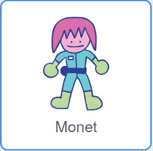

## Who's in the puzzle room?

<div style="display: flex; flex-wrap: wrap">
<div style="flex-basis: 200px; flex-grow: 1; margin-right: 15px;">
In this step, you will add a character to a puzzle room, and create controls to move them around.
</div>
<div>
{:width="300px"}
</div>
</div>

--- task ---

Open [the Scratch starter project](https://scratch.mit.edu/projects/531567946/editor/){:target="_blank"}. Scratch откроется в другой вкладке браузера.

If you are working offline, you can download the starter project at [rpf.io/p/en/puzzle-room-go](https://rpf.io/p/en/puzzle-room-go).

[[[working-offline]]]

--- /task ---

You should see a scene from inside a spaceship. Several sprites have been made for you, and their positions have been set.

**Choose:** Who's in the spaceship? It could be a solo mission from Earth, it could be an alien spaceship, or it could even exist in a future where cats rule the world.

You need one character to interact with the puzzles you are making.

--- task ---

Add a new sprite to your project. In this example, you will see the character **Monet**.



--- /task ---

If your character is too large or too small for the scene, you should change their size. You can also pick a starting position for the character.

--- task ---

Add code to set up your character's size and starting position.

--- /task ---

You will need on-screen controls to enable you to move your character around.

--- task ---

Select one of the **arrow** sprites. When the sprite is clicked, it should broadcast its direction so that it can make the character move in that direction.


```blocks3
when this sprite clicked
broadcast (right v) //Direction the arrow is pointing
```

--- /task ---

**Tip:** If the **arrow** sprites are too difficult to click on when using a mobile or tablet, then you can change their costumes. Each **arrow** sprite also has a large purple circle that can be used instead.

Now add more direction controls to move your main character.

--- task ---

Duplicate the **arrow** sprite three times. Then, for each sprite, change the costume so it points in a different direction.

Change each sprite's name to the direction it is pointing and change the `broadcast`{:class="block3events"} to the direction it is pointing.

Arrange all the **arrow** sprites in the corner of the screen.


--- /task ---

Your main character should move when the arrows are pressed.

--- task ---

Code your main character sprite to move when it receives broadcasts to go `left, right, up, and down`{:class="block3events"}.


```blocks3
when I receive [up v]
change y by (10)

when I receive [down v]
change y by (-10)

when I receive [right v]
change x by (10)

when I receive [left v]
change x by (-10)
```

--- /task ---

--- task ---

**Test:** Click the green flag and then click on the arrows to move your character around.

--- /task ---


--- save ---
