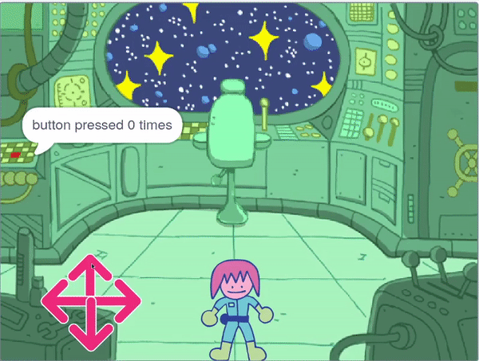
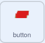

## The button puzzle

<div style="display: flex; flex-wrap: wrap">
<div style="flex-basis: 200px; flex-grow: 1; margin-right: 15px;">
In this step, you will add your first puzzle, which will be to push the button a certain number of times.
</div>
<div>
{:width="300px"}
</div>
</div>

When the game starts, the button needs to stay in the same place, and always be visible on the front layer.

--- task ---

Add the following blocks to the **button** sprite.

```blocks3
when flag clicked
forever
go to x: (-225) y (27)
go to [front v] layer //The button is visible
```

--- /task ---

The button will need to be pushed a number of times for the puzzle to be completed. For this, you will need a `variable`{:class="block3variables"} to store the number of pushes.

--- task ---

Create a new `variable`{:class="block3variables"} and call it `button pressed`{:class="block3variables"}.

--- /task ---

At the start of the game, `button pressed`{:class="block3variables"} should be `0`.

--- task ---

Add the following blocks to the **button** sprite.



```blocks3
when flag clicked
set [button pressed v] to (0) //Button presses set to 0 at start
```

--- /task ---

A `repeat until`{:class="block3control"} block is a loop that keeps repeating until a certain condition is met.

**Choose:** How many times will the button need to be pressed to solve the puzzle? In this example, it will need to be pressed `5` times, but you can choose a different number.

--- task ---

Add a `repeat until`{:class="block3control"} loop, and set its condition to be when `button pressed`{:class="block3variables"} is `equal`{:class="block3operators"} to `5`.


```blocks3
when flag clicked
set [button pressed v] to (0)
+ repeat until <(button pressed) = (5)> //Keep repeating until button is pressed 5 times
```

--- /task ---

Now, the player needs to be able to push the button. They should only be able to press it when the character is close to the button though!

--- task ---

Add blocks to detect if the character is close to the button when the **button** sprite is clicked.


```blocks3
when this sprite clicked
if <(distance to (Monet v)) < (50)> then
else
```

--- /task ---

If the character is close, and the button is pressed, then the `button pressed`{:class="block3variables"} variable can be increased. If the character is not close, the puzzle should reset; the player needs to push the button five times in a row, before trying any other puzzles.

**Tip:** In Scratch, the distance between any two sprites is calculated from the centres of the sprites. This means that large sprites can look as if they are touching, but their centres may still be far apart.

--- task ---

Add code to change the value of the variable `button pressed`{:class="block3variables"}.


```blocks3
when this sprite clicked
if <(distance to (Monet v)) < (50)> then
+ change [button pressed v] by (1) //If close to Monet, then increase button press count
else
+ set [button pressed v] to (0) //If far from Monet, then reset button press count
```

--- /task ---

--- task ---

**Test:** Run your project and move the character close to the button. As you click on the button, the `button pressed`{:class='block3variables'} variable should increase. You can adjust the value of `distance to Monet`{:class='block3sensing'} up or down, until you find a number that makes sense to you.

--- /task ---

You can use the `join`{:class="block3operators"} block to `say`{:class="block3looks"} to the player how many times the button has been pressed.

--- task ---

Place a `join`{:class="block3operators"} block inside another one. Then add in the text you want, and the `button pressed`{:class="block3variables"} variable, all inside a `say`{:class="block3looks"} block.

Например:


```blocks3
when flag clicked
set [button pressed v] to (0)
repeat until <(button pressed) = (5)> 
+ say (join [button pressed] (join (button pressed) [times])
```

**Tip:** Make sure you add spaces in the text in your `join`{:class="block3operators"} block.

--- /task ---

The loop will end when the button has been pressed `5` times, then the last block in the script will be run. This can tell the player that the task is complete.

--- task ---

Use a `say`{:class="block3looks"} block to tell the player the task has been completed.


```blocks3
when flag clicked
set [button pressed v] to (0)
repeat until <(button pressed) = (5)>
say (join [button pressed] (join (button pressed) [times])
end
+ say [task complete] for (2) seconds
```

--- /task ---


--- task ---

**Test:** Run your project and move the character close to the button. When you click on the button five times, the task should be complete.

--- /task ---

--- save ---

