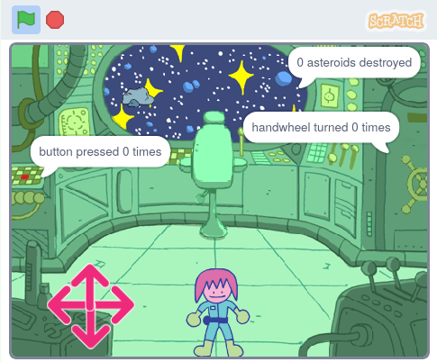

## పరిచయం

ఈ ప్రాజెక్ట్‌లో, మీరు పజిల్‌లను పరిష్కరించే పాత్రతో స్పేస్ షిప్ పజిల్ రూమ్ ని తయారు చేస్తారు.

**పజిల్ రూమ్**, లేదా **ఎస్కేప్ రూమ్**, మీరు గది నుండి బయటకు రావడానికి లేదా తదుపరి గదిలోకి వెళ్లడానికి తప్పనిసరిగా పరిష్కరించాల్సిన పజిల్ లను కలిగి ఉండే గదులు. అవి ఆన్‌లైన్ లేదా నిజమైన గదులు కావచ్చు, కానీ ఆలోచన సాధారణంగా ఒకే విధంగా ఉంటుంది: మీకు వీలైనంత త్వరగా మిషన్‌ను పూర్తి చేయండి!

మీరు:
+ `repeat until`{:class="block3control"} బ్లాకుని, యాక్షన్ నిలువగానే కంట్రోల్ చేయడానికి ఉపయోగించండి
+ వివిధ `join`{:class="block3operators"} బ్లాకులను `variable`{:class="block3variables"} యొక్క విలువను ఓట్ పుట్ చేయడానికి వాడండి
+ `and`{:class="block3operators"}, `or`{:class="block3operators"}, మరియు `not`{:class="block3operators"} కలిపి, కండిషన్ ని సమస్యను పరిష్కరించడానికీ కలపండి

--- no-print ---

### Play ▶️

--- task ---

  
Uh oh, the spaceship is encountering some difficulties! ఇంజనీర్ పాత్రను స్పేస్‌షిప్ చుట్టూ తరలించడానికి బాణాలను ఉపయోగించండి. మీరు వాటిని అన్ని పజిల్స్ పరిష్కరించడానికి మరియు స్పేస్ షిప్ కి సహాయం చేయవచ్చు?

**పజిల్ రూమ్**: [లోపల చూడండి](https://scratch.mit.edu/projects/536877672/editor){:target="_blank"}

  <iframe allowtransparency="true" width="485" height="402" src="https://scratch.mit.edu/projects/embed/536877672/?autostart=false" frameborder="0"></iframe>

--- collapse ---
---
title: ఆడటానికి చిట్కాలు
---

1. మీరు బటన్‌కు దగ్గరగా ఉండి, దాన్ని ఐదుసార్లు క్లిక్ చేయాలి
2. మీరు కుర్చీకి దగ్గరగా ఉండాలి మరియు పది గ్రహశకలాలను నాశనం చేయడానికి క్రాస్‌హైర్లను ఉపయోగించాలి
3. మీరు హ్యాండ్‌వీల్‌కి దగ్గరగా ఉండి, దాన్ని మొత్తం మూడు పూర్తి మలుపులు తిప్పడానికి దాన్ని క్లిక్ చేయాలి

--- /collapse ---

--- /task ---

--- /no-print ---

--- print-only ---

--- /print-only ---

