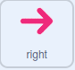

## పజిల్ రూమ్ లో ఎవరున్నారు?

<div style="display: flex; flex-wrap: wrap">
<div style="flex-basis: 200px; flex-grow: 1; margin-right: 15px;">
ఈ దశలో, మీరు పజిల్ గదికి ఒక పాత్రను జోడిస్తారు మరియు వాటిని తరలించడానికి కంట్రోల్ లను సృష్టిస్తారు.
</div>
<div>
{:width="300px"}
</div>
</div>

--- task ---

[Scratch స్టార్టర్ ప్రాజెక్ట్ ](https://scratch.mit.edu/projects/531567946/editor/){:target="_blank"} ని తెరవండి. Scratch మరొక బ్రౌజర్ ట్యాబ్‌లో తెరవబడుతుంది.

మీరు ఆఫ్‌లైన్‌లో పని చేస్తుంటే, మీరు స్టార్టర్ ప్రాజెక్ట్‌ను [rpf.io/p/en/puzzle-room](https://rpf.io/p/en/puzzle-room)లో డౌన్‌లోడ్ చేసుకోవచ్చు.

[[[working-offline]]]

--- /task ---

మీరు స్పేస్ షిప్ లోపల నుండి ఒక దృశ్యాన్ని చూడాలి. మీ కోసం అనేక sprite లు తయారు చేయబడ్డాయి మరియు వాటి స్థానాలు సెట్ చేయబడ్డాయి.

**ఎంచుకోండి:** స్పేప్ షిప్ లో ఎవరున్నారు? ఇది భూమి నుండి సోలో మిషన్ కావచ్చు, ఇది గ్రహాంతర అంతరిక్ష నౌక కావచ్చు లేదా పిల్లులు ప్రపంచాన్ని పరిపాలించే భవిష్యత్తులో కూడా ఉండవచ్చు.

మీరు చేస్తున్న పజిల్స్‌తో పరస్పర సంప్రదింపులు చేయడానికి మీకు ఒక కారెక్టర్ అవసరం.

--- task ---

మీ ప్రాజెక్ట్ కి ఒక కొత్త spriteని జోడించండి. ఈ ఉదాహరణలో, మీరు **Monet** కారెక్టర్ ని చూస్తారు.


--- /task ---

మీ కారెక్టర్ చాలా పెద్దది లేదా సన్నివేశానికి చాలా చిన్నది అయితే, మీరు వాటి పరిమాణాన్ని మార్చాలి. మీరు కారెక్టర్ కోసం ప్రారంభ స్థానాన్ని కూడా ఎంచుకోవచ్చు.

--- task ---

మీ కారెక్టర్ పరిమాణం మరియు ప్రారంభ స్థానాన్ని సెటప్ చేయడానికి కోడ్‌ను జోడించండి.

--- /task ---

మీ క్యారెక్టర్‌ని చుట్టూ తిరిగేలా చేయడానికి మీకు ఆన్-స్క్రీన్ కంట్రోల్స్ అవసరం.

--- task ---

**arrow** sprite లలో ఒకదాన్ని ఎంచుకోండి. Sprite ని క్లిక్ చేసినప్పుడు, అది దాని దిశను బ్రాడ్ కాస్ట్ చేయాలి, తద్వారా అది కారెక్టర్ ను ఆ దిశలో కదిలేలా చేస్తుంది.



```blocks3
when this sprite clicked
broadcast (right v) //Direction the arrow is pointing
```

--- /task ---

**చిట్కా:** మొబైల్ లేదా టాబ్లెట్‌ని ఉపయోగిస్తున్నప్పుడు **arrow** sprite లను క్లిక్ చేయడం చాలా కష్టంగా ఉంటే, మీరు వారి costume లను మార్చవచ్చు. ప్రతి **arrow** sprite కు బదులుగా ఉపయోగించబడే పెద్ద ఊదారంగు వృత్తం కూడా ఉంటుంది.

ఇప్పుడు మీ ప్రధాన కారెక్టర్ ను తరలించడానికి మరిన్ని డైరెక్షన్ కంట్రోల్స్ ను జోడించండి.

--- task ---

**arrow** sprite ను మూడు సార్లు డూప్లికేట్ చేయండి. అప్పుడు, ప్రతి sprite కోసం, costume లను మార్చండి, తద్వారా అది వేరే దిశలో ఉంటుంది.

ప్రతి sprite పేరును అది సూచించే దిశకు మార్చండి మరియు `broadcast`{:class="block3events"}ని అది సూచించే దిశకు మార్చండి.

స్క్రీన్ మూలలో అన్ని **arrow** sprite లను అమర్చండి.


--- /task ---

బాణపు గుర్తులు(arrows) నొక్కినప్పుడు మీ ప్రధాన కారెక్టర్ కదలాలి.

--- task ---

బ్రాడ్ కాస్ట్ లను స్వీకరించినప్పుడు `left, right, up, and down`{:class="block3events"} కి వెళ్లడానికి మీ ప్రధాన కారెక్టర్ sprite ని కోడ్ చేయండి.


```blocks3
when I receive [up v]
change y by (10)

when I receive [down v]
change y by (-10)

when I receive [right v]
change x by (10)

when I receive [left v]
change x by (-10)
```

--- /task ---

--- task ---

**పరీక్ష:** ఆకుపచ్చ జెండాను క్లిక్ చేసి, ఆపై మీ కారెక్టర్ ను చుట్టూ తరలించడానికి బాణాలపై క్లిక్ చేయండి.

--- /task ---


--- save ---
