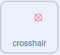
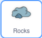

## Asteroids పజిల్

<div style="display: flex; flex-wrap: wrap">
<div style="flex-basis: 200px; flex-grow: 1; margin-right: 15px;">
ఈ దశలో, మీరు అత్యంత సవాలుగా ఉండే పజిల్‌ని సృష్టిస్తారు. ప్రమాదకరమైన గ్రహశకలాలు అనగా ఆస్టరాయిడ్ లను నాశనం చేయడానికి మీరు ఒక పజిల్‌ని సృష్టిస్తారు.
</div>
<div>
{:width="300px"}
</div>
</div>

మీరు గ్రహశకలాలను లక్ష్యంగా చేసుకోవడానికి ఉపయోగించే క్రాస్‌హైర్ అవసరం.

--- task ---

**crosshair**అనే కొత్త spriteను పెయింట్ చేయండి. వృత్తం మరియు రెండు పంక్తులను ఉపయోగించి ఒక ఉదాహరణ క్రింద చూపబడింది. సర్కిల్‌ను మొదట్లో సాలిడ్ గా చేసి, ఒకసారి దాని పరిమాణం, పొజిషన్ సెట్ అయిన తర్వాత, దాని **fill** ని transparent కి సర్దుబాటు చేయండి.


మీకు అవసరమైతే మీ **crosshair** sprite పరిమాణాన్ని మార్చండి.

**చిట్కా**: మీరు **+** మరియు **-** చిహ్నాలను ఉపయోగించి, ప్రత్యేకించి మీరు మొబైల్ లేదా టాబ్లెట్ పరికరంలో ఉన్నట్లయితే, స్థానాలను సులభతరం చేయడానికి పెయింట్ ఎడిటర్‌ను జూమ్ చేయవచ్చు.

--- /task ---

Crosshair మౌస్‌ను అనుసరిస్తుంది, కానీ అది అంతరిక్షంలోకి విండో ద్వారా మాత్రమే కనిపించాలి.

--- task ---

కింది బ్లాక్‌లను ఉపయోగించండి, తద్వారా **crosshair** మౌస్-పాయింటర్‌ను అనుసరిస్తుంది.



```blocks3
when flag clicked
forever
go to (mouse-pointer v)
```

**పరీక్ష:** ఆకుపచ్చ జెండాపై క్లిక్ చేసి, **crosshair** మౌస్-పాయింటర్‌ను అనుసరిస్తున్నట్లు నిర్ధారించుకోండి.

--- /task ---

**crosshair** **port** spriteను తాకుతుందో లేదో పరీక్షించడానికి మీరు `if`{:class="block3control"} బ్లాక్‌ని ఉపయోగించవచ్చు, తద్వారా అది **not** తాకనప్పుడు దాచబడుతుంది.

--- task ---

**crosshair** **port**ని తాకినట్లు నిర్ధారించుకోవడానికి పరీక్షను జోడించండి.


```blocks3
when flag clicked
forever
+ show
go to (mouse-pointer v)
+ if <not <touching (port v) ?>> then //Only show the crosshair when the mouse is touching the port
hide
```

**పరీక్ష:** ఆకుపచ్చ జెండాను క్లిక్ చేయండి మరియు **port**ని తాకనప్పుడు **crosshair** దాగి ఉందని నిర్ధారించుకోండి.

--- /task ---

క్రాస్ హైర్, **port** అంచున కనిపించడం కాబట్టి స్పేస్ షిప్ లోపల ఉన్నట్లు అనిపించడం మీరు గమనించవచ్చు. ఇది బ్యాక్‌డ్రాప్ రంగును తాకడం లేదని తనిఖీ చేయడం ద్వారా దీన్ని పరిష్కరించవచ్చు.

--- task ---

`or`{:class="block3operators"} బ్లాకుని `if`{:class="block3control"} బ్లాకుకి జోడించండి. **crosshair**, **port** ని చుట్టి ఉన్న పచ్చని రంగుని తాకడం రెండవ కండిషన్.


```blocks3
when flag clicked
forever
show
go to (mouse-pointer v)
+ if <<not <touching (port v) ?>> or <touching color (#69B486) ?>> then //Also not touching the edge of the port
hide
```

**చిట్కా:** crosshair మౌస్-పాయింటర్‌ను అనుసరిస్తున్నందున, కలర్ పికర్‌ని ఉపయోగించే ముందు మీరు మీ ప్రాజెక్ట్‌ను ఆపివేసినట్లు నిర్ధారించుకోండి.

--- /task ---

ఇప్పుడు ఆస్టరాయిడ్లను సృష్టించే సమయం వచ్చింది.

--- task ---

**Rocks** sprite ని కనుగొని, దానిని మీ ప్రాజెక్ట్‌కి జోడించండి. Sprite చాలా పెద్దది కాకుండా పరిమాణాన్ని మార్చండి.

--- /task ---

[Nature rover project](https://projects.raspberrypi.org/en/projects/nature-rover){:target="_blank"}లో కోడ్‌ని క్రమబద్ధంగా ఉంచడంలో `my blocks`{:class="block3myblocks"} ఎలా సహాయపడుతుందో మీరు చూసి ఉండవచ్చు.

`My blocks`{:class="block3myblocks"} కూడా దీన్ని తయారు చేయడం ద్వారా సహాయం చేస్తుంది కాబట్టి మీరు ఒకే కోడ్‌ని మళ్లీ మళ్లీ రాయాల్సిన అవసరం లేదు. మీరు **Rocks** కోసం `my blocks`{:class="block3myblocks"}ని స్పేస్‌షిప్ పోర్ట్‌లో ఉంచడానికి ఉపయోగించవచ్చు.

--- task ---

కొత్త `block`{:class="block3myblocks"}ని సృష్టించండి మరియు దానిని `go to position`{:class="block3myblocks"} అని పిలవండి. ప్రారంభ స్థానం స్క్రీన్‌పై ఎక్కడైనా ఉండవచ్చు.



```blocks3
define go to position
go to (random position v)
```

--- /task ---

**Rocks** sprite, **port** ని తాకేవరకు `and`{:class="block3operators"} **port** అంచులను తాకకుండా ఉండే వరకు, ఏదైనా యాదృచ్ఛిక స్థానాన్ని కనుగొనడం అవసరం. ఇది మీరు **crosshair**లో ఉపయోగించిన కోడ్‌ని పోలి ఉంటుంది, కానీ ఈసారి మీరు `and`{:class="block3operators"} బ్లాక్‌ని ఉపయోగిస్తారు.

--- task ---

**Rocks** సరైన పొజిషన్ కి వచ్చే వరకు కదులుతూ ఉండేలా, `repeat until`{:class="block3control"} మరియు `and`{:class="block3operators"} బ్లాకుని జోడించండి.


```blocks3
define go to position
go to (random position v)
+ repeat until <<touching (port v) ?> and <not <touching color (#69B486) ?>>
go to (random position v)

```

**పరీక్ష:** మీ `my blocks`{:class="block3myblocks"} నిర్వచనంపై క్లిక్ చేయండి మరియు పోర్ట్‌లో ఆగిపోయే వరకు రాక్, స్క్రీన్ చుట్టూ యాదృచ్ఛికంగా కదలడం మీరు చూడవచ్చు.

--- /task ---

**Rocks** కదులుతున్నప్పుడు వాటిని కనబడకుండా దాచాలి, కానీ అవి దాచబడి ఉంటే, అవి **port**ని తాకవు, కాబట్టి వాటిని కనబడకుండా చేయడానికి `ghost`{:class="block3looks"} ప్రభావాన్ని ఉపయోగించవచ్చు.

--- task ---

Sprite కదులుతున్నప్పుడు **Rocks** పై `ghost`{:class="block3looks"} ప్రభావాన్ని `100` వరకు సెట్ చేసి, ఆపై గ్రాఫికల్ ఎఫెక్ట్‌ను క్లియర్ చేయండి.


```blocks3
define go to position
go to (random position v)
repeat until <<touching (port v) ?> and <not <touching color (#69B486) ?>>
+ set [ghost v] effect to (100) //Sprite ను దాచండి
end
+ clear graphic effects
```

--- /task ---

చివరి భాగం ఇతర పజిల్స్ మాదిరిగానే ఉంటుంది. `asteroids`{:class="block3variables"} అనే వేరియబుల్‌ని ఉపయోగించి, **crosshair** **Rocks**ని ఎంత తరచుగా తాకుతుందో లెక్కించండి. ఇది ప్రతిసారీ, asteroid వేరియబుల్ పెరుగుతుంది మరియు **Rocks** కొత్త స్థానానికి వెళుతుంది. మీ కారెక్టర్ కుర్చీ దగ్గర ఉంటే మాత్రమే ఇది పని చేస్తుంది.

--- task ---

మీ **character** spriteలో, `at chair`{:class="block3variables"} అనే కొత్త వేరియబుల్‌ను సృష్టించండి, మరియు కారెక్టర్ కుర్చీని తాకినప్పుడు దాన్ని `true` కి మరియు అలా లేనప్పుడు `false` కి సెట్ చేయండి.


```blocks3
when flag clicked
set size to (60) %
go to x: (0) y: (-130)
+ forever //Check that Monet is at the chair
if <touching (chair v) ?> then
set [at chair v] to [true]
else
set [at chair v] to [false]
```

--- /task ---

--- task ---

టాస్క్ పూర్తయినప్పుడు సెట్ చేయడానికి క్రింది బ్లాక్‌లను **Rocks** spriteకి జోడించండి.


```blocks3
when flag clicked
set [asteroids v] to (0)
go to position ::custom
repeat until <(asteroids) = (10)> //10 asteroids have been destroyed
```

--- /task ---

--- task ---

**crosshair** రాక్ ని తాకినట్టు మరియు `at chair`{:class="block3variables"} వేరియబుల్ `true` కి సెట్ అయినట్టు చెక్ చేసేలా, `if`{:class="block3control"} బ్లాకులో మరొక `and`{:class="block3operators"} ని ఉపయోగించండి.


```blocks3
when flag clicked
set [asteroids v] to (0)
go to position ::custom
+ repeat until <(asteroids) = (10)>
+ if <<(at chair) = [true]> and <touching (crosshair v)>> then //Monet is at chair and crosshair is touching asteroid
```

--- /task ---

--- task ---

కండిషన్ నెరవేరినట్లయితే, `asteroid`{:class="block3variables"} వేరియబుల్‌ని `1` ఎక్కువ పెంచవచ్చు మరియు **Rocks** కొత్త పొజిషన్ కి కదిలేలా `my block`{:class="block3custom"}ని మళ్లీ రన్ చేయచ్చు.


```blocks3
when flag clicked
set [asteroids v] to (0)
go to position ::custom
repeat until <(asteroids) = (10)>
if <<(at chair) = [true]> and <touching (crosshair v)>> then
+ change [asteroids v] by (1) //Store the number of asteroids destroyed
+ go to position ::custom //Reset asteroid position
```

--- /task ---

చేయవలసిన చివరి విషయం ఏమిటంటే ఆటగాడికి టాస్క్ గురించి చెప్పడం. దీనిని **port** sprite లో చేయవచ్చు.

--- task ---

ఎన్ని ఆస్టరాయిడ్స్ నాశనం అయ్యాయో ప్లేయర్‌కి చెప్పడానికి బ్లాక్‌లను జోడించండి.


```blocks3
when flag clicked
go to x: (-15) y: (122)
repeat until <(asteroids) = (10)>
say (join (asteroids) [asteroids destroyed])
end
say [task completed] for (2) seconds
```

--- /task ---

--- task ---

**పరీక్ష:** మీ కారెక్టర్ ను కుర్చీకి దగ్గరగా తరలించండి, ఆపై crosshair ను చుట్టూ తిప్పండి మరియు కొన్ని ఆస్టరాయిడ్లను నాశనం చేయడానికి ప్రయత్నించండి. మీరు మీ sprite పరిమాణాలకు బాగా పని చేసేలా చేయడానికి మీరు మీ కోడ్‌లోని ఏదైనా విలువలను సర్దుబాటు చేయవచ్చు.

--- /task ---

--- save ---


